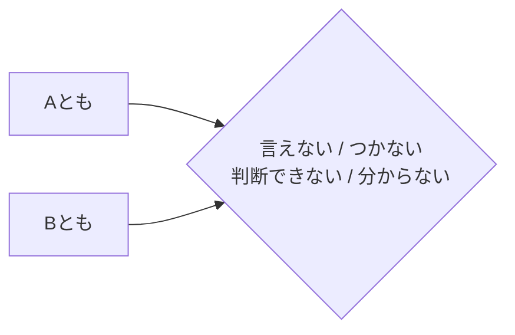

Processing keyword: A とも B とも (A tomo B tomo)
# ចំណុចវេយ្យាករណ៍ជប៉ុន: A とも B とも (A tomo B tomo)
**កម្រិត JLPT:** JLPT N1

## ១. សេចក្តីផ្តើម (Introduction)
នៅក្នុងភាសាជប៉ុន ការបញ្ចេញមតិដែលបង្ហាញពីភាពមិនប្រាកដប្រជា ឬភាពស្រពិចស្រពិល គឺជារឿងចាំបាច់ និងត្រូវបានប្រើប្រាស់ជាញឹកញាប់ ជាពិសេសនៅពេលដែលអ្នកមិនអាចកំណត់និយមន័យ ឬបែងចែកប្រភេទអ្វីមួយឱ្យបានច្បាស់លាស់ដាច់ស្រេច។ ទម្រង់វេយ្យាករណ៍ **AともBとも** ត្រូវបានប្រើដើម្បីបង្ហាញថា អ្វីមួយមិនអាចសន្និដ្ឋាន ឬកំណត់យ៉ាងច្បាស់ថាជា A ឬជា B នោះឡើយ។ ទម្រង់នេះមានប្រយោជន៍ខ្លាំងណាស់សម្រាប់ការបញ្ចេញទស្សនៈ ឬការសង្កេតដែលមានលក្ខណៈស៊ីជម្រៅ និងបន្ទន់សំឡេងកុំឱ្យដាច់អហង្ការពេក។

---
## ២. ការពន្យល់វេយ្យាករណ៍ស្នូល (Core Grammar Explanation)
### អត្ថន័យ (Meaning)
**AともBとも** មានន័យថា "**មិនអាចនិយាយបានថា A ឬ B ឡើយ**" ឬ "**ពិបាកកាត់សេចក្តីថាតើជា A ឬ B**" (cannot definitively say whether A or B / hard to tell if A or B)។ ទម្រង់នេះត្រូវបានប្រើនៅពេលដែលអ្នកនិយាយមិនអាចវិនិច្ឆ័យ ឬសន្និដ្ឋានឱ្យប្រាកដប្រជាថាស្ថានភាពនោះជា A ឬ B ដោយសារតែវាមានលក្ខណៈស្រពិចស្រពិល នៅកណ្តាល ឬមិនទាន់ច្បាស់លាស់។

### ទម្រង់វេយ្យាករណ៍ (Structure)
ទម្រង់ផ្គុំជាមូលដ្ឋាននៃវេយ្យាករណ៍នេះគឺ៖
```
[A] とも [B] とも + កិរិយាសព្ទបដិសេធ (言えない／つかない／分からない／決められない／判断できない／判別できない)
```

- **A** និង **B** ជាធម្មតាជា គុណនាម (Adjectives), កិរិយាសព្ទក្នុងទម្រង់ធម្មតា (Verbs in plain form) ឬ នាម (Nouns)។ A និង B ច្រើនតែជាពាក្យដែលមានន័យផ្ទុយគ្នា (Antonyms) ដូចជា ល្អ-អាក្រក់, ជោគជ័យ-បរាជ័យ, ទៅ-មិនទៅ។
- ត្រូវតែបញ្ចប់ដោយកិរិយាសព្ទបដិសេធ (Negative predicate requirement) ដូចជា៖
  - **言えない** (មិនអាចនិយាយបានថា...)
  - **つかない** (កាត់សេចក្តី/វិនិច្ឆ័យមិនចេញ ដូចជា 判別がつかない / 見分けがつかない)
  - **判断できない** / **判別できない** (មិនអាចវិនិច្ឆ័យបាន / មិនអាចបែងចែកបាន)
  - **分からない** / **決められない** (មិនដឹង / មិនអាចសម្រេចចិត្តបាន)

### តារាងទម្រង់វេយ្យាករណ៍ (Formation Diagram)
| ធាតុផ្សំ | ការពន្យល់ |
| :--- | :--- |
| **Aとも** | "សូម្បីតែ A ក៏..." (បង្កប់ន័យថាមិនអាចសន្និដ្ឋានថាជា A ដាច់ខាត) |
| **Bとも** | "សូម្បីតែ B ក៏..." (បង្កប់ន័យថាមិនអាចសន្និដ្ឋានថាជា B ដាច់ខាត) |
| **言えない／つかない／分からない etc.** | កិរិយាសព្ទបដិសេធបង្ហាញពីអសមត្ថភាពក្នុងការវិនិច្ឆ័យ ឬកំណត់ច្បាស់លាស់ |

### ដ្យាក្រាមរូបភាព (Visual Aid)


---
## ៣. ការវិភាគប្រៀបធៀប និង ន័យស៊ីជម្រៅ (Comparative Nuance Analysis)

### ភាពមិនអាចបែងចែកជាជម្រើសពីរដាច់ដោយឡែក (Binary Categorization Impossibility)
លក្ខណៈពិសេសនៃទម្រង់ **A とも B とも** គឺការបង្ហាញថា អង្គហេតុ ឬកម្មវត្ថុដែលកំពុងនិយាយនោះ **មិនអាចបែងចែកជាពីរដាច់ស្រឡះ (Binary options: A vs B)** បានឡើយ៖
- វាមិនមែនជា A ទាំងស្រុង ហើយក៏មិនមែនជា B ទាំងស្រុងដែរ (ឬក៏មានលក្ខណៈលាយឡំគ្នារវាង A ផង និង B ផង)។
- ចំណុចបង្គោលគឺស្ថិតនៅលើ **ភាពអសមត្ថភាពរបស់អ្នកនិយាយក្នុងការកាត់សេចក្តី** (Impossibility of judgment) ដោយហេតុផលថាទិន្នន័យមិនគ្រប់គ្រាន់ ស្ថានភាពស្រពិចស្រពិល ឬលទ្ធផលស្ថិតនៅចន្លោះប្រហោងកណ្តាល។
- ដូច្នេះហើយ ទម្រង់នេះមាន **លក្ខខណ្ឌកំហិតដាច់ខាតលើកិរិយាសព្ទបញ្ចប់ដែលត្រូវតែជាបដិសេធ (Negative Predicate Requirement)** ជានិច្ច ដូចជា `〜とも…ともつかない` (វិនិច្ឆ័យមិនចេញ), `〜とも…とも言えない` (មិនអាចថាយ៉ាងណា), `〜とも…とも判別できない` (មិនអាចញែកដាច់ពីគ្នាបាន)។ មិនអាចប្រើជាមួយកិរិយាសព្ទស្របដូចជា `*〜とも〜とも言える` ឬ `*〜とも〜とも分かる` បានឡើយ។

### ការប្រៀបធៀបជាមួយទម្រង់ស្រដៀងគ្នា (Comparison with Similar Structures)

| ទម្រង់វេយ្យាករណ៍ | លក្ខណៈពិសេស និង ន័យស៊ីជម្រៅ (Nuance) | ឧទាហរណ៍ |
| :--- | :--- | :--- |
| **A とも B とも (言えない/つかない)** | បង្ហាញពី**ភាពមិនអាចកាត់សេចក្តី** ឬមិនអាចវិនិច្ឆ័យថាជា A ឬ B ដាច់ស្រេចបាន ដោយសារភាពស្រពិចស្រពិល។ ត្រូវតែបញ្ចប់ដោយកិរិយាសព្ទបដិសេធ។ | 賛成**とも**反対**とも言えない**。<br/>(មិនអាចនិយាយបានថា យល់ព្រម ឬប្រឆាំងនោះទេ - ស្ថិតនៅកណ្តាល មិនទាន់ដាច់ស្រេច) |
| **A でも B でもない** | បញ្ជាក់ជាលក្ខណៈ**ដាច់ខាត**ថាវាមិនមែន A ហើយក៏មិនមែន B ដែរ (ដកចេញទាំងពីរយ៉ាងច្បាស់ក្រឡែត)។ មិនមែនជាការស្ទាក់ស្ទើរក្នុងការវិនិច្ឆ័យនោះឡើយ។ | 彼は学生**でも**先生**でもない**。<br/>(គាត់មិនមែនជាសិស្ស ហើយក៏មិនមែនជាគ្រូនោះដែរ - បដិសេធជាក់ច្បាស់) |
| **〜か〜ないか** | បង្ហាញពី**ជម្រើសពីរផ្ទុយគ្នា (បាទ/ទេ, ធ្វើ/មិនធ្វើ)** ឬការសង្ស័យលើការកើតឡើងនៃរឿងមួយ ("ថាតើ... ឬមិន...?")។ អាចប្រើក្នុងប្រយោគកណ្តាលជាមួយកិរិយាសព្ទស្របបាន ដូចជា `〜か〜ないか決める` (សម្រេចថាតើធ្វើឬអត់)។ | 行く**か**行か**ないか**、まだ決めていない。<br/>(ថាតើទៅ ឬមិនទៅ គឺខ្ញុំមិនទាន់សម្រេចចិត្តនៅឡើយទេ) |

**ចំណុចខុសគ្នាគន្លឹះរវាង `AともBとも` និង `〜か〜ないか`៖**
- `〜か〜ないか` ផ្តោតលើភាពមិនច្បាស់លាស់នៃសកម្មភាព ឬជម្រើសមួយថាតើនឹងកើតឡើងឬអត់ (Going or not going) ហើយអាចបញ្ចប់ដោយកិរិយាសព្ទសកម្ម ឬស្រប ដូចជា `決める` (សម្រេចចិត្ត), `迷う` (ស្ទាក់ស្ទើរ), `任せる` (ប្រគល់ការសម្រេច)។
- ចំណែកឯ `AともBとも` ផ្តោតលើ **ការវាយតម្លៃ/ការវិនិច្ឆ័យគុណភាព ឬស្ថានភាព (Qualitative Evaluation)** ដែលមិនអាចដាក់ស្លាក (Label) បានថាជាជម្រើសមួយណា ហើយ **ត្រូវតែ** បញ្ចប់ដោយកិរិយាសព្ទអសមត្ថភាព/បដិសេធ (言えない, つかない, 判別できない)។

---
## ៤. ឧទាហរណ៍ក្នុងបរិបទ (Examples in Context)

### ឧទាហរណ៍ទី ១
**ប្រយោគ (Sentence):**
- 彼の表情は嬉しいとも悲しいとも判断できない。
**របៀបអាន (Reading):**
- かれの ひょうじょう は うれしい とも かなしい とも はんだん できない。
**ការបកប្រែ (Translation):**
- "ទឹកមុខរបស់គាត់មិនអាចវិនិច្ឆ័យបានឡើយថាតើសប្បាយចិត្ត ឬកើតទុក្ខ។"

### ឧទាហរណ៍ទី ២
**ប្រយោគ (Sentence):**
- その映画は面白いともつまらないとも言えない。
**របៀបអាន (Reading):**
- その えいが は おもしろい とも つまらない とも いえない。
**ការបកប្រែ (Translation):**
- "រឿងកុននោះ ខ្ញុំមិនអាចនិយាយបានទេថាជក់ចិត្ត ឬធុញទ្រាន់ (នៅកណ្តាលៗ)។"

### ឧទាហរណ៍ទី ៣
**ប្រយោគ (Sentence):**
- この料理は美味しいとも美味しくないとも言えない味だ。
**របៀបអាន (Reading):**
- この りょうり は おいしい とも おいしくない とも いえない あじ だ。
**ការបកប្រែ (Translation):**
- "ម្ហូបនេះមានរសជាតិប្លែកដែលខ្ញុំមិនអាចនិយាយបានថាឆ្ងាញ់ ឬមិនឆ្ងាញ់នោះឡើយ។"

### ឧទាហរណ៍ទី ៤ (បរិបទផ្លូវការ - Formal Context)
**ប្រយោគ (Sentence):**
- 結果は成功とも失敗とも申せません。
**របៀបអាន (Reading):**
- けっか は せいこう とも しっぱい とも もうせません。
**ការបកប្រែ (Translation):**
- "លទ្ធផលនេះ យើងខ្ញុំមិនអាចជម្រាបបានទេថាតើជាជោគជ័យ ឬជាបរាជ័យ។"

### ឧទាហរណ៍ទី ៥ (ការប្រើជាមួយ つかない / 判別できない)
**ប្រយោគ (Sentence):**
- 遠くに見える影は、人とも動物とも判別がつかない。
**របៀបអាន (Reading):**
- とおく に みえる かげ は、ひと とも どうぶつ とも はんばん が つかない。
**ការបកប្រែ (Translation):**
- "ស្រមោលដែលមើលឃើញពីចម្ងាយនោះ មិនអាចបែងចែកដាច់ឡើយថាតើជាមនុស្ស ឬជាសត្វ។"

---
## ៥. កំណត់សម្គាល់វប្បធម៌ (Cultural Notes)
### ទំនាក់ទំនងវប្បធម៌ (Cultural Relevance)
នៅក្នុងការប្រាស្រ័យទាក់ទងរបស់ជនជាតិជប៉ុន ការបញ្ចេញមតិដែលមិនដាច់អហង្ការ ឬការជៀសវាងការអះអាងត្រង់ៗពេក គឺជារឿងទូទៅ និងចាំបាច់បំផុត ដើម្បីរក្សាសុខដុមនីយកម្ម (和 - Wa) និងជៀសវាងទំនាស់ ឬការទាស់ទែងគ្នា។ ការប្រើប្រាស់ **AともBとも** អនុញ្ញាតឱ្យអ្នកនិយាយបង្ហាញពីភាពស្រពិចស្រពិល និងការស្ទាក់ស្ទើរប្រកបដោយភាពគួរសម និងការប្រុងប្រយ័ត្នខ្ពស់ ដោយមិនបង្ខំកាត់សេចក្តីទៅលើស្ថានភាពណាមួយ។

### កម្រិតគួរសម (Levels of Politeness)
កិរិយាសព្ទដែលដើរតាមក្រោយ **AともBとも** អាចត្រូវបានកែសម្រួលទៅតាមកម្រិតគួរសម៖
- កម្រិតទូទៅ/ស្និទ្ធស្នាល (Casual): 言えない (មិនអាចនិយាយបានថា)
- កម្រិតគួរសម (Polite): 言えません (មិនអាចនិយាយបានទេ)
- កម្រិតបន្ទាបខ្លួន/ផ្លូវការខ្លាំង (Humble/Formal): 申せません / 申し上げられません (មិនអាចជម្រាបបានឡើយ)

---
## ៦. កំហុសទូទៅ និងគន្លឹះចងចាំ (Common Mistakes and Tips)
### ការវិភាគកំហុស (Error Analysis)
- **កំហុសទី ១**: ការប្រើ **AともBとも** ដោយមានជម្រើសតែមួយ។
  - *ខុស*: 彼は行くとも言えない。
  - *ត្រូវ*: 彼は行くとも行かないとも言えない。(ត្រូវតែមានជម្រើសទាំងពីរ A និង B)
- **កំហុសទី ២**: ការភ្លេចកិរិយាសព្ទបដិសេធបញ្ជាក់ពីភាពអសមត្ថភាព ឬភាពមិនច្បាស់លាស់នៅចុងប្រយោគ។
  - *ខុស*: 天気は晴れとも雨とも。
  - *ត្រូវ*: 天気は晴れとも雨とも分からない / 言えない。
- **កំហុសទី ៣**: ការប្រើជាមួយកិរិយាសព្ទស្រប។
  - *ខុស*: その映画は面白いともつまらないとも言える。
  - *ត្រូវ*: その映画は面白いともつまらないとも言えない。(ត្រូវតែជាទម្រង់បដិសេធ 言えない, 判別できない, etc.)

### យុទ្ធសាស្ត្រសិក្សា (Learning Strategies)
- **វិធីសាស្ត្រចងចាំ (Mnemonic Device)**: ចងចាំថាពាក្យ **とも** ត្រូវបានប្រើដដែលៗនៅពីក្រោយទាំង A និង B ដើម្បីសង្កត់ធ្ងន់លើភាពមិនអាចសន្និដ្ឋានបានចំពោះជម្រើសទាំងសងខាង។
- **គន្លឹះ**: ត្រូវចងចាំផ្គួប **AともBとも** ជាមួយកិរិយាសព្ទបដិសេធគន្លឹះជានិច្ចដូចជា **言えない** (មិនអាចនិយាយបាន), **判断できない / 判別できない** (មិនអាចវិនិច្ឆ័យ/ញែកដាច់), **つかない** (វិនិច្ឆ័យមិនចេញ) និង **分からない** (មិនដឹង)។

---
## ៧. សង្ខេប និងរំលឹកឡើងវិញ (Summary and Review)
### ចំណុចគន្លឹះសំខាន់ៗ (Key Takeaways)
- **AともBとも** ត្រូវបានប្រើដើម្បីបង្ហាញថា អ្វីមួយមិនអាចកំណត់ ឬដាក់ស្លាកឱ្យច្បាស់លាស់ថាជា A ឬ B ឡើយ។
- សង្កត់ធ្ងន់លើភាពមិនប្រាកដប្រជា ភាពស្រពិចស្រពិល ឬអសមត្ថភាពក្នុងការវិនិច្ឆ័យឱ្យដាច់ស្រេច។
- តម្រូវឱ្យប្រើជាមួយកិរិយាសព្ទបដិសេធ (Negative predicate) ជាដាច់ខាត ដូចជា **言えない**, **判断できない**, **つかない** ឬ **分からない**។
- ឆ្លុះបញ្ចាំងពីទម្រង់ទំនាក់ទំនងបែបជប៉ុនក្នុងការបន្ទន់ពាក្យសម្តី និងបង្ហាញភាពស្រពិចស្រពិលប្រកបដោយភាពគួរសម។

### កម្រងសំណួររំលឹកឡើងវិញរហ័ស (Quick Recap Quiz)
១. **បំពេញចន្លោះ**: その答えは正しいとも間違っているとも ______。
   - **ចម្លើយ**: 言えない (ឬ 判断できない / つかない)
២. **ត្រូវ ឬ ខុស**: ទម្រង់ **AともBとも** អាចត្រូវបានប្រើដើម្បីបញ្ជាក់យ៉ាងដាច់អហង្ការថា អ្វីមួយមិនមែន A ហើយក៏មិនមែន B ឡើយ។
   - **ចម្លើយ**: ខុស (វាបង្ហាញពីភាពស្រពិចស្រពិល និងអសមត្ថភាពក្នុងការកាត់សេចក្តី មិនមែនជាការអះអាងដាច់ខាតដូច `AでもBでもない` នោះទេ)។
៣. **ជ្រើសរើសកិរិយាសព្ទត្រឹមត្រូវ**: 天気が良いとも悪いとも ______。
   - a) 思う
   - b) 分からない
   - c) 決めた
   - **ចម្លើយ**: b) 分からない

---
សូមអានឧទាហរណ៍ និងការពន្យល់ឡើងវិញ ដើម្បីពង្រឹងការយល់ដឹងរបស់អ្នកអំពីទម្រង់ **AともBとも**។ សូមអនុវត្តដោយបង្កើតប្រយោគផ្ទាល់ខ្លួនរបស់អ្នកដោយប្រើចំណុចវេយ្យាករណ៍នេះ!

---

© [Hanabira.org](https://hanabira.org)
