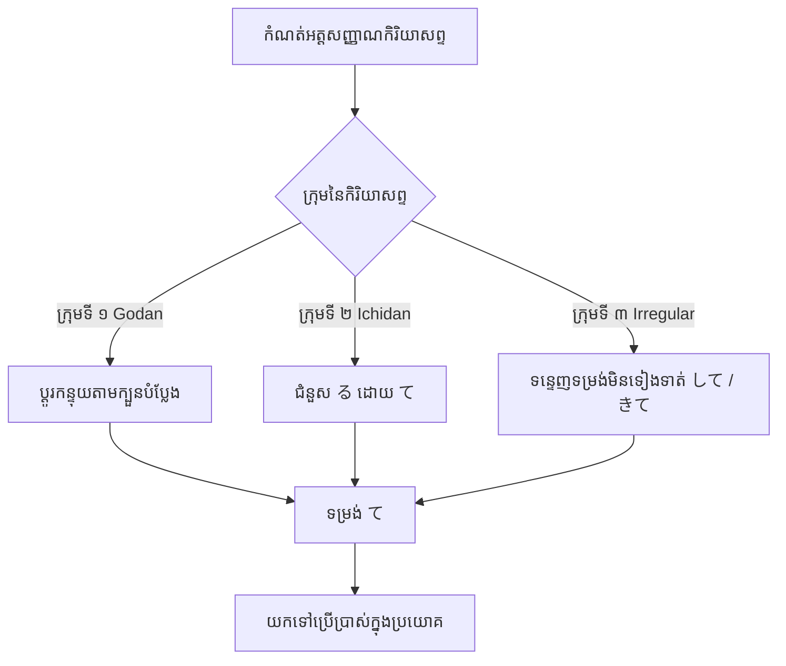

Processing keyword: Verb て～ (Verb + te～)
# ចំណុចវេយ្យាករណ៍ជប៉ុន: Verb て～ (កិរិយាសព្ទ + te～)
**កម្រិត JLPT:** JLPT N5

## ១. សេចក្តីផ្តើម (Introduction)
ទម្រង់ **て (Te-form)** នៃកិរិយាសព្ទ គឺជាទម្រង់បំប្លែងដ៏សំខាន់ និងសម្បូរបែបបំផុតមួយនៅក្នុងវេយ្យាករណ៍ភាសាជប៉ុន។ ការចេះប្រើប្រាស់ទម្រង់ て យ៉ាងស្ទាត់ជំនាញ គឺជាគន្លឹះបើកផ្លូវឆ្ពោះទៅកាន់ការបង្កើតប្រយោគស្មុគស្មាញ ការបង្ហាញពីសកម្មភាពកំពុងបន្ត ការស្នើសុំប្រកបដោយសុជីវធម៌ និងការភ្ជាប់គំនិតផ្សេងៗចូលគ្នាយ៉ាងរលូន។ ការយល់ដឹង និងការប្រើប្រាស់ទម្រង់ て គឺចាំបាច់បំផុតសម្រាប់អ្នកសិក្សាដែលចង់ទទួលបានភាពស្ទាត់ជំនាញក្នុងភាសាជប៉ុន។

---
## ២. ការពន្យល់វេយ្យាករណ៍ស្នូល (Core Grammar Explanation)
### អត្ថន័យ និងការប្រើប្រាស់ (Meaning and Usage)
ទម្រង់ て ត្រូវបានប្រើប្រាស់សម្រាប់៖
- **ភ្ជាប់សកម្មភាពជាបន្តបន្ទាប់** (ឧទាហរណ៍៖ "ធ្វើ A រួចហើយធ្វើ B")
- **បង្កើតទម្រង់បច្ចុប្បន្នកាលកំពុងបន្ត** (ឧទាហរណ៍៖ "កំពុងតែធ្វើ...")
- **ធ្វើការស្នើសុំប្រកបដោយសុជីវធម៌** (ឧទាហរណ៍៖ "សូមមេត្តាធ្វើ...")
- **សុំការអនុញ្ញាត ឬផ្តល់ការអនុញ្ញាត** (ឧទាហរណ៍៖ "តើអាចធ្វើ...បានទេ?")
- **បង្ហាញការហាមឃាត់** (ឧទាហរណ៍៖ "មិនត្រូវធ្វើ...ជាដាច់ខាត")
- **បង្ហាញពីហេតុផល ឬមូលហេតុ** (ឧទាហរណ៍៖ "ដោយសារតែបានធ្វើ...")

### របៀបបំប្លែងទម្រង់ て (Formation of the Te-form)
កិរិយាសព្ទភាសាជប៉ុនត្រូវបានបែងចែកជា ៣ ក្រុម ហើយការបំប្លែងទៅជាទម្រង់ て មានលក្ខណៈខុសៗគ្នាទៅតាមក្រុមនីមួយៗ។

#### ក្រុមនៃកិរិយាសព្ទ (Verb Groups)
1. **ក្រុមទី ១ (Godan verbs / 五段動詞)**: កិរិយាសព្ទដែលបញ្ចប់ដោយសំឡេងព្យញ្ជនៈនៅពីមុខ **う** (កិរិយាសព្ទបញ្ចប់ដោយសូរ _-u_)
2. **ក្រុមទី ២ (Ichidan verbs / 一段動詞)**: កិរិយាសព្ទដែលបញ្ចប់ដោយសំឡេងស្រៈនៅពីមុខ **る** (ភាគច្រើនបញ្ចប់ដោយ _-iru_ និង _-eru_)
3. **ក្រុមទី ៣ (Irregular verbs / 不規則動詞)**: កិរិយាសព្ទមិនទៀងទាត់ រួមមាន **する** (_suru_) និង **くる** (_kuru_)

---
### ក្បួននៃការបំប្លែង (Formation Rules)

#### **ក្រុមទី ១ (Godan Verbs)**
សម្រាប់កិរិយាសព្ទក្រុមទី ១ កន្ទុយរបស់ពាក្យនឹងផ្លាស់ប្តូរទៅតាមព្យញ្ជនៈ ឬសូរដែលនៅពីមុខ **う**៖
| **កន្ទុយបញ្ចប់** | **ការបំប្លែងទៅជាទម្រង់ て** | **ឧទាហរណ៍កិរិយាសព្ទ** | **ទម្រង់ て** |
|------------------|-----------------------------|-----------------------|---------------|
| **う**, **つ**, **る** | って                        | 会う (_au_, ជួប)       | 会って        |
| **ぶ**, **む**, **ぬ** | んで                        | 飲む (_nomu_, ផឹក)     | 飲んで        |
| **く**           | いて                        | 書く (_kaku_, សរសេរ)   | 書いて        |
| **ぐ**           | いで                        | 泳ぐ (_oyogu_, ហែលទឹក) | 泳いで        |
| **す**           | して                        | 話す (_hanasu_, និយាយ)  | 話して        |

*ចំណាំពិសេស (ករណីលើកលែង):* កិរិយាសព្ទ **行く** (_iku_, ទៅ) មិនបំប្លែងជា いទេ ទេ គឺត្រូវបំប្លែងទៅជា **行って** (_itte_)។

#### **ក្រុមទី ២ (Ichidan Verbs)**
សម្រាប់កិរិយាសព្ទក្រុមទី ២ គ្រាន់តែលុប **る** ចេញ រួចជំនួសដោយ **て** ជាការស្រេច៖
| **ឧទាហរណ៍កិរិយាសព្ទ** | **ទម្រង់ て** |
|-----------------------|---------------|
| 食べる (_taberu_, ញ៉ាំ) | 食べて        |
| 見る (_miru_, មើល)      | 見て          |

#### **ក្រុមទី ៣ (Irregular Verbs)**
កិរិយាសព្ទមិនទៀងទាត់ទាំងពីរនេះត្រូវទន្ទេញចាំ៖
| **កិរិយាសព្ទ**     | **ទម្រង់ て** |
|-------------------|---------------|
| する (_suru_, ធ្វើ) | して          |
| くる (_kuru_, មក)   | きて          |

---
### ដ្យាក្រាមជំនួយស្មារតី: ដំណើរការបំប្លែងកិរិយាសព្ទ (Verb Conjugation Flowchart)

---
## ៣. ការវិភាគប្រៀបធៀប និង ន័យស៊ីជម្រៅ (Comparative Nuance Analysis)

### ១. មុខងារស្នូលទាំង ៣ នៃការតភ្ជាប់ដោយទម្រង់ て (Core Linking Functions)
ទម្រង់ て មាននាទីជាឈ្នាប់តភ្ជាប់កិរិយាសព្ទ ប៉ុន្តែទំនាក់ទំនងនៃអត្ថន័យរវាងកិរិយាសព្ទទី ១ និងកិរិយាសព្ទទី ២ មាន ៣ លក្ខណៈចម្បង៖
1. **លំដាប់លំដោយនៃសកម្មភាព (Sequential Actions):** ធ្វើសកម្មភាពមួយចប់ ទើបបន្តធ្វើសកម្មភាពមួយទៀតតាមលំដាប់ពេលវេលាពិតប្រាកដ (A រួចហើយទើប B)។
   - ឧទាហរណ៍៖ 朝起きて、顔を洗います (ក្រោកពីគេង រួចហើយលុបមុខ)។
2. **ហេតុនិងផល (Cause and Effect):** សកម្មភាព ឬស្ថានភាពខាងមុខជាហេតុនាំឱ្យកើតលទ្ធផលនៅខាងក្រោយ។
   - ឧទាហរណ៍៖ 寒くて、風邪をひきました (ដោយសារតែត្រជាក់ ទើបផ្តាសាយ)។ ចំណាំ៖ នៅពេលប្រើជាហេតុផល ផ្នែកខាងក្រោយមិនអាចប្រើជាប្រយោគបញ្ជា ឬសំណើដោយចេតនាបានឡើយ។
3. **មធ្យោបាយ របៀប ឬស្ថានភាពអម (Manner/Method):** កិរិយាសព្ទខាងមុខបង្ហាញពីមធ្យោបាយ ឬឥរិយាបថដែលអមជាមួយសកម្មភាពចម្បងខាងក្រោយ។
   - ឧទាហរណ៍៖ 歩いて学校へ行きます (ទៅសាលារៀនដោយថ្មើរជើង / ដើរទៅសាលា)។

### ២. ការប្រៀបធៀបរវាង「〜て〜」និង「〜たり〜たりする」
ទម្រង់ទាំងពីរនេះសុទ្ធតែប្រើដើម្បីរៀបរាប់អំពីសកម្មភាពលើសពីមួយ ប៉ុន្តែមានន័យខុសគ្នាដាច់ស្រឡះ៖
- **〜て〜 (លំដាប់ជាក់លាក់ និងពេញលេញ):**
  - បង្ហាញពីសកម្មភាពដែលកើតឡើងតាមលំដាប់លំដោយពេលវេលាយ៉ាងតឹងរ៉ឹង (ធ្វើ A រួចហើយទើបធ្វើ B)។
  - បង្កប់ន័យថាសកម្មភាពដែលបានរៀបរាប់គឺជាសកម្មភាពសំខាន់ទាំងអស់ដែលបានកើតឡើងក្នុងចន្លោះពេលនោះ។
- **〜たり〜たりする (ការលើកជាឧទាហរណ៍ មិនកំណត់លំដាប់):**
  - ប្រើសម្រាប់លើកឧទាហរណ៍នៃសកម្មភាពមួយចំនួនក្នុងចំណោមសកម្មភាពជាច្រើនទៀត (ដូចជាធ្វើ A ផង ធ្វើ B ផង ជាដើម)។
  - មិនប្រកាន់លំដាប់លំដោយមុនក្រោយនៃពេលវេលាឡើយ ហើយបង្កប់ន័យថានៅមានសកម្មភាពផ្សេងទៀតដែលមិនបានរៀបរាប់។

### ៣. ការប្រៀបធៀបរវាងទម្រង់ て (Te-form) និង ទម្រង់ ます (Masu-form)
- **ទម្រង់ ます (Masu-form):** ប្រើសម្រាប់បញ្ចប់ប្រយោគដោយភាពគួរសម ស័ក្តិសមសម្រាប់កាលៈទេសៈផ្លូវការ និងការសន្ទនាទូទៅ។
  - ឧទាហរណ៍៖ 食べます (_tabemasu_, "ញ៉ាំ" - គួរសម បញ្ចប់ប្រយោគ)
- **ទម្រង់ て (Te-form):** មិនអាចប្រើតែឯងដើម្បីបញ្ចប់ប្រយោគផ្លូវការបានឡើយ ប៉ុន្តែវាដើរតួជាស្ពានតភ្ជាប់កិរិយាសព្ទ បង្កើតការស្នើសុំ ឬបង្កើតប្រយោគផ្សំ។
  - ឧទាហរណ៍៖ 食べて (_tabete_, "ញ៉ាំរួចហើយ...")

---
## ៤. ឧទាហរណ៍ក្នុងបរិបទ (Examples in Context)

### ១. ការភ្ជាប់សកម្មភាពបន្តបន្ទាប់ (Connecting Actions)
**彼は朝起きて、ジョギングをします。**
*かれは あさ おきて、ジョギングを します。*
*Kare wa asa okite, jogingu o shimasu.*
"គាត់ក្រោកពីគេងនៅពេលព្រឹក រួចហើយរត់ហាត់ប្រាណ។"

### ២. ទម្រង់បច្ចុប្បន្នកាលកំពុងបន្ត (Present Progressive Tense)
**彼女は今、音楽を聴いています。**
*かのじょは いま、おんがくを きいています。*
*Kanojo wa ima, ongaku o kiite imasu.*
"នាងកំពុងតែស្តាប់តន្ត្រីនៅពេលនេះ។"

### ៣. ការធ្វើការស្នើសុំប្រកបដោយសុជីវធម៌ (Making Polite Requests)
**窓を閉めてください。**
*まどを しめてください。*
*Mado o shimete kudasai.*
"សូមមេត្តាបិទបង្អួច។"

### ៤. ការសុំ ឬផ្តល់ការអនុញ្ញាត (Granting Permission)
**ここで写真を撮ってもいいですか。**
*ここで しゃしんを とってもいいですか。*
*Koko de shashin o totte mo ii desu ka.*
"តើខ្ញុំអាចថតរូបនៅទីនេះបានទេ?"

### ៥. ការបង្ហាញពីការហាមឃាត់ (Expressing Prohibition)
**携帯電話を使ってはいけません。**
*けいたいでんわを つかってはいけません。*
*Keitai denwa o tsukatte wa ikemasen.*
"មិនត្រូវប្រើប្រាស់ទូរស័ព្ទដៃនៅទីនេះជាដាច់ខាត។"

### ៦. ការបង្ហាញពីហេតុផល ឬមូលហេតុ (Expressing Reason or Cause)
**雨が降って、試合が延期になりました。**
*あめが ふって、しあいが えんきに なりました。*
*Ame ga futte, shiai ga enki ni narimashita.*
"ដោយសារតែភ្លៀងធ្លាក់ ការប្រកួតក៏ត្រូវបានពន្យារពេល។"

### ៧. ការសន្ទនាក្នុងកម្រិតស្និទ្ធស្នាល (Informal Conversations)
**友達と映画を見て、晩ごはんを食べた。**
*ともだちと えいがを みて、ばんごはんを たべた。*
*Tomodachi to eiga o mite, bangohan o tabeta.*
"ខ្ញុំបានមើលកុនជាមួយមិត្តភក្តិ រួចហើយក៏បានញ៉ាំបាយពេលល្ងាចជាមួយគ្នា។"

---
## ៥. កំណត់សម្គាល់បែបវប្បធម៌ (Cultural Notes)
### កម្រិតគួរសម និងការប្រើប្រាស់ (Politeness and Formality)
- នៅពេលផ្សំទម្រង់ て ជាមួយ **ください** វានឹងក្លាយជាការស្នើសុំប្រកបដោយសុជីវធម៌។
  - ឧទាហរណ៍៖ 手伝ってください。(_Tetsudatte kudasai._) "សូមជួយខ្ញុំបន្តិច។"
- ការលុប **ください** ចេញ ដោយប្រើត្រឹមតែទម្រង់ て នឹងក្លាយជាការនិយាយបែបស្និទ្ធស្នាល ស័ក្តិសមសម្រាប់តែមិត្តភក្តិជិតស្និទ្ធ ឬមនុស្សក្នុងគ្រួសារប៉ុណ្ណោះ។
  - ឧទាហរណ៍៖ 手伝って。(_Tetsudatte._) "ជួយគ្នាหน่อยមើល!"

### កន្សោមឃ្លាសំខាន់ៗដែលប្រើជាមួយទម្រង់ て (Idiomatic Expressions Using Te-form)
- **～ている**: បង្ហាញពីសកម្មភាពកំពុងបន្ត ឬស្ថានភាពដែលកើតចេញពីលទ្ធផលនៃសកម្មភាពណាមួយ។
  - 住んでいる (_sunde iru_): "កំពុងរស់នៅ"
- **～てしまう**: បង្ហាញពីការធ្វើអ្វីមួយចប់សព្វគ្រប់ទាំងស្រុង ឬបង្ហាញពីការសោកស្តាយ ភ្លាត់ស្នៀតធ្វើរឿងអ្វីមួយដោយអចេតនា។
  - 食べてしまった (_tabete shimatta_): "បានញ៉ាំអស់រលីងហើយ" ឬ "ជ្រុលមាត់ញ៉ាំបាត់ទៅហើយ"។

---
## ៦. កំហុសទូទៅ និងគន្លឹះចងចាំ (Common Mistakes and Tips)
### កំហុសដែលតែងតែកើតមាន (Common Mistakes)
1. **ការកំណត់ក្រុមនៃកិរិយាសព្ទខុស**
   ការយល់ច្រឡំក្រុមនៃកិរិយាសព្ទនឹងនាំឱ្យមានការបំប្លែងខុសក្បួន។
   - កំហុស៖ **起きる (okiru)** -> **起きって** ❌
   - កែតម្រូវ៖ **起きる** គឺជាកិរិយាសព្ទក្រុមទី ២ ដូច្នេះត្រូវបំប្លែងទៅជា **起きて** ✅
2. **ការភ្លេចករណីកិរិយាសព្ទមិនទៀងទាត់**
   ការភ្លេចថា **する** និង **くる** ជាកិរិយាសព្ទមិនទៀងទាត់។
   - កំហុស៖ **する** -> **すて** ❌
   - កែតម្រូវ៖ **する** -> **して** ✅
3. **ការភ្លេចករណីលើកលែង 行く**
   - កំហុស៖ **行く (iku)** -> **行いて** ❌
   - កែតម្រូវ៖ **行く** -> **行って** ✅

### គន្លឹះសម្រាប់ជំនួយការចងចាំ (Tips for Learning)
- **ចង្វាក់ចងចាំសម្រាប់កិរិយាសព្ទក្រុមទី ១ បញ្ចប់ដោយ う, つ, る**
  - ចងចាំថា "**U - Tsu - Ru -> Tte (って)**"
  - កិរិយាសព្ទបញ្ចប់ដោយ **う**, **つ**, **る** ត្រូវប្តូរជា **って**
- **សម្រាប់កិរិយាសព្ទបញ្ចប់ដោយ む, ぶ, ぬ**
  - ចងចាំថា "**Mu - Bu - Nu -> Nde (んで)**"
  - ត្រូវប្តូរជា **んで**
- **ហាត់រៀនបែងចែកក្រុមជាប្រចាំ**
  - អនុវត្តកំណត់ក្រុមនៃកិរិយាសព្ទឱ្យបានត្រឹមត្រូវជាប្រចាំ ដើម្បីងាយស្រួលបំប្លែងបានរហ័ស។

---
## ៧. សេចក្តីសង្ខេប និងការរំលឹកឡើងវិញ (Summary and Review)
### ចំណុចសំខាន់ៗដែលត្រូវចងចាំ (Key Takeaways)
- **ទម្រង់ て (Te-form)** មានសារៈសំខាន់ខ្លាំងណាស់ក្នុងការតភ្ជាប់កិរិយាសព្ទ និងជាគ្រឹះក្នុងការបង្កើតទម្រង់វេយ្យាករណ៍ជាច្រើនទៀត។
- ការបំប្លែងបានត្រឹមត្រូវ អាស្រ័យលើការកំណត់ក្រុមនៃកិរិយាសព្ទឱ្យបានច្បាស់លាស់។
- ទម្រង់ て ត្រូវបានប្រើប្រាស់នៅក្នុងការសន្ទនាប្រចាំថ្ងៃយ៉ាងទូលំទូលាយ ទាំងកម្រិតគួរសម និងកម្រិតស្និទ្ធស្នាល។

### កម្រងសំណួរខ្លីៗសម្រាប់វាស់ស្ទង់ (Quick Recap Quiz)
1. **ចូរបំប្លែងកិរិយាសព្ទ 読む (_yomu_, "អាន") ទៅជាទម្រង់ て។**
   **ចម្លើយ:** 読んで (_yonde_)
2. **តើគេនិយាយពាក្យថា "សូមមេត្តានិយាយយឺតៗ" ដោយប្រើទម្រង់ て យ៉ាងដូចម្តេច?**
   **ចម្លើយ:** ゆっくり話してください。(_Yukkuri hanashite kudasai._)
3. **តើទម្រង់ て នៃកិរិយាសព្ទ 行く (_iku_, "ទៅ") គឺជាអ្វី?**
   **ចម្លើយ:** 行って (_itte_)

---
*ចូរព្យាយាមអនុវត្តប្រើប្រាស់ទម្រង់ て នៅក្នុងបរិបទផ្សេងៗឱ្យបានច្រើន ដើម្បីបង្កើនការយល់ដឹង និងភាពស្ទាត់ជំនាញរបស់អ្នក!*

---

© [Hanabira.org](https://hanabira.org)
