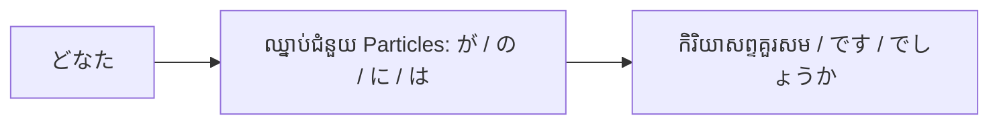

Processing keyword: どなた～ (donata～)
# ចំណុចវេយ្យាករណ៍ភាសាយ៉ា stets: どなた～ (donata～)
**កម្រិត JLPT:** JLPT N5

## ១. សេចក្តីផ្តើម (Introduction)
នៅក្នុងមេរៀននេះ យើងនឹងសិក្សាអំពីរបៀបប្រើប្រាស់ពាក្យ **どなた** (donata) ដែលជាសព្វនាមសួរ (interrogative pronoun) បែបគួរសម និងលើកតម្កើងនៅក្នុងភាសាជប៉ុន។ ការយល់ដឹងពីរបៀបប្រើប្រាស់ពាក្យ **どなた** ឱ្យបានត្រឹមត្រូវគឺមានសារៈសំខាន់ខ្លាំងណាស់សម្រាប់ការទំនាក់ទំនងប្រកបដោយការគោរព ជាពិសេសក្នុងបរិបទផ្លូវការ និងការងារ។

---

## ២. ការពន្យល់វេយ្យាករណ៍ស្នូល (Core Grammar Explanation)

### អត្ថន័យ (Meaning)
**どなた** (donata) មានន័យថា **"នរណា / អ្នកណា / លោកណា"** នៅក្នុងភាសាខ្មែរ។ វាគឺជាទម្រង់គួរសម ឬទម្រង់លើកតម្កើង (Polite/Honorific form) នៃពាក្យ **誰** (dare) ដែលមានន័យថា "នរណា/អ្នកណា" ដូចគ្នា។

### ទម្រង់វេយ្យាករណ៍ (Structure)
ពាក្យ **どなた** ត្រូវបានប្រើនៅក្នុងប្រយោគសំណួរដើម្បីសួរអំពីអត្តសញ្ញាណរបស់បុគ្គលណាម្នាក់ក្នុងលក្ខណៈគួរសម និងផ្តល់ការគោរព។

#### ដ្យាក្រាមទម្រង់ (Formation Diagram)

- **どなたですか？**  
  *Donata desu ka?*  
  "តើលោកជាអ្នកណាដែរ? / តើអ្នកណាដែរ?" (កម្រិតគួរសម)

### កំណត់សម្គាល់នៃការប្រើប្រាស់ (Usage Notes)
- **どなた** ត្រូវបានប្រើប្រាស់ជាទូទៅនៅក្នុងស្ថានភាពផ្លូវការ ដូចជាកិច្ចប្រជុំការងារ សេវាកម្មអតិថិជន ឬនៅពេលនិយាយទៅកាន់មនុស្សចាស់ ឬអ្នកដែលមានឋានៈសង្គមខ្ពស់ជាងខ្លួន។
- វាមានកម្រិតគួរសម និងការគោរពខ្ពស់ជាងពាក្យ **誰** (dare) ឆ្ងាយណាស់។

---

## ៣. ការវិភាគប្រៀបធៀប និង ន័យស៊ីជម្រៅ (Nuance & Comparative Analysis)

### តារាងប្រៀបធៀបកម្រិតគួរសម

| ភាសាជប៉ុន (Japanese) | អាន (Reading) | កម្រិតគួរសម (Politeness Level) | ការប្រើប្រាស់ និងបរិបទ (Usage Context) |
| :--- | :--- | :--- | :--- |
| **誰** | dare | ស្និទ្ធស្នាល / ធម្មតា (Casual / Neutral) | ប្រើក្នុងចំណោមមិត្តភក្តិ មនុស្សស្និទ្ធស្នាល ឬមនុស្សស្មើគ្នា/ទាបជាង |
| **どなた** | donata | គួរសម / ផ្លូវការ (Polite / Formal) | ប្រើក្នុងបរិបទផ្លូវការ ការងារ និងពេលនិយាយជាមួយមនុស្សមិនសូវស្គាល់ |
| **どなた様** | donata-sama | គួរសមខ្លាំង / លើកតម្កើងខ្ពស់ (Honorific) | ប្រើចំពោះអតិថិជន ភ្ញៀវ ឬការសន្ទនាតាមទូរស័ព្ទក្នុងអាជីវកម្ម |
| **どちら様** | dochira-sama | គួរសម និងទន់ភ្លន់កម្រិតខ្ពស់ (Super-polite / Euphemistic) | ផ្លូវការកម្រិតខ្ពស់បំផុត (ប្រើទិសដៅ どちら ជំនួសមនុស្ស ដើម្បីកាត់បន្ថយភាពចាក់ដោត) |

### ការវិភាគស៊ីជម្រៅលើភាពខុសប្លែកគ្នា (Deep Nuance Breakdown)

1. **誰 (dare) vs. どなた (donata):**
   - **誰 (dare)** គឺជាពាក្យអព្យាក្រឹត (neutral)។ ប្រសិនបើសួរបុគ្គលមិនស្គាល់មុខ ឬមនុស្សចាស់ថា **「あなたは誰ですか」 (Anata wa dare desu ka?)** វានឹងស្តាប់ទៅកំបុត ឆ្គង ឬគ្មានការគួរសម (ស្មើនឹងពាក្យខ្មែរថា "ឯងជានរណា?")។
   - ផ្ទុយទៅវិញ ការប្រើ **どなた** (ដូចជា **「どなたですか」**) បង្ហាញពីការផ្តល់តម្លៃ និងគោរពអត្តសញ្ញាណរបស់ភាគីម្ខាងទៀត (ស្មើនឹង "តើលោកជាអ្នកណាដែរ?")។

2. **សុជីវធម៌ក្នុងការទទួលទូរស័ព្ទ និងសេវាកម្មអាជីវកម្ម (Business Telephone Manners):**
   - ក្នុងការឆ្លើយទូរស័ព្ទការងារ ឬនៅមុខទ្វារក្រុមហ៊ុន/គេហដ្ឋាន ជប៉ុនមិនសួរត្រឹមតែ *どなたですか* នោះទេ ពីព្រោះពាក្យ *ですか* នៅតែអាចស្តាប់ទៅរាងដាច់ខាត។
   - គេតែងតែបន្ថែមបច្ច័យលើកតម្កើង **様 (sama)** និងទម្រង់ប្រយោល **でしょうか (deshou ka)** បង្កើតបានជាឃ្លា៖  
     **「どなた様でしょうか。」 (Donata-sama deshou ka?)** ឬ **「どちら様でしょうか。」 (Dochira-sama deshou ka?)**  
     ឃ្លានេះមានន័យថា "តើខ្ញុំកំពុងជម្រាបសួរទៅកាន់លោក/លោកស្រីណាដែរ?" ដែលជាទម្រង់គួរសមប្រកបដោយភាពទន់ភ្លន់ខ្ពស់បំផុតក្នុងវប្បធម៌ធុរកិច្ចជប៉ុន។

---

## ៤. ឧទាហរណ៍ក្នុងបរិបទជាក់ស្តែង (Examples in Context)

### ប្រយោគគំរូ (Example Sentences)
១. **こちらはどなたですか。**  
   *Kochira wa donata desu ka.*  
   "តើលោកខាងនេះជាអ្នកណាដែរ?" (ការសួរសុំស្គាល់ដោយគួរសម)

២. **お電話をくださったのはどなたでしょうか。**  
   *O-denwa o kudasatta no wa donata deshou ka.*  
   "តើលោក/លោកស្រីណាបានទូរស័ព្ទមកអម្បាញ់មិញនេះដែរ?" (ទម្រង់គួរសម និងលើកតម្កើងខ្ពស់)

៣. **会場にはどなたがいらっしゃいますか。**  
   *Kaijou ni wa donata ga irasshaimasu ka.*  
   "តើមានលោក/លោកស្រីណាខ្លះមានវត្តមាននៅក្នុងសាលប្រជុំដែរ?" (គួរសម ដោយប្រើប្រាស់រួមជាមួយកិរិយាសព្ទលើកតម្កើង いらっしゃる)

៤. **どなたにお会いしたいですか。**  
   *Donata ni o-ai shitai desu ka.*  
   "តើលោកចង់ជួបជាមួយអ្នកណាដែរ?" (កម្រិតគួរសម)

### ការប្រើប្រាស់តាមស្ថានភាព (Contextual Usage)
- **ស្ថានភាពផ្លូវការក្នុងការងារ (Formal Setting / Business):**  
  **どなたがプロジェクトの責任者ですか。**  
  *Donata ga purojekuto no sekininsha desu ka.*  
  "តើលោកណាជាអ្នកទទួលខុសត្រូវលើគម្រោងនេះដែរ?"

- **សេវាកម្មអតិថិជន (Customer Service):**  
  **ご予約はどなたの名前でされていますか。**  
  *Goyoyaku wa donata no namae de sarete imasu ka.*  
  "តើការកក់ទុកធ្វើឡើងក្រោមឈ្មោះរបស់លោក/លោកស្រីណាដែរ?"

---

## ៥. កំណត់សម្គាល់វប្បធម៌ (Cultural Notes)

### សារៈសំខាន់នៃវប្បធម៌ (Cultural Relevance)
ការជ្រើសរើសប្រើពាក្យ **どなた** បង្ហាញយ៉ាងច្បាស់ពីវប្បធម៌ជប៉ុនដែលផ្តល់តម្លៃខ្ពស់ទៅលើការគោរព និងឋានានុក្រមសង្គម (Social hierarchy)។ វាមានសារៈសំខាន់ចាំបាច់ក្នុងការប្រើប្រាស់កម្រិតគួរសមឱ្យបានស័ក្តិសមដើម្បីបង្ហាញការគោរព ជាពិសេសក្នុងកាលៈទេសៈដូចខាងក្រោម៖
- នៅពេលនិយាយទៅកាន់អតិថិជន ឬដៃគូអាជីវកម្ម
- នៅពេលនិយាយទៅកាន់មនុស្សចាស់ ឬថ្នាក់លើ
- នៅក្នុងកម្មវិធីផ្លូវការ និងការណែនាំខ្លួន

### ឃ្លាប្រើប្រាស់ជាក់ស្តែង (Idiomatic Expressions)
- **どなた様でしょうか。**  
  *Donata-sama deshou ka.*  
  ជាទម្រង់គួរសម និងផ្តល់កិត្តិយសខ្ពស់បំផុតក្នុងការសួរថា "តើលោក/លោកស្រីណាដែរ?" ដែលតែងតែប្រើជាទូទៅនៅពេលទទួលទូរស័ព្ទ ឬឆ្លើយតបនៅពេលមានភ្ញៀវមកគោះទ្វារ។

---

## ៦. កំហុសទូទៅ និងគន្លឹះចងចាំ (Common Mistakes and Tips)

### ការវិភាគកំហុស (Error Analysis)
- **ការប្រើពាក្យ 誰 (dare) ជំនួស どなた (donata) ក្នុងស្ថានភាពផ្លូវការ៖**  
  ការធ្វើបែបនេះអាចស្តាប់ទៅគ្មានសុជីវធម៌ ឬស្និទ្ធស្នាលហួសហេតុ។  
  - មិនត្រឹមត្រូវ (មិនគួរសម): **あなたは誰ですか。** (*Anata wa dare desu ka.*)  
  - ត្រឹមត្រូវ (គួរសម): **どなたですか。** (*Donata desu ka.*) ឬ **どなた様でしょうか。** (*Donata-sama deshou ka.*)

### គន្លឹះ និងយុទ្ធសាស្ត្រសិក្សា (Learning Strategies)
- **គន្លឹះចងចាំ (Mnemonic):**  
  ចងចាំថា **どなた** (Donata) សម្រាប់ប្រើជាមួយមនុស្សដែលយើងត្រូវផ្តល់ "កិត្តិយស និងការគោរព" ខុសពី **だれ** (Dare) ដែលប្រើសម្រាប់មនុស្សស្និទ្ធស្នាល។
- **ការអនុវត្តកម្រិតគួរសម (Practice Politeness Levels):**  
  ប្រើ **どなた** တွဲជាមួយកិរិយាសព្ទលើកតម្កើងដើម្បីបង្កើនភាពគួរសមកាន់តែខ្ពស់។ ឧទាហរណ៍៖ ប្រើ **いらっしゃいます** (irasshaimasu) ជំនួសឱ្យ **います** (imasu)។

---

## ៧. សង្ខេប និងរំលឹកឡើងវិញ (Summary and Review)

### ចំណុចគន្លឹះសំខាន់ៗ (Key Takeaways)
- **どなた** គឺជាទម្រង់គួរសមរបស់ពាក្យ **誰** (នរណា / អ្នកណា)។
- ត្រូវប្រើ **どなた** នៅក្នុងស្ថានភាពផ្លូវការ ឬជាមួយមនុស្សដែលត្រូវផ្តល់ការគោរព។
- ត្រូវកែសម្រួលកម្រិតនៃការគួរសមឱ្យសមស្របទៅតាមបរិបទ និងបុគ្គលដែលអ្នកកំពុងសន្ទនាជាមួយ (ឧ. បន្ថែម *様* និង *でしょうか* ពេលទទួលទូរស័ព្ទការងារ)។

### កម្រងសំណួររំលឹកឡើងវិញ (Quick Recap Quiz)
១. តើត្រូវសួរថា "តើលោកខាងនេះជាអ្នកណាដែរ?" ក្នុងភាសាជប៉ុនបែបគួរសមយ៉ាងដូចម្តេច?  
   a) **これは誰ですか。**  
   b) **こちらはどなたですか。**  
   c) **これは何ですか。**  
២. តើពាក្យមួយណាគួរសមជាងរវាង **誰** និង **どなた**?  
៣. ចូរជ្រើសរើសពាក្យបំពេញចន្លោះឱ្យបានសមស្រប៖ **ご担当者は ______ でしょうか。**  
   *(តើលោកណាជាអ្នកទទួលបន្ទុកកិច្ចការនេះដែរ?)*  

---

**ចម្លើយ (Answers):**
១. b) **こちらはどなたですか。**  
២. **どなた** គឺគួរសមជាង **誰**។  
៣. **どなた** — **ご担当者はどなたでしょうか。**

---

© [Hanabira.org](https://hanabira.org)