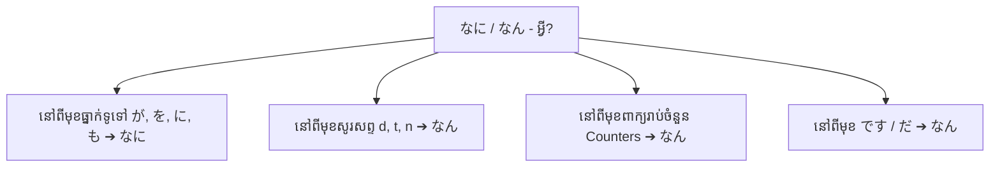

# វេយ្យាករណ៍ភាសាញ៉បុ៉ន: なに～ (nani~)
**កម្រិត JLPT:** JLPT N5

---

## ១. សេចក្តីផ្តើម (Introduction)
ពាក្យ **なに** (*nani*) គឺជាសព្វនាមសួរ (Interrogative Pronoun) មូលដ្ឋានគ្រឹះដ៏សំខាន់បំផុតមួយនៅក្នុងភាសាញ៉បុ៉ន ដែលមានន័យស្មើនឹងពាក្យ **"អ្វី"** ឬ **"ស្អី"** ជាភាសាខ្មែរ ("what" ក្នុងភាសាអង់គ្លេស)។ ពាក្យនេះត្រូវបានប្រើដើម្បីបង្កើតជាសំណួរសាកសួរអំពីវត្ថុ សកម្មភាព ឬសេចក្តីពន្យល់ផ្សេងៗ។ ការយល់ដឹងច្បាស់អំពីរបៀបប្រើប្រាស់ **なに** ព្រមទាំងការប្រែប្រួលសូរសព្ទរបស់វាទៅជា **なん** (*nan*) គឺជាចំណុចស្នូលចាំបាច់បំផុតសម្រាប់ការប្រាស្រ័យទាក់ទង និងការប្រឡងសមត្ថភាពភាសាញ៉បុ៉នកម្រិត JLPT N5។

---

## ២. ការពន្យល់វេយ្យាករណ៍ស្នូល (Core Grammar Explanation)

### អត្ថន័យ និងការប្រើប្រាស់ (Meaning and Usage)
- **なに (nani)**: មានន័យថា **"អ្វី"** ឬ **"ស្អី"** ប្រើសម្រាប់សាកសួរអំពីវត្ថុ ហេតុការណ៍ សកម្មភាព ឬសុំការពន្យល់។
- វាអាចប្រើប្រាស់ដោយឯករាជ្យ ឬផ្សំជាមួយធ្នាក់ (Particles) ផ្សេងៗដើម្បីបង្កើតជាសំណួរ និងកន្សោមពាក្យជាច្រើន។

### ទម្រង់វេយ្យាករណ៍ (Structure and Formation)

#### ទម្រង់សំណួរមូលដ្ឋាន (Basic Question Structure)
```markdown
[ពាក្យសួរ (なに/なん)] + [ធ្នាក់ (助詞)] + [កិរិយាសព្ទ (動詞)] + か？
```

- **なにをしますか？**
  - *Nani o shimasu ka?*
  - "តើអ្នកនឹងធ្វើអ្វី? / តើអ្នកធ្វើអ្វី?"

#### ការផ្សំជាមួយធ្នាក់ (Combining with Particles)

| ធ្នាក់ (Particle) | មុខងារវេយ្យាករណ៍ | ឧទាហរណ៍ (Example) | ការបកប្រែជាភាសាខ្មែរ (Translation) |
|---|---|---|---|
| **が** | បង្ហាញប្រធាននៃប្រយោគ (Subject) | なにが必要ですか？ (*Nani ga hitsuyō desu ka?*) | តើត្រូវការអ្វីដែរ? / តើអ្វីខ្លះដែលចាំបាច់? |
| **を** | បង្ហាញកម្មបទផ្ទាល់នៃកិរិយាសព្ទ (Direct Object) | なにを食べますか？ (*Nani o tabemasu ka?*) | តើអ្នកនឹងញ៉ាំអ្វី? / តើអ្នកញ៉ាំអ្វី? |
| **に** | បង្ហាញការសម្រេចចិត្ត គោលដៅ ឬជម្រើស | なにしますか？ (*Nani ni shimasu ka?*) | តើអ្នកសម្រេចចិត្តយកអ្វី? / តើអ្នកជ្រើសរើសយកអ្វី? |
| **で** | បង្ហាញមធ្យោបាយ ឧបករណ៍ ឬមូលហេតុ | なにで行きますក？ (*Nani de ikimasu ka?*) / なんで行きますか？ | តើអ្នកទៅដោយមធ្យោបាយអ្វី? (ជិះអ្វីទៅ?) |
| **も** (+ កិរិយាសព្ទអវិជ្ជមាន) | មានន័យថា "អ្វីក៏ដោយ...មិន/គ្មាន" (Nothing at all) | なにもいりません。 (*Nani mo irimasen.*) | ខ្ញុំមិនត្រូវការអ្វីទាំងអស់។ |
| **か** | មានន័យថា "អ្វីមួយ" (Something / Anything) | なにかありますか？ (*Nanika arimasu ka?*) | តើមានអ្វីមួយដែរឬទេ? |

---

## ៣. ការវិភាគប្រៀបធៀប និង ន័យស៊ីជម្រៅ (Comparative Analysis & Nuances)

### ភាពខុសគ្នារវាង なに (*nani*) និង なん (*nan*)
ទាំង **なに** និង **なん** សុទ្ធតែមានន័យថា "អ្វី" ដូចគ្នា ប៉ុន្តែការបញ្ចេញសំឡេងប្រែប្រួលទៅតាមសំឡេង ឬពាក្យដែលនៅខាងក្រោយ (Phonetic Conditioning)។



#### ១. វិធានសូរសព្ទ "D / T / N":
នៅពេលពាក្យបន្ទាប់ចាប់ផ្តើមដោយសូរសំឡេងក្នុងជួរ **d**, **t**, ឬ **n** (តំបន់ធ្មេញ/អញ្ចាញ - Alveolar/Dental sounds) សំឡេង **なに** នឹងត្រូវកាត់បន្ថយមកជា **なん (nan)** ដោយស្វ័យប្រវត្ត ដើម្បីសម្រួលដល់ការបញ្ចេញសំឡេងឱ្យរលូន និងលឿន៖
- **នៅពីមុខជួរ d (だ, で, ど, etc.):**
  - なん**で**すか (*Nan desu ka?* - តើជាអ្វី?) [មិនប្រើ なにですか ឡើយ]
  - なん**だ** (*Nan da?* - ស្អីហ្នឹង? / ស្អីគេ?)
  - なん**で** (*Nan de?* - ហេតុអ្វី? / តាមមធ្យោបាយអ្វី?)
- **នៅពីមុខជួរ t (と, て, etc.):**
  - なん**と**言いましたか (*Nan to iimashita ka?* - តើអ្នកបាននិយាយថាដូចម្តេច?)
  - なん**て** (*Nan te...* - ស្អីគេ...)
- **នៅពីមុខជួរ n (の, etc.):**
  - なん**の**本ですか (*Nan no hon desu ka?* - តើជាសៀវភៅអំពីអ្វី?)

#### ២. នៅពីមុខពាក្យរាប់ចំនួន (Counters / Quantifiers):
នៅពេលសួរបរិមាណ ឬចំនួន តែងតែប្រើ **なん (nan)** ជានិច្ច៖
- **なんにん** (*nan-nin* - ប៉ុន្មាននាក់?)
- **なんじ** (*nan-ji* - ម៉ោងប៉ុន្មាន?)
- **なんばん** (*nan-ban* - លេខប៉ុន្មាន?)
- **なんさい** (*nan-sai* - អាយុប៉ុន្មាន?)
- **なんようび** (*nan-yōbi* - ថ្ងៃអ្វី?)
- **なんかい** (*nan-kai* - ប៉ុន្មានដង? / ជាន់ទីប៉ុន្មាន?)

#### ៣. ករណីពិសេស: なんで (*nande*) vs なにで (*nani de*)
- **なんで (nande):** ក្នុងភាសានិយាយប្រចាំថ្ងៃ ភាគច្រើនមានន័យស្មើនឹង **どうして (dōshite - ហេតុអ្វី?)**។ ប៉ុន្តែវាក៏អាចមានន័យថា "ដោយមធ្យោបាយអ្វី" ផងដែរ។
- **なにで (nani de):** ត្រូវបានប្រើដើម្បីបញ្ជាក់ឱ្យច្បាស់តែម្តងអំពី **មធ្យោបាយ ឬឧបករណ៍** (ឧទាហរណ៍៖ なにで行きますか - តើទៅដោយជិះអ្វី?) ដើម្បីជៀសវាងការភ័ន្តច្រឡំជាមួយន័យ "ហេតុអ្វីបានជាទៅ?"។

### តារាងប្រៀបធៀបជាមួយសព្វនាមសួរដទៃទៀត (Comparison with Other Interrogatives)

| ភាសាញ៉បុ៉ន (Japanese) | រ៉ូម៉ាជី (Romaji) | អត្ថន័យជាភាសាខ្មែរ (Meaning) | មុខងារសាកសួរ |
|---|---|---|---|
| **なに / なん** | **nani / nan** | **អ្វី / ស្អី** | សួរអំពីវត្ថុ សកម្មភាព ឬខ្លឹមសារ |
| **どれ** | dore | មួយណា (ក្នុងចំណោមច្រើន) | សួរជ្រើសរើសវត្ថុឯករាជ្យ |
| **どの (+ នាម)** | dono | ...ណា (ឧ. មនុស្សណា មួកណា) | គុណនាមសួរភ្ជាប់ពីមុខនាម |
| **だれ / どなた** | dare / donata | នរណា / អ្នកណា | សួរអំពីមនុស្ស (どなた គួរសមជាង) |
| **いつ** | itsu | ពេលណា / កាលណា | សួរអំពីពេលវេលា |
| **どこ / どちら** | doko / dochira | ទីណា / កន្លែងណា | សួរអំពីទីកន្លែង ឬទិសដៅ |
| **どう / いかが** | dō / ikaga | យ៉ាងម៉េច / យ៉ាងដូចម្តេច | សួរអំពីស្ថានភាព ឬមតិយោបល់ |

---

## ៤. ឧទាហរណ៍ក្នុងបរិបទ (Examples in Context)

### ការសន្ទនាផ្លូវការ / គួរសម (Formal Speech)
1. **お名前はなんですか？**  
   - *O-namae wa nan desu ka?*  
   - "តើលោក/អ្នកមានឈ្មោះអ្វីដែរ?"
2. **これはなにがありますか？**  
   - *Kore wa nani ga arimasu ka?*  
   - "តើនៅទីនេះមានអ្វីខ្លះ?"
3. **朝食にはなにを食べましたか？**  
   - *Chōshoku ni wa nani o tabemashita ka?*  
   - "តើអ្នកបានពិសារអ្វីខ្លះសម្រាប់អាហារពេលព្រឹក?"

### ការសន្ទនាក្រៅផ្លូវការ / ស្និទ្ធស្នាល (Informal Speech)
1. **なに食べる？**  
   - *Nani taberu?*  
   - "តើញ៉ាំអីហ្នឹង? / តើចង់ញ៉ាំអី?"
2. **週末になにするの？**  
   - *Shūmatsu ni nani suru no?*  
   - "ចុងសប្តាហ៍ហ្នឹងធ្វើអីដែរ?"
3. **それ、なに？**  
   - *Sore, nani?*  
   - "អាហ្នឹងជាស្អីគេ?"

### បរិបទភាសាសរសេរ (Written Context)
1. **この言葉の意味はなんですか。**  
   - *Kono kotoba no imi wa nan desu ka.*  
   - "តើពាក្យនេះមានន័យដូចម្តេច / អត្ថន័យជាអ្វី?"
2. **なにを求めていますか。**  
   - *Nani o motomete imasu ka.*  
   - "តើអ្នកកំពុងស្វែងរកអ្វី?"

### បរិបទភាសានិយាយជាក់ស្តែង (Spoken Context)
1. **えっ、なんだって？**  
   - *Eh, nan datte?*  
   - "អ្ហេ៎! ថាស្អីមិញហ្នឹង? / និយាយថាម៉េច?"
2. **なにが起こったの？**  
   - *Nani ga okotta no?*  
   - "តើមានរឿងអ្វីកើតឡើងហ្នឹង?"

---

## ៥. កំណត់សម្គាល់វប្បធម៌ និងការប្រើប្រាស់ (Cultural Notes)

### កម្រិតនៃការគួរសម (Levels of Politeness)
- ការប្រើប្រាស់ **なんですか？ (Nan desu ka?)** ពេលខ្លះអាចស្តាប់ទៅរាងគំរោះគំរើយ ឬកំបុតកំបុ័ង (abrupt) ប្រសិនបើសួរទៅកាន់មនុស្សចាស់ថ្នាក់លើ ឬអតិថិជន។
- ដើម្បីបង្កើនកម្រិតគួរសម និងភាពទន់ភ្លន់៖
  - ប្រើ **なんでしょうか？ (*Nan deshō ka?*)** ជំនួសឱ្យ *Nan desu ka?*។
  - បន្ថែមបុព្វបទគួរសម **お (o-)** ដូចជា៖ **お名前は？ (*O-namae wa?* - ចុះឈ្មោះវិញតើលោកឈ្មោះអ្វីដែរ?)* ដោយមិនចាំបាច់មានពាក្យ なんですか ឡើយ។

### កន្សោមពាក្យសាមញ្ញប្រចាំថ្ងៃ (Idiomatic Expressions)
1. **なになに (Nani nani)**
   - ប្រើសម្រាប់បង្ហាញការចាប់អារម្មណ៍ខ្លាំង ឬជំរុញឱ្យដៃគូសន្ទនានិយាយបន្ត៖  
     - **なになに、もっと教えて。** (*Nani nani, motto oshiete.*)  
     - "ស្អីគេៗ? ប្រាប់មកទៀតមើល៎!"
2. **なになに (Naninani - ពាក្យតំណាង/បំពេញចន្លោះ)**
   - ប្រើសម្រាប់តំណាងឱ្យឈ្មោះ ឬរបស់ដែលមិនបញ្ជាក់ច្បាស់ (ដូចពាក្យថា "នេះៗ នោះៗ" ឬ "such and such")៖  
     - **彼はなになに会社の社長だ。** (*Kare wa naninani kaisha no shachō da.*)  
     - "គាត់ជាប្រធានក្រុមហ៊ុនចុះឈ្មោះនេះៗនោះឯង។"

---

## ៦. កំហុសទូទៅ និងគន្លឹះចងចាំ (Common Mistakes and Tips)

### កំហុសទូទៅដែលត្រូវប្រុងប្រយ័ត្ន
- **ការប្រើច្រឡំរវាង "nani" និង "nan" ដោយមិនពិនិត្យមើលសំឡេងខាងក្រោយ:**
  - មិនត្រឹមត្រូវ: **なにですか？** ❌
  - ត្រឹមត្រូវ: **なんですか？**  (*Nan desu ka?*)
- **ការភ្លេចប្រើធ្នាក់នៅពីក្រោយ "nani" ក្នុងល្បះផ្លូវការ:**
  - មិនត្រឹមត្រូវ: **なに食べますか？** ❌ (អាចប្រើបានតែក្នុងការសន្ទនាក្រៅផ្លូវការប៉ុណ្ណោះ)
  - ត្រឹមត្រូវ: **なにを食べますか？**  (*Nani o tabemasu ka?*)

### គន្លឹះជំនួយការចងចាំ
- **ច្បាប់ "D / T / N":** ចងចាំជានិច្ចថា ឱ្យតែនៅពីមុខអក្សរដែលអានចេញសំឡេង **d, t, n** និងពាក្យរាប់ចំនួន ត្រូវប្រើ **なん (nan)**។
- **ការប្រើប្រាស់ធ្នាក់ឱ្យបានត្រឹមត្រូវ:** ត្រូវភ្ជាប់ធ្នាក់សមស្របតាមមុខងាររបស់វា (**が** សម្រាប់ប្រធាន, **を** សម្រាប់កម្មបទ, **に** សម្រាប់គោលដៅ/ការសម្រេចចិត្ត, **で** សម្រាប់មធ្យោបាយ)។

---

## ៧. សេចក្តីសង្ខេប និងលំហាត់រំលឹកឡើងវិញ (Summary and Review)

### ចំណុចសំខាន់ៗដែលត្រូវចងចាំ (Key Takeaways)
- **なに** មានន័យថា "អ្វី" និងជាសព្វនាមសួរមូលដ្ឋានសម្រាប់បង្កើតសំណួរ។
- ជ្រើសរើសរវាង **なに** ឬ **なん** អាស្រ័យលើសូរសព្ទនៃពាក្យដែលនៅបន្ទាប់ (ច្បាប់ D/T/N និង Counters)។
- ផ្សំ **なに** ជាមួយធ្នាក់ដើម្បីកំណត់តួនាទីវេយ្យាករណ៍ឱ្យច្បាស់លាស់។
- ត្រូវប្រុងប្រយ័ត្នចំពោះកម្រិតគួរសម ក្នុងការជ្រើសរើសប្រើប្រាស់រវាង なんですか និង なんでしょうか។

### លំហាត់រំលឹកខ្លីៗ (Quick Recap Quiz)
១. ចូរជ្រើសរើសបំពេញចន្លោះ: **______で行きますか？** (*តើអ្នកទៅដោយមធ្យោបាយអ្វី?*)  
   - **ចម្លើយ:** **なに** (なにで行きますか) ឬ **なん** (なんで行きますか)។ ប្រសិនបើចង់សង្កត់ធ្ងន់លើមធ្យោបាយច្បាស់លាស់ គេច្រើនប្រើ **なにで**។  
២. តើប្រយោគនេះត្រឹមត្រូវដែរឬទេ: **なにですか？**  
   - **ចម្លើយ:** មិនត្រឹមត្រូវទេ ត្រូវកែជា **なんですか？** (Nan desu ka?) ពីព្រោះ です ចាប់ផ្តើមដោយសំឡេង "d"។  
៣. តើអ្នកនិយាយថា "តើអ្នកនឹងផឹកអ្វី?" ជាភាសាញ៉បុ៉នបែបគួរសមដូចម្តេច?  
   - **ចម្លើយ:** **なにを飲みますか？** (*Nani o nomimasu ka?*)  

---

ការយល់ដឹងច្បាស់អំពី **なに / なん** នឹងជួយឱ្យអ្នកអាចបង្កើតសំណួរបានយ៉ាងសម្បូរបែប និងទំនាក់ទំនងភាសាញ៉បុ៉នបានត្រឹមត្រូវប្រកបដោយទំនុកចិត្ត!

---

© [Hanabira.org](https://hanabira.org)
