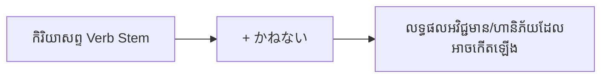

Processing keyword: ～かねない (〜kane nai)
# ចំណុចវេយ្យាករណ៍ជប៉ុន: ～かねない (〜kane nai)
**កម្រិត JLPT:** JLPT N2

## ១. សេចក្តីផ្តើម (Introduction)
នៅក្នុងមេរៀននេះ យើងនឹងសិក្សាអំពីទម្រង់វេយ្យាករណ៍ភាសាជប៉ុនកម្រិត N2 គឺ **～かねない (〜kane nai)**។ ទម្រង់នេះត្រូវបានប្រើប្រាស់ដើម្បីបង្ហាញពីលទ្ធភាព ឬហានិភ័យដែលអាចនឹងកើតឡើងនូវរឿងរ៉ាវមិនល្អ អវិជ្ជមាន ឬគ្រោះថ្នាក់ណាមួយ។ ការយល់ដឹងច្បាស់អំពីរបៀបប្រើ **～かねない** នឹងជួយឱ្យអ្នកអាចបញ្ចេញការព្រួយបារម្ភ និងការព្រមានអំពីផលវិបាកអវិជ្ជមានបានយ៉ាងត្រឹមត្រូវ និងច្បាស់លាស់។

---
## ២. ការពន្យល់វេយ្យាករណ៍ស្នូល (Core Grammar Explanation)
### អត្ថន័យ (Meaning)
**～かねない** មានន័យថា "**អាចនឹង... (បណ្តាលឱ្យកើតរឿងមិនល្អ)**", "**ប្រឈមនឹង...**", ឬ "**ងាយនឹងធ្លាក់ចូលក្នុងសភាព (អវិជ្ជមាន)**"។ វាត្រូវបានប្រើជាពិសេសដើម្បីព្រមាន ព្រួយបារម្ភ ឬវិនិច្ឆ័យផ្អែកលើស្ថានភាពជាក់ស្តែងថា ប្រសិនបើនៅតែបន្តបែបនេះ នោះលទ្ធផលអាក្រក់ ឬគ្រោះថ្នាក់ណាមួយអាចនឹងកើតឡើងយ៉ាងពិតប្រាកដ។

### ទម្រង់ផ្សំ (Structure)
ទម្រង់នៃការប្រើប្រាស់ **～かねない** គឺ៖
```
កិរិយាសព្ទ Verb Stem (ទម្រង់ ます កាត់ ます ចោល) + かねない
```

### តារាងទម្រង់នៃការផ្សំ (Formation Diagram)
| ទម្រង់ដើមនៃកិរិយាសព្ទ | បំប្លែងជា Verb Stem | + かねない | ទម្រង់លទ្ធផល (Resulting Form) |
|-----------------------|---------------------|------------|-------------------------------|
| 読む (អាន)            | 読み (កាត់ ます)     | かねない    | **読みかねない** (អាចនឹងអាន...) |
| 起こす (បង្កឱ្យកើត)    | 起こし (កាត់ ます)   | かねない    | **起こしかねない** (អាចនឹងបង្កឱ្យកើត...) |
| なる (ក្លាយជា)        | なり (កាត់ ます)     | かねない    | **なりかねない** (អាចនឹងក្លាយជា...) |
| 壊れる (ខូច/បាក់បែក)  | 壊れ (កាត់ ます)     | かねない    | **壊れかねない** (អាចនឹងខូច/បែក...) |

### ការពន្យល់លម្អិត (Detailed Explanation)
- **Verb Stem (ទម្រង់គល់នៃកិរិយាសព្ទ)**: ទទួលបានដោយការលុប **-ます** ចេញពីកិរិយាសព្ទទម្រង់ **-ます** (ឧទាហរណ៍៖ **食べます** → **食べ**; **行きます** → **行き**; **します** → **し**; **来ます** → **来 [き]**).
- **～かねない** ត្រូវបានភ្ជាប់ដោយផ្ទាល់ទៅនឹងគល់កិរិយាសព្ទ (Verb Stem)។
- ទម្រង់នេះផ្អែកលើការសន្និដ្ឋានរបស់អ្នកនិយាយថា យោងតាមកាលៈទេសៈ ឬមូលហេតុបច្ចុប្បន្ន ហានិភ័យអវិជ្ជមាននោះមានកម្រិតខ្ពស់ដែលអាចនឹងកើតឡើង។

### គំនូសបំព្រួញលំហូរនៃការប្រើប្រាស់ (Visual Aid: Usage Flowchart)


---
## ៣. ការវិភាគប្រៀបធៀប និង ន័យស៊ីជម្រៅ (Comparative Nuance Analysis)

ដើម្បីប្រើប្រាស់វេយ្យាករណ៍នេះឱ្យបានត្រឹមត្រូវ អ្នកសិក្សាត្រូវបែងចែកឱ្យដាច់រវាង **～かねない**, **～かねる**, និង **～かもしれない**៖

### ក. ～かねない vs. ～かねる (កុំច្រឡំទម្រង់បដិសេធ និងស្រប)
- ថ្វីបើ **かねない** មានកន្ទុយ **ない** (មើលទៅដូចទម្រង់បដិសេធ) ប៉ុន្តែអត្ថន័យជាក់ស្តែងរបស់វាគឺ **ការបញ្ជាក់ស្រប (Affirmative/Possibility)** ថា «អាចនឹងកើតឡើង (រឿងអាក្រក់)»។
- ចំណែក **～かねる** វិញ ថ្វីបើគ្មានកន្ទុយ ない ក៏ដោយ តែន័យរបស់វាគឺ **បដិសេធ (Negative/Inability)** មានន័យថា «មិនអាចធ្វើបាន / ពិបាកនឹងធ្វើបាន» (ដោយសារកត្តាចិត្តសាស្ត្រ សីលធម៌ ឬជំហរការងារ ប្រើច្រើនក្នុងការបដិសេធដោយគួរសមក្នុងធុរកិច្ច)។
  - ឧទាហរណ៍ ～かねる: 私にはわかり**かねます**。(ខ្ញុំពិបាកនឹងយល់/មិនអាចដឹងបានឡើយ។)
  - ឧទាហរណ៍ ～かねない: 秘密が漏れ**かねない**。(ការសម្ងាត់អាចនឹងបែកធ្លាយ។)

### ខ. ～かねない vs. ～かもしれない (លក្ខណៈអវិជ្ជមាន vs ភាពអព្យាក្រឹត)
| លក្ខណៈវិនិច្ឆ័យ | ～かねない (JLPT N2) | ～かもしれない (JLPT N4/N3) |
|-----------------|----------------------|----------------------------|
| **លក្ខណៈនៃលទ្ធផល** | **អវិជ្ជមានសុទ្ធសាធ (១០០%)**: ប្រើតែចំពោះគ្រោះថ្នាក់ ការខូចខាត ការបរាជ័យ ឬរឿងអាក្រក់ប៉ុណ្ណោះ។ | **អព្យាក្រឹត (Neutral)**: អាចប្រើបានទាំងរឿងល្អ រឿងអាក្រក់ និងរឿងទូទៅ។ |
| **ការយល់ឃើញរបស់អ្នកនិយាយ** | សង្កត់ធ្ងន់លើ **ហានិភ័យ និងការព្រមាន** (Risk/Warning) ផ្អែកលើហេតុផលជាក់ស្តែង។ | បង្ហាញត្រឹមតែ **ការទស្សន៍ទាយមិនច្បាស់លាស់** (៥០/៥០)។ |
| **ឧទាហរណ៍រឿងល្អ** | **ខុស:** ❌ 試験に合格しかねない (មិនអាចប្រើជាមួយការប្រឡងជាប់បានទេ) | **ត្រូវ:** ⭕ 試験に合格するかもしれない (ប្រហែលជាអាចប្រឡងជាប់) |
| **ឧទាហរណ៍រឿងអាក្រក់** | **ត្រូវ:** ⭕ 事故を起こしかねない (អាចនឹងបង្កគ្រោះថ្នាក់ - មានហានិភ័យខ្ពស់) | **ត្រូវ:** ⭕ 事故を起こすかもしれない (ប្រហែលជាអាចបង្កគ្រោះថ្នាក់) |

---
## ៤. ឧទាហរណ៍ក្នុងបរិបទ (Examples in Context)

### ប្រយោគគំរូ (Example Sentences)
១. **彼の言い方は誤解を招きかねない。**
   - *Kare no iikata wa gokai o maneki kane nai.*
   - របៀបនិយាយរបស់គាត់អាចនឹងបង្កឱ្យមានការយល់ច្រឡំ។

២. **そんな無責任な態度では、問題が起こりかねない。**
   - *Sonna musekinin na taido de wa, mondai ga okori kane nai.*
   - ជាមួយនឹងអាកប្បកិរិយាគ្មានការទទួលខុសត្រូវបែបនោះ បញ្ហាអាចនឹងកើតឡើងមិនខាន។

៣. **このまま雨が降り続けば、川が氾濫しかねない。**
   - *Kono mama ame ga furitsudzukeba, kawa ga hanran shi kane nai.*
   - ប្រសិនបើភ្លៀងនៅតែបន្តធ្លាក់បែបនេះទៀត ទឹកទន្លេអាចនឹងជន់លិចជាក់ជាមិនខាន។

៤. **あまりお酒を飲むと健康を害しかねない。**
   - *Amari osake o nomu to kenkō o gaishi kane nai.*
   - ប្រសិនបើទទួលទានគ្រឿងស្រវឹងច្រើនជ្រុល អាចនឹងប៉ះពាល់ដល់សុខភាព។

៥. **彼女は怒りを抑えきれず、言い過ぎてしまいかねない。**
   - *Kanojo wa ikari o osae kirezu, iisugite shimai kane nai.*
   - នាងមិនអាចទប់កំហឹងបានឡើយ ហើយអាចនឹងនិយាយជ្រុលពាក្យពេចន៍។

---
## ៥. កំណត់សម្គាល់បែបវប្បធម៌ និងការប្រើប្រាស់ (Cultural Notes)

### កម្រិតគួរសម និងផ្លូវការ (Levels of Politeness and Formality)
- **～かねない** គឺជាកន្សោមពាក្យដែលមានលក្ខណៈកណ្តាល (neutral) អាចប្រើប្រាស់បានទាំងក្នុងកាលៈទេសៈផ្លូវការ និងក្រៅផ្លូវការ។
- ទម្រង់នេះត្រូវបានប្រើប្រាស់យ៉ាងញឹកញាប់នៅក្នុងការសរសេរ របាយការណ៍ព័ត៌មាន ឬសេចក្តីថ្លែងការណ៍ផ្លូវការ ដើម្បីដាស់តឿន និងព្រមានអំពីហានិភ័យដែលអាចកើតមានឡើង។
- នៅពេលចង់ប្រើជាទម្រង់គួរសម (Polite form) យើងបំប្លែងទៅជា **～かねません** (ឧ. 事故になり**かねません** - អាចនឹងក្លាយជាគ្រោះថ្នាក់បាន)។

### បន្សំឃ្លាជាក់លាក់ (Idiomatic Expressions)
- **死にかねない (Shini kane nai)**: អាចនឹងស្លាប់បាន (ប្រើដើម្បីសង្កត់ធ្ងន់លើភាពធ្ងន់ធ្ងរនៃស្ថានភាព ឬគ្រោះថ្នាក់)។
- **忘れかねない (Wasure kane nai)**: អាចនឹងភ្លេច (ប្រើដើម្បីបង្ហាញការព្រួយបារម្ភខ្លាចភ្លេចរឿងសំខាន់ណាមួយ)។

---
## ៦. កំហុសទូទៅ និងគន្លឹះចងចាំ (Common Mistakes and Tips)

### ការវិភាគកំហុស (Error Analysis)
- **កំហុសទី ១**: ប្រើប្រាស់ទម្រង់វចនានុក្រម (Dictionary Form) ជំនួសឱ្យគល់កិរិយាសព្ទ (Verb Stem)។
  - ❌ ខុស: *食べるかねない*
  - ⭕ ត្រូវ: *食べかねない*
- **កំហុសទី ២**: ប្រើ **～かねない** ជាមួយរឿងល្អ ឬរឿងវិជ្ជមាន។
  - ❌ ខុស: *今度の試合で勝ちかねない* (មិនអាចប្រើបានឡើយ ព្រោះការឈ្នះជារឿងល្អ)
  - ⭕ ត្រូវ: *今度の試合で負けかねない* (អាចនឹងចាញ់ - រឿងអវិជ្ជមាន)
  - ⭕ ត្រូវ: *今度の試合で勝つかもしれない* (ប្រហែលជាអាចឈ្នះ - ប្រើ かもしれない)
- **កំហុសទី ៣**: ច្រឡំរវាង **～かねない** (អាចកើតឡើង) និង **～かねる** (មិនអាចធ្វើបាន)។

### វិធីសាស្ត្រ និងគន្លឹះចងចាំ (Learning Strategies)
- **គន្លឹះចងចាំ**: ចូរគិតថា «かね» មកពីពាក្យបដិសេធ ប៉ុន្តែនៅពេលបូកជាមួយ «ない» (បដិសេធ ២ ដង = ស្រប) មានន័យថា "មិនអាចនិយាយបានថាមិនកើតឡើងនោះទេ" ពោលគឺ **វាអាចនឹងកើតឡើងយ៉ាងពិតប្រាកដនូវរឿងអាក្រក់នោះ**។
- ស្រមៃមើលសញ្ញាព្រមានពណ៌លឿង ឬក្រហម ⚠️ រាល់ពេលដែលជួប **～かねない** ព្រោះវាជាសញ្ញាព្រមានអំពីគ្រោះថ្នាក់ ឬផលវិបាកអាក្រក់ជានិច្ច!

---
## ៧. សេចក្តីសង្ខេប និងការរំលឹកឡើងវិញ (Summary and Review)

### ចំណុចគន្លឹះសំខាន់ៗ (Key Takeaways)
- **～かねない** ប្រើសម្រាប់បង្ហាញពីលទ្ធភាពដែលរឿងរ៉ាវ **អវិជ្ជមាន ឬគ្រោះថ្នាក់** អាចនឹងកើតឡើង។
- ផ្សំឡើងដោយយក **កិរិយាសព្ទ Verb Stem + かねない**។
- មានន័យបង្កប់ថា ស្ថិតក្រោមលក្ខខណ្ឌ ឬកាលៈទេសៈបច្ចុប្បន្ន ហានិភ័យអាក្រក់នោះមានកម្រិតខ្ពស់។
- ខុសពី **～かもしれない** ត្រង់ថា **～かねない** ប្រើតែជាមួយលទ្ធផលអាក្រក់/អវិជ្ជមានប៉ុណ្ណោះ។

### សំណួររំលឹកមេរៀនរហ័ស (Quick Recap Quiz)
១. តើបំប្លែងកិរិយាសព្ទ **書く (សរសេរ)** ជាមួយ **～かねない** យ៉ាងដូចម្តេច?
   - **ចម្លើយ**: 書きかねない (kaki kane nai)
២. តើន័យស៊ីជម្រៅចម្បងរបស់ **～かねない** គឺជាអ្វី?
   - **ចម្លើយ**: បង្ហាញពីលទ្ធភាព ឬហានិភ័យដែលអាចនឹងកើតឡើងនូវរឿងរ៉ាវមិនល្អ ឬគ្រោះថ្នាក់ (អវិជ្ជមាន)។
៣. ចូរបកប្រែប្រយោគនេះជាភាសាខ្មែរ: そんなことを言うと、彼を怒らせかねない。
   - **ចម្លើយ**: ប្រសិនបើឯងនិយាយរឿងបែបនោះ អាចនឹងធ្វើឱ្យគាត់ខឹងមិនខាន។

---
តាមរយៈការក្តាប់បានច្បាស់នូវទម្រង់ **～かねない** អ្នកនឹងអាចបញ្ចេញការព្រួយបារម្ភអំពីផលវិបាកអវិជ្ជមាននៅក្នុងភាសាជប៉ុនប្រកបដោយប្រសិទ្ធភាព និងបង្កើនសមត្ថភាពទំនាក់ទំនងទាំងការនិយាយ និងការសរសេរ។

---

© [Hanabira.org](https://hanabira.org)
