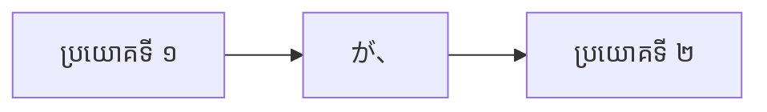

Processing keyword: ～が、～ (〜ga, 〜)
# ចំណុចវេយ្យាករណ៍ជប៉ុន: ～が、～ (〜ga, 〜)
**កម្រិត JLPT:** JLPT N5

## ១. សេចក្តីផ្តើម (Introduction)
នៅក្នុងមេរៀននេះ យើងនឹងស្វែងយល់អំពីចំណុចវេយ្យាករណ៍ភាសាជប៉ុន **～が、～ (〜ga, 〜)**។ ទម្រង់នេះត្រូវបានប្រើប្រាស់ដើម្បីភ្ជាប់ប្រយោគតូចពីរ (clauses) ចូលគ្នា ដោយភាគច្រើនប្រើសម្រាប់បង្ហាញអំពីទំនាស់/ភាពផ្ទុយគ្នា (contrast) ឬក៏បង្ហាញព័ត៌មានបន្ថែម ដែលជួនកាលជាព័ត៌មានដែលមិនបានរំពឹងទុកជាមុន។ ការចេះប្រើប្រាស់ទម្រង់វេយ្យាករណ៍នេះយ៉ាងស្ទាត់ជំនាញ នឹងជួយឱ្យអ្នកបង្កើតប្រយោគកាន់តែវែង មានភាពស៊ីជម្រៅ និងអាចបង្ហាញគំនិតប្រកបដោយភាពទន់ភ្លន់ និងកម្រិតសមរម្យក្នុងភាសាជប៉ុន។

## ២. ការពន្យល់វេយ្យាករណ៍ស្នូល (Core Grammar Explanation)
### អត្ថន័យ (Meaning)
ឈ្នាប់ **が** បំពេញមុខងារជាឈ្នាប់ភ្ជាប់ប្រយោគ (conjunction) មានន័យថា **«ប៉ុន្តែ»**, **«ក៏ប៉ុន្តែ»** ឬ **«ទោះបីជា...ក៏ដោយ»** នៅពេលប្រើសម្រាប់ភ្ជាប់ប្រយោគតូចពីរ។ វាបញ្ជាក់ថាប្រយោគទីពីរមានន័យផ្ទុយ ឬបន្ថែមព័ត៌មានទៅលើប្រយោគទីមួយ។ ក្រៅពីនេះ វាក៏ត្រូវបានប្រើជាពាក្យបន្ទន់សម្លេង ឬអារម្ភកថា (buffer/cushion) មុននឹងស្នើសុំ ឬសួរសំណួរផងដែរ។

### ទម្រង់វេយ្យាករណ៍ (Structure)
**[ប្រយោគទី ១]** + **が、** + **[ប្រយោគទី ២]**
- **ប្រយោគទី ១**: ប្រយោគថ្លែង ឬប្រយោគបញ្ជាក់ណាមួយ (អាចបញ្ចប់ដោយទម្រង់ធម្មតា Plain Form ឬទម្រង់គួរសម Polite Form です/ます)។
- **が、**: ឈ្នាប់ភាសាជប៉ុន មានន័យថា «ប៉ុន្តែ / ក៏ប៉ុន្តែ»។
- **ប្រយោគទី ២**: ប្រយោគដែលបង្ហាញអត្ថន័យផ្ទុយ ឬបន្ថែមលើប្រយោគទី ១។

#### គំនូសបំព្រួញទម្រង់ (Formation Diagram)

### តារាងរចនាសម្ព័ន្ធរូបវន្ត (Visual Aid: Structure Table)
| ធាតុផ្សំ | តួនាទី | ឧទាហរណ៍ |
|-------------|-------------------------|-------------------------|
| ប្រយោគទី ១ (Clause 1) | សេចក្តីថ្លែងដំបូង | この本は面白い (សៀវភៅនេះល្អមើល/គួរឱ្យចាប់អារម្មណ៍) |
| が、 | ឈ្នាប់ (ប៉ុន្តែ/ក៏ប៉ុន្តែ) | が、 |
| ប្រយោគទី ២ (Clause 2) | សេចក្តីផ្ទុយ ឬបន្ថែម | 高いです (ថ្លៃ) |

**ប្រយោគពេញលេញ:** この本は面白い**が、**高いです。  
**អត្ថន័យជាភាសាខ្មែរ:** សៀវភៅនេះល្អមើល/គួរឱ្យចាប់អារម្មណ៍ **ប៉ុន្តែ**ថ្លៃ។

---

## ៣. ការវិភាគប្រៀបធៀប និង ន័យស៊ីជម្រៅ (Deep Nuance & Comparative Analysis)

ឈ្នាប់ **～が、～** នៅក្នុងភាសាជប៉ុនមានមុខងារសំខាន់ ២ យ៉ាង និងមានភាពខុសប្លែកគ្នាពីឈ្នាប់ផ្ទុយដទៃទៀតដូចខាងក្រោម៖

### ១. មុខងារស្នូលទាំងពីររបស់ ～が、～
1. **ការបង្ហាញអត្ថន័យផ្ទុយ (Contrastive "But / However"):**
   - ប្រើសម្រាប់ភ្ជាប់គំនិតពីរដែលផ្ទុយគ្នាស្រឡះ ឬមានលទ្ធផលខុសពីការរំពឹងទុក។
   - ឧទាហរណ៍៖ 日本語は難しい**が**、面白いです。(ភាសាជប៉ុនពិបាក **ប៉ុន្តែ**គួរឱ្យចាប់អារម្មណ៍។)
2. **ការប្រើជាពាក្យបន្ទន់សម្លេង និងអារម្ភកថា (Preliminary Softener / Buffer):**
   - មិនមែនបង្ហាញអត្ថន័យផ្ទុយជានិច្ចនោះទេ ប៉ុន្តែប្រើសម្រាប់បើកផ្លូវ បន្ទន់សំដី (cushion word) មុននឹងសុំជំនួយ សួរសំណួរ ឬបង្ហាញការស្នើសុំ ដើម្បីកុំឱ្យសម្តីស្តាប់ទៅរឹងកំព្រឹស ឬទាមទារពេក។
   - ឧទាហរណ៍៖ すみません**が**、ちょっと教えてください。(សូមអភ័យទោស **ប៉ុន្តែ**ជួយប្រាប់បន្តិចបានទេ?) ឬ 申し訳ありません**が**、...(ពិតជាមានការសោកស្តាយ/សុំទោសជាខ្លាំង ប៉ុន្តែ...)។

### ២. ការប្រៀបធៀបរវាង が, けど, でも និង しかし
| ឈ្នាប់ | កម្រិតគួរសម/ផ្លូវការ | ទីតាំង និងការប្រើប្រាស់ | បរិបទសមស្រប |
| :--- | :--- | :--- | :--- |
| **～が、～** | គួរសម / ផ្លូវការកម្រិតមធ្យមទៅខ្ពស់ | នៅកណ្តាលប្រយោគ (ភ្ជាប់ប្រយោគតូចពីរក្នុងប្រយោគតែមួយ) | ការសន្ទនាគួរសម ជំនួញ ការសរសេរផ្លូវការ និងការនិយាយជាសាធារណៈ |
| **～けど / けれども** | ស្និទ្ធស្នាល / និយាយក្រៅផ្លូវការ | នៅកណ្តាលប្រយោគ (ដូច が ដែរ) | ការសន្ទនាប្រចាំថ្ងៃជាមួយមិត្តភក្តិ ឬមនុស្សស្និទ្ធស្នាល (けど ក្រៅផ្លូវការបំផុត, けれども សុភាពជាង) |
| **でも** | សន្ទនាទូទៅ / ក្រៅផ្លូវការ | ឈរនៅដើមប្រយោគទីពីរ (ត្រូវផ្តាច់ប្រយោគ) | ការសន្ទនាប្រចាំថ្ងៃ មិនប្រើក្នុងការសរសេរផ្លូវការខ្លាំងឡើយ |
| **しかし** | ផ្លូវការខ្លាំង (Formal / Written) | ឈរនៅដើមប្រយោគទីពីរ | អត្ថបទសរសេរ សារព័ត៌មាន សុន្ទរកថាផ្លូវការ បង្ហាញភាពផ្ទុយគ្នាយ៉ាងច្បាស់ |

**ការប្រៀបធៀបជាក់ស្តែង:**
- **が (ភ្ជាប់ក្នុងប្រយោគមួយ):** この本は面白いです**が**、高いです。 (សៀវភៅនេះល្អមើល ប៉ុន្តែថ្លៃ - សុភាព រលូន)
- **けど (ស្និទ្ធស្នាល):** この本、面白い**けど**、高いね。 (សៀវភៅនេះល្អមើលមែន តែថ្លៃណាស់ណ៎ - និយាយលេងជាមួយមិត្តភក្តិ)
- **でも (ផ្តាច់ប្រយោគ):** この本は面白いです。**でも**、高いです。 (សៀវភៅនេះល្អមើល។ ប៉ុន្តែ ថ្លៃ។)
- **しかし (ផ្លូវការខ្លាំង/សរសេរ):** この本は面白いです。**しかし**、高いです。 (សៀវភៅនេះល្អមើល។ ទោះជាយ៉ាងណាក៏ដោយ ក៏វាមានតម្លៃថ្លៃដែរ។)

---

## ៤. ឧទាហរណ៍ក្នុងបរិបទជាក់ស្តែង (Examples in Context)

### ឧទាហរណ៍ទី ១: បរិបទផ្លូវការក្នុងការសរសេរ (Formal Written Context)
- **ប្រយោគ:** 日本語は難しい**が、**とても面白いです。
- **រ៉ូម៉ាជី:** Nihongo wa muzukashii **ga,** totemo omoshiroi desu.
- **ប្រែជាខ្មែរ:** ភាសាជប៉ុនពិបាក **ប៉ុន្តែ**ពិតជាគួរឱ្យចាប់អារម្មណ៍ខ្លាំងណាស់។

### ឧទាហរណ៍ទី ២: ការសន្ទនាបែបគួរសម (Polite Conversation - ប្រើជាពាក្យបន្ទន់សម្លេង)
- **ប្រយោគ:** すみません**が、**塩を取ってください。
- **រ៉ូម៉ាជី:** Sumimasen **ga,** shio o totte kudasai.
- **ប្រែជាខ្មែរ:** សូមអភ័យទោស **ប៉ុន្តែ**សូមជួយហុចអំបិលឱ្យខ្ញុំបន្តិចបានទេ?

### ឧទាហរណ៍ទី ៣: ការបង្ហាញភាពផ្ទុយគ្នា (Expressing Contrast)
- **ប្រយោគ:** 映画を見たい**が、**時間がありません。
- **រ៉ូម៉ាជី:** Eiga o mitai **ga,** jikan ga arimasen.
- **ប្រែជាខ្មែរ:** ខ្ញុំចង់មើលកុន/ភាពយន្ត **ប៉ុន្តែ**ខ្ញុំគ្មានពេលទេ។

### ឧទាហរណ៍ទី ៤: ការបន្ថែមព័ត៌មានដែលមិនបានរំពឹងទុក (Adding Unexpected Information)
- **ប្រយោគ:** 彼は若い**が、**経験があります。
- **រ៉ូម៉ាជី:** Kare wa wakai **ga,** keiken ga arimasu.
- **ប្រែជាខ្មែរ:** គាត់នៅក្មេង **ប៉ុន្តែ**គាត់មានបទពិសោធន៍។

### ឧទាហរណ៍ទី ៥: បរិបទនិយាយទូទៅ (Casual Spoken Context)
- **ប្រយោគ:** 天気はいい**が、**寒いです。
- **រ៉ូម៉ាជី:** Tenki wa ii **ga,** samui desu.
- **ប្រែជាខ្មែរ:** អាកាសធាតុល្អ **ប៉ុន្តែ**ត្រជាក់។

---

## ៥. កំណត់សម្គាល់វប្បធម៌ (Cultural Notes)
### ទំនាក់ទំនងវប្បធម៌ (Cultural Relevance)
នៅក្នុងការប្រាស្រ័យទាក់ទងរបស់ជនជាតិជប៉ុន ភាពមិននិយាយចំៗ (indirectness) និងភាពគួរសម (politeness) ត្រូវបានផ្តល់តម្លៃខ្ពស់បំផុត (ដើម្បីរក្សាសុខដុមនីយកម្ម ឬ 和 - Wa)។ ការប្រើប្រាស់ **が** អនុញ្ញាតឱ្យអ្នកនិយាយអាចបង្ហាញគំនិតដែលផ្ទុយគ្នា ឬបដិសេធសំណើដោយមិនស្តាប់ទៅកំបុតកំបុយ ឬគ្មានសុជីវធម៌។ វាជួយបន្ទន់សំដី និងបង្ហាញការគោរពចំពោះអារម្មណ៍របស់អ្នកស្តាប់។

### កម្រិតគួរសម និងផ្លូវការ (Levels of Politeness and Formality)
- **が、** ត្រូវបានចាត់ទុកថាជាទម្រង់គួរសម និងស័ក្តិសមសម្រាប់ទាំងកាលៈទេសៈផ្លូវការ និងពាក់កណ្តាលផ្លូវការ។
- វាមានលក្ខណៈផ្លូវការជាង **けど** ដូច្នេះវាស័ក្តិសមបំផុតក្នុងការប្រើប្រាស់ក្នុងបរិយាកាសការងារ ជំនួញ ឬនៅពេលនិយាយទៅកាន់អ្នកដែលមានឋានៈខ្ពស់ជាង។

### កន្សោមពាក្យទម្លាប់និយម (Idiomatic Expressions)
- **申し訳ありませんが、** (Mōshiwake arimasen ga,): «ពិតជាមានការសោកស្តាយ/សុំទោសជាខ្លាំង ប៉ុន្តែ...»
- **残念ですが、** (Zannen desu ga,): «ពិតជាគួរឱ្យសោកស្តាយណាស់ ប៉ុន្តែ...»  
កន្សោមពាក្យទាំងនេះច្រើនប្រើដើម្បីបដិសេធការបបួល ឬការស្នើសុំប្រកបដោយសុជីវធម៌ ឬប្រើដើម្បីថ្លែងប្រាប់ដំណឹងមិនល្អ។

---

## ៦. កំហុសទូទៅ និងគន្លឹះសំខាន់ៗ (Common Mistakes and Tips)
### ការវិភាគកំហុស (Error Analysis)
**កំហុសទី ១: ច្រឡំរវាង が (ឈ្នាប់ចង្អុលប្រធាន) ជាមួយ が、 (ឈ្នាប់ភ្ជាប់ប្រយោគ)**
- **ឧទាហរណ៍ឈ្នាប់ចង្អុលប្រធាន:** 私**が**行きます。 (ខ្ញុំជាអ្នកទៅ។) -> នៅទីនេះ が បញ្ជាក់ថា «ខ្ញុំ» ជាប្រធាននៃអំពើ។
- **ឧទាហរណ៍ឈ្នាប់ភ្ជាប់ប្រយោគ:** 行きたい**が、**忙しいです。 (ខ្ញុំចង់ទៅ **ប៉ុន្តែ**ខ្ញុំរវល់។) -> នៅទីនេះ が ភ្ជាប់ប្រយោគពីរ។
- **គន្លឹះ:** នៅពេលដែល **が** ឈរនៅចន្លោះប្រយោគពីរ (ហើយច្រើនតែមានសញ្ញាក្បៀស «、» នៅពីក្រោយ) វាដំណើរការជាឈ្នាប់ភ្ជាប់ប្រយោគដែលមានន័យថា «ប៉ុន្តែ»។

**កំហុសទី ២: ប្រើ が、 ច្រើនពេកក្នុងការសន្ទនាក្រៅផ្លូវការជាមួយមិត្តភក្តិ**
- នៅក្នុងការសន្ទនាស្និទ្ធស្នាលប្រចាំថ្ងៃ ការប្រើ **が、** អាចស្តាប់ទៅរាងរឹង ឬផ្លូវការពេក។ ការប្រើ **けど** ឬ **けれど** គឺមានលក្ខណៈធម្មជាតិជាង។
- **ឧទាហរណ៍:** 映画を見たい**けど、**お金がない。 (ចង់មើលកុនដែរ តែគ្មានលុយសោះ។)

### យុទ្ធសាស្ត្ររៀនសូត្រ (Learning Strategies)
- **ហ្វឹកហាត់ភ្ជាប់ប្រយោគ:** សាកល្បងសរសេរប្រយោគដោយប្រើ **が、** ដើម្បីភ្ជាប់គំនិតពីរដែលផ្ទុយគ្នា។
- **ការដើរតួសន្ទនា (Role-Playing):** អនុវត្តការសន្ទនាក្នុងស្ថានភាពដែលអ្នកត្រូវបដិសេធការបបួលដោយគួរសម ឬការសុំជំនួយពីអ្នកដទៃ។
- **ការស្តាប់ជាក់ស្តែង:** ស្តាប់ព័ត៌មាន ឬសុន្ទរកថាផ្លូវការ ដើម្បីយល់ដឹងពីរបៀបដែលជនជាតិជប៉ុនប្រើ **が、** តាមបែបធម្មជាតិ។

---

## ៧. សង្ខេប និងរំលឹកឡើងវិញ (Summary and Review)
### ចំណុចគន្លឹះសំខាន់ៗ (Key Takeaways)
- **が、** ត្រូវបានប្រើជាឈ្នាប់ភ្ជាប់ប្រយោគ មានន័យថា «ប៉ុន្តែ» ឬ «ក៏ប៉ុន្តែ»។
- វាភ្ជាប់ប្រយោគតូចពីរ ដោយប្រយោគទីពីរមានន័យផ្ទុយ ឬបន្ថែមលើប្រយោគទីមួយ។
- វាអាចប្រើជាពាក្យបន្ទន់សម្លេង ឬបើកផ្លូវ (Buffer) ក្នុងសំណើ ឬការសួរសុជីវធម៌ (ឧ. すみませんが、...)។
- វាមានលក្ខណៈគួរសម និងសមស្របសម្រាប់កាលៈទេសៈផ្លូវការ។
- ត្រូវប្រុងប្រយ័ត្នជ្រើសរើសឈ្នាប់ឱ្យត្រូវតាមបរិបទ និងកម្រិតស្និទ្ធស្នាល (**が、**, **でも**, **けど** ឬ **しかし**)។

### កម្រងសំណួររំលឹកឡើងវិញ (Quick Recap Quiz)
១. តើ **が、** មានន័យដូចម្តេចនៅពេលប្រើសម្រាប់ភ្ជាប់ប្រយោគពីរ?  
២. តើ **が、** មានលក្ខណៈផ្លូវការជាង ឬស្និទ្ធស្នាល/ធម្មតាជាង បើធៀបនឹង **けど**?  
៣. ចូរភ្ជាប់ប្រយោគទាំងពីរខាងក្រោមនេះចូលគ្នាដោយប្រើ **が、**៖  
   - **ប្រយោគទី ១:** 明日は休みです。 (ថ្ងៃស្អែកជាថ្ងៃឈប់សម្រាក។)  
   - **ប្រយោគទី ២:** 私は仕事をします。 (ខ្ញុំត្រូវធ្វើការ។)

### ចម្លើយ (Answers)
១. វាមានន័យថា «ប៉ុន្តែ» ឬ «ក៏ប៉ុន្តែ» ដែលភ្ជាប់ប្រយោគពីរមានន័យផ្ទុយគ្នា ឬប្រើសម្រាប់បន្ទន់សម្លេង។  
២. មានលក្ខណៈផ្លូវការ និងគួរសមជាង (More formal/polite)។  
៣. 明日は休みです**が、**私は仕事をします。 (ថ្ងៃស្អែកជាថ្ងៃឈប់សម្រាក **ប៉ុន្តែ**ខ្ញុំត្រូវធ្វើការ។)

---
តាមរយៈការយល់ដឹង និងការអនុវត្តប្រើប្រាស់ **～が、～ (〜ga, 〜)** អ្នកនឹងអាចបង្កើនសមត្ថភាពក្នុងការបញ្ចេញគំនិតដ៏ស្មុគស្មាញប្រកបដោយភាពទន់ភ្លន់ គួរសម និងមានប្រសិទ្ធភាពក្នុងភាសាជប៉ុន។

---

© [Hanabira.org](https://hanabira.org)
