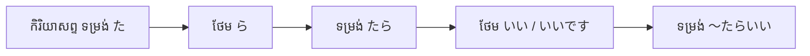

# ចំណុចវេយ្យាករណ៍ជប៉ុន៖ ～たらいい (〜tara ii)
**កម្រិត JLPT:** JLPT N4

---

## ១. សេចក្តីផ្តើម (Introduction)

ទម្រង់វេយ្យាករណ៍ **～たらいい (〜tara ii)** គឺជាទម្រង់ដ៏មានប្រយោជន៍ និងប្រើប្រាស់ញឹកញាប់ក្នុងភាសាជប៉ុន សម្រាប់ផ្តល់ដំបូន្មាន ធ្វើការណែនាំ ស្នើសុំយោបល់ ឬបង្ហាញពីក្តីសង្ឃឹម និងបំណងប្រាថ្នា។ វាមានន័យស្មើនឹង «...ទៅល្អហើយ / បើ...ល្អហើយ / គួរតែ...»។ ទម្រង់នេះជួយឱ្យអ្នកនិយាយផ្តល់ការណែនាំ ឬសុំដំបូន្មានប្រកបដោយភាពគួរសម និងមិនបង្ខិតបង្ខំ ដែលឆ្លុះបញ្ចាំងពីវប្បធម៌ជប៉ុនក្នុងការប្រាស្រ័យទាក់ទងបែបយោគយល់ និងទន់ភ្លន់។

---

## ២. ពន្យល់វេយ្យាករណ៍គោល (Core Grammar Explanation)

### អត្ថន័យ និងការប្រើប្រាស់ (Meaning and Usage)

1. **ផ្តល់ដំបូន្មាន ឬការណែនាំ (Giving Advice / Suggestions):** ណែនាំនូវទង្វើមួយដែលភាគីម្ខាងទៀតគួរតែធ្វើ («បើធ្វើបែបនេះទៅ ល្អហើយ / គួរតែធ្វើ...»)។
2. **សុំដំបូន្មាន ឬការណែនាំ (Asking for Advice / Instructions):** ប្រើជាទម្រង់សំណួរដូចជា `どうしたらいいですか` (តើខ្ញុំគួរធ្វើបែបណាទៅ?) ដើម្បីសុំការចង្អុលបង្ហាញពីអ្នកដទៃ។
3. **បង្ហាញក្តីសង្ឃឹម ឬបំណងប្រាថ្នា (Expressing Wishes / Hopes):** បង្ហាញពីបំណងចង់ឱ្យស្ថានភាពណាមួយកើតឡើង ដូចជា `〜たらいいな` ឬ `〜たらいいですね` («សង្ឃឹមថា... / ប្រសិនបើ...ប្រហែលជាល្អណាស់»)។

### ទម្រង់កម្រង (Formation)

ដើម្បីបង្កើតប្រយោគជាមួយ **～たらいい** សូមអនុវត្តតាមជំហានខាងក្រោម៖
1. បំប្លែងកិរិយាសព្ទទៅជា **ទម្រង់អតីតកាល (た形 / た-form)**។
2. បន្ថែម **ら** ដើម្បីបង្កើតជាទម្រង់លក្ខខណ្ឌ (たら形 / たら-form)។
3. បន្ថែម **いい** ឬ **いいです** នៅខាងចុង។

#### តារាងទម្រង់ (Structure)

| ធាតុផ្សំ | របៀបបំប្លែង | ឧទាហរណ៍ជាមួយ 見る (មើល) |
|---|---|---|
| កិរិយាសព្ទ (た形) | 見た | 見た |
| + ら (ទម្រង់ たら) | 見たら | 見たら |
| + いい / いいです | 見たらいい (です) | 見たらいい (です) |

#### ឧទាហរណ៍
- **映画を見たらいい。 / 映画を見たらいいですよ。**
  - *Eiga o mitara ii. / Eiga o mitara ii desu yo.*
  - អ្នកគួរតែមើលកុនទៅ (បើមើលកុនទៅល្អហើយ)។

### ដ្យាក្រាមដំណើរការ (Visual Diagram)

---

## ៣. ការវិភាគប្រៀបធៀប និង ន័យស៊ីជម្រៅ (Nuance & Comparative Analysis)

ក្នុងកម្រិត JLPT N4 ទម្រង់សម្តែងដំបូន្មាន ឬបំណងប្រាថ្នាមានទម្រង់ស្រដៀងគ្នាបីគឺ៖ **〜たらいい**, **〜ばいい**, និង **〜といい**។ ខាងក្រោមនេះជាការវិភាគស៊ីជម្រៅលើលក្ខណៈខុសប្លែកគ្នារវាងទម្រង់ទាំងនេះ៖

### ក. ការសុំដំបូន្មាន (Asking for Advice): どうしたらいいですか vs. どうすればいいですか

| ទម្រង់ | កម្រិតគួរសម និងបរិបទប្រើប្រាស់ | លក្ខណៈពិសេស |
|---|---|---|
| **どうしたらいいですか** (〜たらいい) | ការសន្ទនាប្រចាំថ្ងៃទូទៅ ស្និទ្ធស្នាល និងធម្មជាតិបំផុត | ជាទម្រង់ដែលជនជាតិជប៉ុននិយមប្រើក្នុងការនិយាយផ្ទាល់មាត់ច្រើនជាងគេពេលជួបបញ្ហាជាក់ស្តែង ហើយត្រូវការដោះស្រាយភ្លាមៗ។ |
| **どうすればいいですか** (〜ばいい) | គួរសម មានលក្ខណៈឡូជីខល និងផ្លូវការបន្តិច | ផ្តោតលើលក្ខខណ្ឌ និងដំណោះស្រាយតាមបែបហេតុផល (Logic/Pragmatic)។ អាចប្រើទាំងក្នុងការនិយាយ និងការសរសេរ។ |

### ខ. ការផ្តល់ការណែនាំ / ដំបូន្មាន (Giving Advice)

- **〜たらいい (〜たらいいですよ):**
  - បរិបទ៖ ផ្តល់យោបល់បែបសាមញ្ញ ស្រាលស្រទន់ មិនដាក់សម្ពាធលើអ្នកស្តាប់ឡើយ។ សមស្របបំផុតក្នុងការសន្ទនាប្រចាំថ្ងៃ។
  - *ឧទាហរណ៍៖* 薬を飲んだらいいですよ (គួរតែលេបថ្នាំទៅល្អជាង / បើលេបថ្នាំទៅល្អហើយ)។
- **〜ばいい (〜ばいいですよ):**
  - បរិបទ៖ បង្ហាញពីដំណោះស្រាយបែបលក្ខខណ្ឌចាំបាច់ («ឱ្យតែធ្វើបែបនេះ គឺគ្រប់គ្រាន់/រួចរាល់ហើយ»)។ ជួនកាលប្រសិនបើប្រើជាមួយអ្នកធំ ឬមិនប្រយ័ត្ន អាចស្តាប់ទៅរាងស្ទើរតែដូចបង្គាប់ ឬចាត់ទុកបញ្ហានោះថាងាយស្រួលពេក។
- **〜といい (〜といいですよ):**
  - បរិបទ៖ បង្ហាញពីលទ្ធផលល្អដែលនឹងកើតឡើងតាមបែបធម្មជាតិ ប្រសិនបើធ្វើសកម្មភាពនោះ។ មិនសូវប្រើសម្រាប់សុំដំបូន្មានផ្ទាល់ខ្លួនដូច `どうしたらいい` ឡើយ។

### គ. ការបង្ហាញក្តីសង្ឃឹម ឬបំណងប្រាថ្នា (Expressing Wishes/Hopes)

នៅពេលភ្ជាប់ជាមួយពាក្យបញ្ជាក់អារម្មណ៍ខាងចុង (終助詞) ដូចជា **な**, **ね**, ឬ **のに**៖
- **〜たらいいな / 〜たらいいですね:**
  - បង្ហាញពីក្តីប្រាថ្នាផ្ទាល់ខ្លួន ឬជូនពរអ្នកដទៃ («សង្ឃឹមថា... / បើ...គឺពិតជាល្អណាស់»)។
  - *ឧទាហរណ៍៖* 明日、晴れたらいいな (សង្ឃឹមថាថ្ងៃស្អែកមេឃស្រឡះទៅចុះ!)។
- **〜たらいいのに:**
  - បង្ហាញពីការសោកស្តាយ ឬការទោមនស្សចំពោះការពិតដែលផ្ទុយពីបំណង («គួរតែ...ល្អហើយ តែការពិតមិនដូច្នោះសោះ»)។
  - *ឧទាហរណ៍៖* 雨が止んだらいいのに (គួរតែរាំងភ្លៀងល្អហើយ តែនៅតែបន្តធ្លាក់ទៀត)។
- **ការប្រៀបធៀបជាមួយ 〜といいな:**
  - `〜といいな / 〜といいですね` ផ្តោតលើព្រឹត្តិការណ៍ធម្មជាតិ ឬរឿងដែលស្ថិតក្រៅការគ្រប់គ្រងរបស់អ្នកនិយាយច្រើនជាង ខណៈដែល `〜たらいいな` អាចប្រើបានយ៉ាងទូលំទូលាយទាំងរឿងផ្ទាល់ខ្លួន និងរឿងធម្មជាតិ។

---

## ៤. ឧទាហរណ៍ក្នុងបរិបទជាក់ស្តែង (Examples in Context)

### ការផ្តល់ដំបូន្មាន (Giving Advice)
1. **日本語を練習したらいいですよ。**
   - *Nihongo o renshuu shitara ii desu yo.*
   - អ្នកគួរតែហាត់រៀនភាសាជប៉ុនទៅល្អហើយ។
2. **疲れているなら、早く寝たらいい。**
   - *Tsukarete iru nara, hayaku netara ii.*
   - បើសិនជាអស់កម្លាំង គួរតែឆាប់ចូលគេងទៅល្អជាង។

### ការធ្វើការណែនាំ ឬស្នើយោបល់ (Making Suggestions)
1. **このレストランに行ったらいいんじゃない？**
   - *Kono resutoran ni ittara iin janai?*
   - តើយើងទៅញ៉ាំអាហារនៅហាងនេះមិនល្អទេអី? (ម៉េចមិនទៅហាងនេះ?)
2. **時間があるとき、美術館を訪ねたらいいと思います。**
   - *Jikan ga aru toki, bijutsukan o tazunetara ii to omoimasu.*
   - នៅពេលមានពេលទំនេរ ខ្ញុំគិតថាអ្នកគួរតែទៅទស្សនាសារមន្ទីរសិល្បៈទៅល្អហើយ។

### ការបង្ហាញក្តីសង្ឃឹម និងការសោកស្តាយ (Expressing Wishes & Regrets)
1. **雨が止んだらいいのに。**
   - *Ame ga yandara ii noni.*
   - សង្ឃឹមថាភ្លៀងរាំងទៅល្អហើយ (គួរឱ្យស្តាយដែលភ្លៀងនៅតែធ្លាក់)។
2. **試験に合格したらいいな。**
   - *Shiken ni goukaku shitara ii na.*
   - សង្ឃឹមថាខ្ញុំនឹងប្រឡងជាប់ទៅចុះ!

### ការសុំយោបល់ ឬដំបូន្មាន (Asking for Advice)
1. **どのパソコンを買ったらいいですか。**
   - *Dono pasokon o kattara ii desu ka.*
   - តើខ្ញុំគួរតែទិញកុំព្យូទ័រមួយណាទៅល្អ?
2. **次は何をしたらいい？**
   - *Tsugi wa nani o shitara ii?*
   - បន្ទាប់មកទៀត តើខ្ញុំគួរធ្វើអ្វីទៅ?

---

## ៥. កំណត់សម្គាល់វប្បធម៌ និងកម្រិតគួរសម (Cultural Notes)

### ភាពគួរសម និងក្រមសីលធម៌សង្គម (Politeness and Social Norms)
នៅក្នុងវប្បធម៌ជប៉ុន ការប្រាស្រ័យទាក់ទងដោយប្រយោលត្រូវបានផ្តល់តម្លៃខ្ពស់ ដើម្បីរក្សាសុខដុមរមនា (和 - *wa*) និងបង្ហាញការគោរពចំពោះអ្នកដទៃ។ ការប្រើប្រាស់ **～たらいい** ជួយបន្ទន់ពាក្យណែនាំ ធ្វើឱ្យវាមិនស្តាប់ទៅដូចជាការបញ្ជា ឬដាក់សម្ពាធ តែជាការផ្តល់ជម្រើសដ៏កក់ក្តៅ និងគិតគូរដល់ដៃគូសន្ទនា។

### កម្រិតនៃការប្រើប្រាស់ (Levels of Formality)
- **ការសន្ទនាស្និទ្ធស្នាល (Casual Speech):** ប្រើជាមួយមិត្តភក្តិ ឬមនុស្សស្មើគ្នា ដោយមិនចាំបាច់ប្រើទម្រង់គួរសម។
  - ឧទាហរណ៍៖ **遊びに来たらいいよ。** (*Asobi ni kitara ii yo.* - ទំនេរមកលេងមក!)
- **ការសន្ទនាគួរសម (Polite Speech):** បន្ថែម **です** ឬ **ですよ** នៅចុងបញ្ចប់ ដើម្បីបង្កើនភាពគួរសមសមរម្យ។
  - ឧទាហរណ៍៖ **先生に相談したらいいですよ。** (*Sensei ni soudan shitara ii desu yo.* - អ្នកគួរតែពិភាក្សាជាមួយលោកគ្រូទៅល្អហើយ។)
- **ចំណាំចំពោះអ្នកមានឋានៈខ្ពស់ជាង:** បើចង់ណែនាំអ្នកមានឋានៈខ្ពស់ជាង (ចៅហ្វាយនាយ គ្រូបង្រៀន) មិនគួរប្រើ `〜たらいいですよ` ផ្ទាល់ឡើយ ព្រោះនៅតែបង្កប់ន័យថាខ្លួនកំពុងប្រាប់គេឱ្យធ្វើអ្វីមួយ។ គួរប្រើទម្រង់គួរសមខ្ពស់ដូចជា `〜てはいかがでしょうか` ឬ `〜なさるとよろしいかと存じます` ជំនួសវិញ។

### កន្សោមពាក្យទាក់ទង (Idiomatic Expressions)
- **～たらどう？ (〜tara dou?) / ～たらどうですか (〜tara dou desu ka?)**
  - ជាទម្រង់សួរយោបល់ត្រង់ៗថា «ចុះបើសិនជា...វិញ យ៉ាងម៉េចដែរ?» (ស្រដៀងនឹង "How about...?")។
  - ឧទាហរណ៍៖ **一緒に行ったらどう？** (*Issho ni ittara dou?* - ចុះបើយើងទៅជាមួយគ្នា យ៉ាងម៉េចដែរ?)

---

## ៦. កំហុសទូទៅ និងគន្លឹះចងចាំ (Common Mistakes & Tips)

### ការវិភាគកំហុស (Error Analysis)
1. **ភ្លេចបំប្លែងកិរិយាសព្ទទៅជាទម្រង់អតីតកាល (た形):**
   - ❌ ខុស៖ **食べらいい。**
   -  ត្រូវ៖ **食べたらいい。**
   - *គន្លឹះ៖ ត្រូវតែបំប្លែងកិរិយាសព្ទទៅជាទម្រង់ た形 ជាមុនសិន ទើបបន្ថែម ら (ឧទាហរណ៍៖ 食べる ➔ 食べた ➔ 食べたらいい)។*

2. **ច្រឡំជាមួយទម្រង់ចង់បាន ～たい (want to):**
   - **～たらいい** គឺសម្រាប់ផ្តល់ការណែនាំ ឬសុំដំបូន្មាន មិនមែនសម្រាប់បញ្ជាក់ពីចំណង់ផ្ទាល់ខ្លួនឡើយ។
   - ❌ ខុស៖ **映画を見たらいいです。** (ក្នុងន័យចង់និយាយថា "ខ្ញុំចង់មើលកុន")
   -  ត្រូវ៖ **映画を見たいです。** (ខ្ញុំចង់មើលកុន)

3. **ច្រឡំរវាងការសុំយោបល់ និងការសុំការអនុញ្ញាត:**
   - ប្រសិនបើសុំការអនុញ្ញាត («តើខ្ញុំអាចធ្វើ...បានទេ?») ត្រូវប្រើ `〜てもいいですか`។
   - ប្រសិនបើសុំដំបូន្មាន («តើខ្ញុំគួរធ្វើ...បែបណាទៅ?») ត្រូវប្រើ `〜たらいいですか`។
   - *ឧទាហរណ៍៖*
     - ここで写真を撮ってもいいですか。(តើខ្ញុំអាចថតរូបនៅទីនេះបានទេ? - សុំការអនុញ្ញាត)
     - どこで写真を撮ったらいいですか。(តើខ្ញុំគួរថតរូបនៅកន្លែងណាទៅល្អ? - សុំដំបូន្មាន)

### យុទ្ធសាស្ត្ររៀនសូត្រ (Learning Strategies)
- **ហ្វឹកហាត់ទម្រង់លក្ខខណ្ឌ たら:** រំលឹកឡើងវិញនូវការបំប្លែងកិរិយាសព្ទគ្រប់ក្រុម (ក្រុម ១, ក្រុម ២, និងក្រុម ៣) ទៅជាទម្រង់ た形 ឱ្យបានស្ទាត់ជំនាញ។
- **បង្កើតរូបមន្តចងចាំ:** ចងចាំឃ្លាគន្លឹះប្រចាំជីវិត `どうしたらいいですか` (តើខ្ញុំគួរធ្វើបែបណាទៅ?) ព្រោះវាជាទម្រង់ជាក់ស្តែងដែលជួបញឹកញាប់បំផុត។

---

## ៧. សង្ខេប និងកម្រងសំណួរខ្លី (Summary & Review)

### ចំណុចសំខាន់ៗដែលត្រូវចងចាំ
- **～たらいい** ប្រើសម្រាប់ផ្តល់ការណែនាំ សុំដំបូន្មាន និងបង្ហាញក្តីសង្ឃឹមប្រកបដោយភាពគួរសម និងទន់ភ្លន់។
- បង្កើតឡើងដោយ៖ **កិរិយាសព្ទ (た形) + ら + いい (です)**។
- ឆ្លុះបញ្ចាំងពីវប្បធម៌ជប៉ុនក្នុងការប្រាស្រ័យទាក់ទងបែបយោគយល់ និងរក្សាសុខដុមរមនា។

### កម្រងសំណួររំលឹកមេរៀន (Quick Recap Quiz)

1. **ចូរបំប្លែងកិរិយាសព្ទ 食べる (ញ៉ាំ) ទៅជាទម្រង់ ～たらいい៖**
   - **ចម្លើយ៖** 食べたらいい (ឬ 食べたらいいです)
2. **ចូរប្រែប្រយោគនេះជាភាសាខ្មែរ៖ 早く起きたらいいですよ。**
   - **ចម្លើយ៖** អ្នកគួរតែក្រោកពីព្រលឹមទៅល្អហើយ។
3. **ចូររកចំណុចខុសក្នុងប្រយោគនេះ៖ 試験に合格するらいい。**
   - **ចម្លើយ៖** កិរិយាសព្ទត្រូវតែបំប្លែងទៅជាទម្រង់ た形 សិន មុននឹងថែម ら។ ទម្រង់ត្រឹមត្រូវគឺ៖ **試験に合格したらいい**។

---

តាមរយៈការយល់ដឹង និងការអនុវត្តប្រើប្រាស់ទម្រង់ **～たらいい** អ្នកនឹងអាចផ្តល់ការណែនាំ ស្នើសុំយោបល់ និងបង្ហាញពីក្តីប្រាថ្នារបស់អ្នកបានយ៉ាងធម្មជាតិ និងគួរសមក្នុងការសន្ទនាភាសាជប៉ុនប្រចាំថ្ងៃ។

---

© [Hanabira.org](https://hanabira.org)
