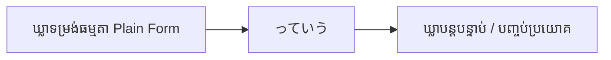
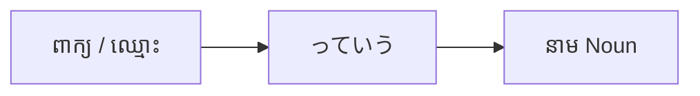

# ចំណុចវេយ្យាករណ៍ជប៉ុន: ～っていう (〜tte iu)
**កម្រិត JLPT:** JLPT N4

---

## ១. សេចក្តីផ្តើម (Introduction)

ទម្រង់ **～っていう** (អានថា *tte iu*) គឺជាចំណុចវេយ្យាករណ៍ដ៏សម្បូរបែប និងត្រូវបានប្រើប្រាស់យ៉ាងទូលំទូលាយបំផុតនៅក្នុងភាសាជប៉ុន។ វាត្រូវបានប្រើជាញឹកញាប់ក្នុងការសន្ទនាបែបស្និទ្ធស្នាលប្រចាំថ្ងៃ (Casual spoken Japanese) ហើយមានមុខងារសំខាន់ៗជាច្រើន ដូចជា ការដកស្រង់សម្តីអ្នកដទៃ (Quotation), ការហៅឈ្មោះ ឬផ្តល់និយមន័យដល់អ្វីមួយ (Naming/Defining) និងការសង្កត់ធ្ងន់លើប្រធានបទណាមួយ។ ការយល់ច្បាស់ពីរបៀបប្រើ **～っていう** នឹងជួយឱ្យអ្នកអាចសន្ទនាភាសាជប៉ុនជាក់ស្តែងបានយ៉ាងរលូន និងបែបធម្មជាតិ។

---

## ២. ការពន្យល់វេយ្យាករណ៍គោល (Core Grammar Explanation)

### អត្ថន័យ (Meaning)
**～っていう** ត្រូវបានប្រើសម្រាប់៖
- **ដកស្រង់ (Quote)** នូវអ្វីដែលនរណាម្នាក់បាននិយាយ ឬបានគិត («គេថានឹង... / គាត់និយាយថា...»)។
- **ហៅឈ្មោះ ឬលើកឡើង (Refer/Name)** អំពីអ្វីមួយដែលមានឈ្មោះ ឬត្រូវបានគេហៅថា («...ដែលគេហៅថា... / ឈ្មោះថា...»)។
- **សង្កត់ធ្ងន់ (Emphasize)** ឬបញ្ជាក់ឱ្យច្បាស់អំពីប្រធានបទ ឬគំនិតណាមួយ («អ្វីដែលហៅថា...»)។

### ទម្រង់ផ្សំ (Structure)
ទម្រង់មូលដ្ឋាននៃការប្រើប្រាស់ **～っていう** រួមមាន៖

1. **ការដកស្រង់សម្តី ឬគំនិត (Quoting Speech or Thoughts)**
   ```
   [ឃ្លា/ប្រយោគទម្រង់ធម្មតា (Plain Form)] + っていう
   ```

2. **ការផ្តល់និយមន័យ ឬការហៅឈ្មោះ (Defining or Naming)**
   ```
   [ពាក្យ/ឈ្មោះ/កន្សោមពាក្យ] + っていう + [នាម (Noun)]
   ```

3. **ការសង្កត់ធ្ងន់លើប្រធានបទ (Emphasizing a Topic)**
   ```
   [នាម/ប្រធានបទ] + っていう + [នាម/គំនិតទូទៅ (ដូចជា の, もの, こと)]
   ```

### ដ្យាក្រាមទម្រង់ផ្សំ (Formation Diagram)

#### ១. ការដកស្រង់សម្តី ឬគំនិត


#### ២. ការផ្តល់និយមន័យ ឬការហៅឈ្មោះ


---

## ៣. ការវិភាគប្រៀបធៀប និង ន័យស៊ីជម្រៅ (Comparative & Nuance Analysis)

### ការប្រៀបធៀប: ～っていう vs ～という vs ～って

នៅក្នុងភាសាជប៉ុន កន្សោមដែលប្រើសម្រាប់ដកស្រង់សម្តី និងការហៅឈ្មោះមានកម្រិតផ្លូវការខុសៗគ្នា៖

1. **～という (កម្រិតផ្លូវការ / ភាសាសរសេរ):**
   - ផ្សំឡើងពីឈ្នាប់ដកស្រង់ `と` + កិរិយាសព្ទ `いう` (និយាយ/ហៅ)។
   - ប្រើក្នុងភាសាសរសេរ ឯកសារ ព័ត៌មាន និងការនិយាយបែបគួរសម/ផ្លូវការ (Formal/Written Japanese)។

2. **～っていう (កម្រិតស្និទ្ធស្នាល / ភាសានិយាយកន្ត្រាក់):**
   - ក្លាយមកពីការកន្ត្រាក់សូរនៃ `〜という` (`と` ក្លាយជាសម្លេងទប់ `っ` + `て`) ទៅជា `っていう`។
   - ប្រើជាទូទៅក្នុងការសន្ទនាប្រចាំថ្ងៃជាមួយមិត្តភក្តិ សមាជិកគ្រួសារ ឬអ្នកជិតស្និទ្ធ (Casual spoken register)។
   - មិនស័ក្តិសមសម្រាប់ប្រើក្នុងតែងសេចក្តី ឯកសារអាជីវកម្ម ឬការប្រជុំផ្លូវការឡើយ។

3. **～って (ការកន្ត្រាក់ខ្លីបំផុតក្នុងភាសានិយាយ):**
   - អាចជំនួសបានទាំងស្រុងលើ `っていう` ឬ `と言っている` ឬ `という` នៅចុងប្រយោគ (ឧទាហរណ៍៖ `田中さんっていう人` អាចនិយាយកាត់ថា `田中さんって人` ឬ `雨が降るっていう` អាចកាត់ថា `雨が降るって`)។

| កន្សោមវេយ្យាករណ៍ | កម្រិតគួរសម/ផ្លូវការ | របៀបប្រើប្រាស់ជាក់ស្តែង |
|---|---|---|
| **～という** | ផ្លូវការ / កណ្តាល | ភាសាសរសេរ, ឯកសារ, ការសន្ទនាបែបគួរសម (Polite/Formal) |
| **～っていう** | ស្និទ្ធស្នាល (Casual) | ភាសានិយាយទូទៅក្នុងជីវភាពប្រចាំថ្ងៃ |
| **～って** | ស្និទ្ធស្នាលខ្លាំង (Very Casual) | ភាសានិយាយកាត់ខ្លី ប្រើជាមួយមនុស្សជិតស្និទ្ធ |

### ន័យស៊ីជម្រៅ (Nuance Breakdown)
- **ការបញ្ចៀសការអះអាងដាច់ខាត (Softening & Hearsay):** នៅពេលប្រើ `〜っていう` នៅចុងប្រយោគដើម្បីដកស្រង់ដំណឹង វាមានន័យស្មើនឹង «គេថា... / ឮថា...» ដែលជួយឱ្យអ្នកនិយាយមិនចាំបាច់ទទួលខុសត្រូវទាំងស្រុងលើប្រភពព័ត៌មាននោះឡើយ។ នេះស្របតាមវប្បធម៌ជប៉ុនដែលចូលចិត្តការបន្ទន់សម្តី។
- **ការណែនាំឈ្មោះថ្មីដែលភាគីម្ខាងទៀតប្រហែលជាមិនស្គាល់:** នៅពេលនិយាយថា `[ឈ្មោះ] + っていう + [នាម]` (ឧ. `「すし」っていう料理`) បង្ហាញពីការយល់ឃើញរបស់អ្នកនិយាយថា អ្នកស្តាប់ប្រហែលជាទើបតែឮឈ្មោះនេះជាលើកដំបូង ឬចង់បញ្ជាក់ឈ្មោះឱ្យច្បាស់លាស់។

---

## ៤. ឧទាហរណ៍ក្នុងបរិបទ (Examples in Context)

### ១. ការដកស្រង់សម្តី ឬគំនិត (Quoting Speech or Thoughts)
- **ការសន្ទនាស្និទ្ធស្នាល (ដំណឹងឮតៗគ្នា):**
  - **ជប៉ុន:** 明日、雨が降るっていう。
  - **រ៉ូម៉ាជី:** Ashita, ame ga furu tte iu.
  - **ខ្មែរ:** «គេថាស្អែកនេះមេឃនឹងធ្លាក់ភ្លៀង។»
- **ការដកស្រង់សម្តីមនុស្សទីបី:**
  - **ជប៉ុន:** 彼は行かないっていう。
  - **រ៉ូម៉ាជី:** Kare wa ikanai tte iu.
  - **ខ្មែរ:** «គាត់និយាយថាគាត់មិនទៅទេ។»

### ២. ការផ្តល់និយមន័យ ឬការហៅឈ្មោះ (Defining or Naming)
- **ការណែនាំឈ្មោះវត្ថុ/ម្ហូប:**
  - **ជប៉ុន:** これは抹茶っていうお茶です。
  - **រ៉ូម៉ាជី:** Kore wa matcha tte iu ocha desu.
  - **ខ្មែរ:** «នេះជាប្រភេទតែដែលគេហៅថា ម៉ាតឆា (Matcha)។»
- **ការពន្យល់ពាក្យសព្ទ ឬកន្សោមពាក្យ:**
  - **ជប៉ុន:** 漫画っていうのは日本のコミックです。
  - **រ៉ូម៉ាជី:** Manga tte iu no wa Nihon no komikku desu.
  - **ខ្មែរ:** «អ្វីដែលគេហៅថាម៉ានហ្គា (Manga) នោះ គឺជាសៀវភៅរឿងគំនូរជីវចលរបស់ជប៉ុន។»

### ៣. ការសង្កត់ធ្ងន់លើប្រធានបទ (Emphasizing a Topic)
- **ការលើកឡើងពីគោលគំនិតអរូបី:**
  - **ជប៉ុន:** 愛っていうのは難しいね。
  - **រ៉ូម៉ាជី:** Ai tte iu no wa muzukashii ne.
  - **ខ្មែរ:** «អ្វីដែលហៅថាសេចក្តីស្នេហានេះ ពិតជាស្មុគស្មាញពិបាកយល់មែនណ៎ា។»
- **ការពិភាក្សាអំពីតម្លៃ ឬទស្សនៈ:**
  - **ជប៉ុន:** 時間っていうものは大切だ。
  - **រ៉ូម៉ាជី:** Jikan tte iu mono wa taisetsu da.
  - **ខ្មែរ:** «របស់ដែលហៅថាពេលវេលានេះ ពិតជាមានតម្លៃណាស់។»

---

## ៥. កំណត់សម្គាល់វប្បធម៌ (Cultural Notes)

### ទំនាក់ទំនងក្នុងវប្បធម៌ជប៉ុន
នៅក្នុងវប្បធម៌ទំនាក់ទំនងរបស់ជនជាតិជប៉ុន ការនិយាយបែបប្រយោល និងមិនអះអាងជ្រុលត្រូវបានចាត់ទុកជាសុជីវធម៌ដ៏សំខាន់។ ការប្រើប្រាស់ **～っていう** ជួយឱ្យអ្នកនិយាយ៖
- បញ្ចេញមតិ ឬការយល់ឃើញដោយបន្ទន់សម្លេង មិនរឹងត្អឹង។
- ដកស្រង់សម្តីអ្នកដទៃដោយមិនចាត់ទុកថាជាការពិតដាច់ខាត ១០០%។
- បង្កើនភាពស្និទ្ធស្នាល និងភាពរាបសារ ដោយចៀសវាងការបញ្ជាក់ការពិតបែបផ្ទាល់ៗខ្លាំងពេក។

### កន្សោមទម្លាប់ពេញនិយម (Idiomatic Expressions)
- **っていうか (tte iu ka):** ប្រើសម្រាប់កែតម្រូវសម្តីខ្លួនឯងភ្លាមៗ ឬប្តូររបៀបនិយាយ («...ឬអាចនិយាយម្យ៉ាងទៀតថា... / និយាយឱ្យចំទៅ...»)។
  - **ឧទាហរណ៍:**
    - **ជប៉ុន:** 彼は、っていうか、彼女も来ます。
    - **រ៉ូម៉ាជី:** Kare wa, tte iu ka, kanojo mo kimasu.
    - **ខ្មែរ:** «គាត់... ឬនិយាយឱ្យចំទៅ នាងក៏នឹងមកដែរ។»

---

## ៦. កំហុសទូទៅ និងគន្លឹះចងចាំ (Common Mistakes and Tips)

### ការវិភាគកំហុសដែលឧស្សាហ៍កើតមាន
- **ការប្រើប្រាស់ហួសហេតុក្នុងភាសាសរសេរផ្លូវការ:**
  - *កំហុស:* ប្រើ **～っていう** ក្នុងការសរសេរតែងសេចក្តី រាយការណ៍ ឬឯកសារផ្លូវការ។
  - *កែតម្រូវ:* ត្រូវប្តូរមកប្រើ **～という** វិញជានិច្ចក្នុងកាលៈទេសៈផ្លូវការ។
- **ការដាក់ទីតាំងពាក្យខុសក្នុងប្រយោគ:**
  - *កំហុស:* ដាក់ **～っていう** ដាច់ពីពាក្យ ឬឃ្លាដែលវាចង់កែប្រែ/បញ្ជាក់ន័យ។
  - *កែតម្រូវ:* ត្រូវប្រាកដថាវាស្ថិតនៅជាប់ពីក្រោយពាក្យ ឬឃ្លាដែលវាពន្យល់ដោយផ្ទាល់។

### យុទ្ធសាស្ត្រសិក្សា
- **គន្លឹះទន្ទេញចាំ:**
  - ចងចាំថា **～っていう** ស្មើនឹងឃ្លាក្នុងភាសានិយាយខ្មែរថា «គេថា...», «ឮថា...» ឬ «ឈ្មោះថា... / ហៅថា...»។
- **ការអនុវត្តបំប្លែងទម្រង់:**
  - សាកល្បងបំប្លែងប្រយោគពីទម្រង់ផ្លូវការ **～という** មកជាទម្រង់ស្និទ្ធស្នាល **～っていう** ដើម្បីឱ្យស៊ាំនឹងកម្រិតនៃការសន្ទនាជាក់ស្តែង។

---

## ៧. សេចក្តីសង្ខេប និងការរំលឹកឡើងវិញ (Summary and Review)

### ចំណុចគន្លឹះសំខាន់ៗ
- **～っていう** គឺជាកន្សោមភាសានិយាយបែបស្និទ្ធស្នាល សម្រាប់ដកស្រង់សម្តី ហៅឈ្មោះ ឬសង្កត់ធ្ងន់លើប្រធានបទ។
- វាជាទម្រង់ក្រៅផ្លូវការ (Casual) ដែលកន្ត្រាក់មកពី **～という**។
- ប្រើតែក្នុងការសន្ទនាផ្ទាល់មាត់ ឬការជជែកលេងប៉ុណ្ណោះ មិនត្រូវប្រើក្នុងឯកសារសរសេរផ្លូវការឡើយ។

### សំណួររំលឹកខ្លីៗ (Quick Recap Quiz)
១. **តើគេប្រើទម្រង់ ～っていう យ៉ាងដូចម្តេចដើម្បីណែនាំឈ្មោះអ្វីមួយ?**
   - *ចម្លើយ:* `[ឈ្មោះ/ពាក្យ] + っていう + [នាម]`
២. **ចូរផ្លាស់ប្តូរប្រយោគផ្លូវការខាងក្រោមឱ្យទៅជាភាសានិយាយស្និទ្ធស្នាលដោយប្រើ ～っていう៖**
   
   **ទម្រង់ផ្លូវការ:** これは寿司という料理です。
   
   - *ចម្លើយ:* これは寿司っていう料理です。
៣. **តើយើងអាចប្រើ ～っていう ក្នុងសំណេរផ្លូវការ ឬតែងសេចក្តីបានដែរឬទេ?**
   - *ចម្លើយ:* មិនអាចទេ! ក្នុងបរិបទផ្លូវការ ត្រូវប្រើទម្រង់ ～という ជំនួសវិញ។

---

ការយល់ច្បាស់ និងការអនុវត្តប្រើប្រាស់ **～っていう** នឹងជួយឱ្យអ្នកអាចដកស្រង់សម្តី ហៅឈ្មោះ និងសង្កត់ធ្ងន់ក្នុងប្រយោគបានយ៉ាងទាក់ទាញ និងបែបធម្មជាតិដូចជនជាតិជប៉ុនក្នុងការសន្ទនាប្រចាំថ្ងៃ។

---

© [Hanabira.org](https://hanabira.org)
