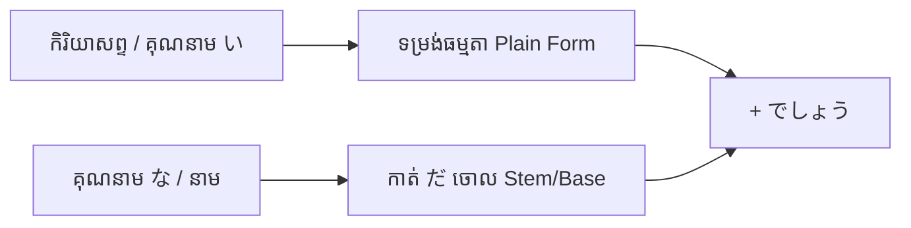

Processing keyword: ～でしょう (〜deshou)
# ចំណុចវេយ្យាករណ៍ជប៉ុន: ～でしょう (〜deshou)
**កម្រិត JLPT:** JLPT N4

---

## ១. សេចក្តីផ្តើម (Introduction)

ទម្រង់វេយ្យាករណ៍ **～でしょう** (〜deshou) គឺជាកន្សោមពាក្យដ៏សម្បូរបែបមួយក្នុងភាសាជប៉ុន ដែលប្រើសម្រាប់បង្ហាញពីការស្មាន ប្រូបាប៊ីលីតេ (ទំនងជា/ប្រហែលជា) ឬប្រើដើម្បីសួរស្វែងរកការបញ្ជាក់យល់ស្របពីអ្នកស្តាប់ (មែនទេ? / ត្រូវទេ?)។ ក្នុងភាសាខ្មែរ យើងតែងបកប្រែថា «ប្រហែលជា...», «ទំនងជា...», «ខ្ញុំគិតថា...» ឬ «...មែនទេ?»។ ការយល់ដឹងពីរបៀបប្រើ **～でしょう** ឱ្យបានត្រឹមត្រូវ ទាំងកម្រិតសំឡេង និងបរិបទ នឹងជួយលើកកម្ពស់សមត្ថភាពរបស់អ្នកក្នុងការបង្ហាញពីភាពមិនប្រាកដប្រជា ការទស្សន៍ទាយ និងការបញ្ជាក់ព័ត៌មានទាំងក្នុងស្ថានភាពផ្លូវការ និងមិនផ្លូវការ។

---

## ២. ការពន្យល់វេយ្យាករណ៍ស្នូល (Core Grammar Explanation)

### អត្ថន័យ (Meaning)
1. **ការបង្ហាញពីប្រូបាប៊ីលីតេ ឬការស្មាន (Expressing Probability or Conjecture):** បង្ហាញថាអ្វីមួយទំនងជាកើតឡើង ឬប្រហែលជាពិត (ច្រើនប្រើជាមួយសំឡេងចុះក្រោម ↘)។
2. **ការសួរស្វែងរកការបញ្ជាក់ (Seeking Confirmation):** ប្រើនៅចុងប្រយោគដើម្បីសុំការយល់ស្រប ឬសួរបញ្ជាក់ពីដៃគូសន្ទនា ស្រដៀងនឹង «...មែនទេ?» ឬ «...ត្រូវទេ?» (ប្រើជាមួយសំឡេងឡើងលើ ↗)។

---

### ទម្រង់ផ្សំ (Formation)

ការផ្សំនៃ **～でしょう** គឺប្រើជាមួយទម្រង់ធម្មតា (Plain Form) ប៉ុន្តែចំពោះគុណនាម な និងនាម ត្រូវកាត់ **だ** ចោល៖

| ប្រភេទពាក្យ (Word Type) | ទម្រង់ធម្មតា (Plain Form) | + でしょう | អត្ថន័យជាភាសាខ្មែរ |
|---|---|---|---|
| **កិរិយាសព្ទ (Verb)** | 食べる (taberu) | 食べる **でしょう** | ប្រហែលជាញ៉ាំ / នឹងញ៉ាំមែនទេ? |
| **គុណនាម い (い-Adj)** | 高い (takai) | 高い **でしょう** | ប្រហែលជាថ្លៃ / ថ្លៃមែនទេ? |
| **គុណនាម な (な-Adj)** | 便利**だ** (benri **da**) | 便利 **でしょう** *(កាត់ だ ចោល)* | ប្រហែលជាងាយស្រួល / ងាយស្រួលមែនទេ? |
| **នាម (Noun)** | 学生**だ** (gakusei **da**) | 学生 **でしょう** *(កាត់ だ ចោល)* | ប្រហែលជាសិស្ស / ជាសិស្សមែនទេ? |

> **ចំណាំសំខាន់:** ចំពោះ **គុណនាម な** និង **នាម** ត្រូវកាត់កិរិយាសព្ទជំនួយ **だ** ចោលជានិច្ច មុននឹងភ្ជាប់ជាមួយ **でしょう** (ឧទាហរណ៍៖ `学生でしょう` មិនមែន `学生だでしょう` ឡើយ)។

---

### ដ្យាក្រាមទម្រង់ផ្សំ (Formation Diagram)

---

## ៣. ការវិភាគប្រៀបធៀប និង ន័យស៊ីជម្រៅ (Nuance & Comparative Analysis)

### កម្រិតសំឡេង និងមុខងារពីរយ៉ាង (Intonation Nuance)
ទម្រង់ **～でしょう** មានមុខងារពីរយ៉ាងដាច់ដោយឡែកពីគ្នា ដែលកំណត់ដោយកម្រិតសំឡេង (Intonation) នៅចុងប្រយោគ៖

1. **ការទស្សន៍ទាយ/ស្មានដោយគួរសម (Polite Conjecture - សំឡេងចុះ ↘):**
   - និយាយដោយសំឡេងរាបស្មើ ឬចុះក្រោមនៅចុងប្រយោគ។
   - មានន័យថា «ប្រហែលជា... / ទំនងជា...» (ប្រូបាប៊ីលីតេខ្ពស់ ប្រហែល ៧០% - ៨០%)។
   - ឧទាហរណ៍៖ ព្យាករណ៍អាកាសធាតុ ព័ត៌មាន ឬការសន្និដ្ឋានដែលមានមូលដ្ឋានច្បាស់លាស់។
2. **ការសួរបញ្ជាក់ដោយគួរសម (Polite Confirmation - សំឡេងឡើង ↗):**
   - និយាយដោយលើកសំឡេងឡើងខ្ពស់នៅចុងប្រយោគ (សរសេរសញ្ញាសួរ `?`)។
   - មានន័យថា «...មែនទេ? / ...ត្រូវទេ?» ដើម្បីទាញការយល់ស្របពីអ្នកស្តាប់ ស្រដៀងនឹង `〜ですね` ប៉ុន្តែផ្តល់អារម្មណ៍ថាអ្នកនិយាយមានទំនុកចិត្តលើរឿងនោះរួចទៅហើយ។

---

### តារាងប្រៀបធៀប៖ ～でしょう vs. ～だろう vs. ～かもしれません

| ចំណុចប្រៀបធៀប | ～でしょう (deshou) | ～だろう (darou) | ～かもしれません (kamoshiremasen) |
|---|---|---|---|
| **កម្រិតភាពប្រាកដ (Certainty)** | ខ្ពស់គួរសម (~៧០% - ៨០%) | ខ្ពស់គួរសម (~៧០% - ៨០%) | ទាបទៅមធ្យម (~៥០% ឬតិចជាង) |
| **កម្រិតគួរសម (Formality/Register)** | គួរសម / ផ្លូវការ (丁寧語) | ស្និទ្ធស្នាល / ធម្មតា (普通語 - ប្រើច្រើនដោយបុរស) | គួរសម / ផ្លូវការ (丁寧語) |
| **អត្ថន័យស្នូល** | ប្រហែលជា... / ...មែនទេ? | ប្រហែលជា... / ...មែនទេ? (សន្ទនាទូទៅ) | ប្រហែលជា... / អាចនឹង... (មិនច្បាស់លាស់) |
| **បរិបទប្រើប្រាស់** | ព័ត៌មាន, ការសន្ទនាគួរសម, ការងារ | មិត្តភក្តិ, គ្រួសារ, គិតម្នាក់ឯង (Monologue) | ពេលស្ទាក់ស្ទើរខ្លាំង មិនហ៊ានអះអាង |
| **ឧទាហរណ៍** | 明日は雨が降る**でしょう**。 *(ស្អែកទំនងជាភ្លៀង - ព័ត៌មាន/គួរសម)* | 明日は雨が降る**だろう**。 *(ស្អែកប្រហែលជាភ្លៀងហ្នឹង - និយាយលេង)* | 明日は雨が降る**かもしれません**。 *(ស្អែកអាចនឹងភ្លៀងក៏ថាបាន - មិនសូវច្បាស់)* |

---

## ៤. ឧទាហរណ៍ក្នុងបរិបទ (Examples in Context)

### ការសន្ទនាផ្លូវការ និងការទស្សន៍ទាយ (Formal Speech & Conjecture)

1. **明日は寒くなるでしょう。**
   - *Ashita wa samuku naru deshou.*
   - ថ្ងៃស្អែកទំនងជាត្រជាក់ហើយ។ *(សំឡេងចុះ ↘ - ការព្យាករណ៍អាកាសធាតុ)*

2. **彼は今忙しいでしょうか。**
   - *Kare wa ima isogashii deshou ka.*
   - តើលោកគិតថាពេលនេះគាត់រវល់ទេ? *(ទម្រង់សួរបែបគួរសមខ្លាំង)*

3. **技術はさらに進歩するでしょう。**
   - *Gijutsu wa sara ni shinpo suru deshou.*
   - បច្ចេកវិទ្យាទំនងជានឹងបន្តរីកចម្រើនទៅមុខទៀតជាមិនខាន។ *(សំណេរផ្លូវការ ឬបទបង្ហាញ)*

### ការសួរស្វែងរកការបញ្ជាក់ (Seeking Confirmation - សំឡេងឡើង ↗)

1. **これはあなたの本でしょう？**
   - *Kore wa anata no hon deshou?*
   - នេះជាសៀវភៅរបស់អ្នក មែនទេ?

2. **彼女は日本に行くでしょうね。**
   - *Kanojo wa Nihon ni iku deshou ne.*
   - នាងនឹងទៅប្រទេសជប៉ុន មែនទេនុង?

3. **疲れたでしょう？ 少し休んでください。**
   - *Tsukareta deshou? Sukoshi yasunde kudasai.*
   - ហត់ហើយមែនទេ? សូមសម្រាកបន្តិចសិនទៅ។ *(បង្ហាញការយកចិត្តទុកដាក់ និងយល់ចិត្ត)*

### ការសន្ទនាស្និទ្ធស្នាលជាមួយទម្រង់ធម្មតា (Informal Counterpart: ～だろう)

1. **あの映画は面白いだろう。**
   - *Ano eiga wa omoshiroi darou.*
   - រឿងកុននោះប្រហែលជាជក់ចិត្តមើលហើយ។

2. **もうすぐ着くだろう。**
   - *Mou sugu tsuku darou.*
   - បន្តិចទៀតប្រហែលជាទៅដល់ហើយ។

---

## ៥. កត់សម្គាល់ផ្នែកវប្បធម៌ (Cultural Notes)

### ភាពគួរសម និងការរក្សាសុជីវធម៌ (Politeness and Tactfulness)
- ជនជាតិជប៉ុនឱ្យតម្លៃខ្ពស់លើភាពសុខដុម (和 - Wa) និងការជៀសវាងការអះអាងដាច់ខាតដែលនាំឱ្យប៉ះពាល់អារម្មណ៍អ្នកដទៃ។ ការប្រើ **～でしょう** ជួយបន្ទន់សម្តី (Softening expression) ធ្វើឱ្យការបញ្ចេញមតិ ឬការព្យាករណ៍មិនស្តាប់ទៅរឹងត្អឹងពេក។
- **～でしょう** ត្រូវបានប្រើប្រាស់ជាទូទៅក្នុងសេចក្តីរាយការណ៍ព័ត៌មាន ទូរទស្សន៍ ការព្យាករណ៍អាកាសធាតុ និងការសន្ទនាបែបគួរសមប្រចាំថ្ងៃ។

### កន្សោមពាក្យសំនួនវោហារ (Idiomatic Expressions)
- **でしょうがない / しょうがない (Deshou ga nai / Shou ga nai)**
  - មានន័យថា «គ្មានជម្រើសអ្វីក្រៅពី... / ជៀសមិនរួចឡើយ / ធ្វើម៉េចបើអញ្ចឹងទៅហើយ»។
  - ឧទាហរណ៍៖ **待つしかないでしょうがない。**
    - *Matsu shika nai deshou ga nai.*
    - «មានតែរង់ចាំប៉ុណ្ណោះ គ្មានវិធីណាផ្សេងឡើយ។»

---

## ៦. កំហុសទូទៅ និងគន្លឹះចងចាំ (Common Mistakes and Tips)

### កំហុសទូទៅ (Common Mistakes)
1. **ច្រឡំដាក់ だ ជាមួយនាម ឬគុណនាម な៖**
   - ❌ ខុស: `学生だでしょう` / `便利だでしょう`
   -  ត្រូវ: `学生でしょう` / `便利でしょう`
2. **ការច្រឡំកម្រិតគួរសមរវាង ～でしょう និង ～だろう៖**
   - កុំប្រើ `～だろう` ទៅកាន់ចៅហ្វាយនាយ ឬមនុស្សចាស់ ព្រោះវាជាទម្រង់ស្និទ្ធស្នាល គ្មានភាពគួរសមឡើយ។ ចំពោះមនុស្សកម្រិតខ្ពស់ជាង ត្រូវប្រើ `～でしょう` ឬ `～でしょうか`។
3. **ការច្រឡំរវាង ～でしょう និង ～と思います (to omoimasu)៖**
   - **～と思います** បង្ហាញពីគំនិត ឬទស្សនៈផ្ទាល់ខ្លួនរបស់អ្នកនិយាយសុទ្ធសាធ («ខ្ញុំគិតថា...»)។
   - **～でしょう** ច្រើនបង្ហាញពីការសន្និដ្ឋានដោយផ្អែកលើតម្រុយ ឬភស្តុតាងជាក់ស្តែងណាមួយ ឬទាក់ទាញឱ្យដៃគូសន្ទនាយល់ស្រប។

### គន្លឹះរៀនឆាប់ចាំ (Learning Tips)
- **ការសម្គាល់សំឡេង:**
  - ចុងប្រយោគសំឡេងចុះ ↘ = **ស្មាន/ព្យាករណ៍** («ប្រហែលជា...»)
  - ចុងប្រយោគសំឡេងឡើង ↗ = **សួរបញ្ជាក់** («...មែនទេ?»)

---

## ៧. សេចក្តីសង្ខេប និងការរំលឹកឡើងវិញ (Summary and Review)

### ចំណុចគន្លឹះសំខាន់ៗ (Key Takeaways)
- **～でしょう** ប្រើសម្រាប់បង្ហាញការស្មាន ប្រូបាប៊ីលីតេ ឬសួរស្វែងរកការបញ្ជាក់ដោយគួរសម។
- គុណនាម な និង នាម ត្រូវកាត់ **だ** ចោលជានិច្ច មុននឹងបូក **でしょう**។
- ប្រៀបធៀប៖ **～でしょう** (គួរសម) vs **～だろう** (ស្និទ្ធស្នាល)។
- កម្រិតភាពប្រាកដ៖ **～でしょう** (ប្រហែល ៧០-៨០%) មានទំនុកចិត្តខ្ពស់ជាង **～かもしれません** (ប្រហែល ៥០% ឬតិចជាង)។

---

### កម្រងសំណួររំលឹកចំណេះដឹង (Quick Recap Quiz)

១. **តើប្រយោគមួយណាមានន័យថា «ថ្ងៃស្អែកទំនងជាភ្លៀង» ដោយប្រើកម្រិតភាពប្រាកដខ្ពស់បែបគួរសម?**  
   ក) 明日は雨が降るでしょう。  
   ខ) 明日は雨が降るかもしれません。  

២. **រវាង ～でしょう និង ～だろう តើមួយណាជាទម្រង់គួរសម (Polite)?**  

៣. **ចូរជ្រើសរើសទម្រង់ត្រឹមត្រូវសម្រាប់ប្រយោគ៖ «គាត់ប្រហែលជាគ្រូបង្រៀន»**  
   ក) 彼は先生だでしょう。  
   ខ) 彼は先生でしょう。  

---

**ចម្លើយ (Answers):**
១. **ក) 明日は雨が降るでしょう。**  
២. **～でしょう** ជាទម្រង់គួរសម (丁寧語)។  
៣. **ខ) 彼は先生でしょう。** (កាត់ だ ចោល)

---

© [Hanabira.org](https://hanabira.org)
