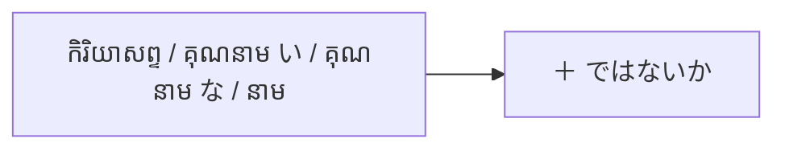

Processing keyword: ～ではないか (〜de wa nai ka)
# ចំណុចវេយ្យាករណ៍ជប៉ុន៖ ～ではないか (〜de wa nai ka)
**កម្រិត JLPT:** JLPT N2

---

## ១. សេចក្តីផ្តើម (Introduction)

ទម្រង់វេយ្យាករណ៍ **～ではないか (〜de wa nai ka)** គឺជាទម្រង់កម្រិត N2 ដ៏សំខាន់ និងសម្បូរបែបមួយនៅក្នុងភាសាជប៉ុន ដែលត្រូវបានប្រើប្រាស់ជាចម្បងសម្រាប់៖
- **ការចោទជាសំនួរវោហាសាស្ត្រ (Rhetorical question)** ដើម្បីទាមទារការយល់ស្រប បញ្ចេញទស្សនៈផ្ទាល់ខ្លួនយ៉ាងមុតមាំ ឬលើកសំណើជំរុញឱ្យធ្វើសកម្មភាព ("...មិនអញ្ចឹងទេអី?", "...តើមិនល្អទេឬ?", "...តោះធ្វើទាំងអស់គ្នាទៅ!")
- **ការឧទានបង្ហាញការភ្ញាក់ផ្អើល** នៅពេលរកឃើញ ឬប្រទះឃើញការពិតដែលនឹកស្មានមិនដល់ ("នែ៎! ស្រាប់តែ...", "មើលចុះ! ពិតជា...មែន!")

កន្សោមនេះជួយឱ្យការនិយាយ ការសរសេរ និងការតស៊ូមតិរបស់អ្នកកាន់តែមានទម្ងន់ គួរឱ្យជឿជាក់ និងបង្កើតទំនាក់ទំនងប្រាស្រ័យទាក់ទងយ៉ាងស៊ីជម្រៅជាមួយអ្នកស្តាប់។

---

## ២. ការពន្យល់វេយ្យាករណ៍ស្នូល (Core Grammar Explanation)

### អត្ថន័យ និងរបៀបប្រើប្រាស់ (Meaning and Usage)

**～ではないか** ត្រូវបានប្រើក្នុងបរិបទសំខាន់ៗដូចខាងក្រោម៖

1. **ការចោទជាសំនួរវោហាសាស្ត្រ និងការបញ្ចេញទស្សនៈមុតមាំ (Rhetorical Opinion / Assertion)**
   - ប្រើដើម្បីបញ្ជាក់ជំហរ ឬទស្សនៈរបស់អ្នកនិយាយយ៉ាងច្បាស់លាស់ ដោយរំពឹង និងជំរុញឱ្យអ្នកស្តាប់យល់ស្របតាម។
   - ន័យជាភាសាខ្មែរ៖ *"តើ...មិនមែនទេឬ?", "...មិនអញ្ចឹងទេអី?", "...ពិតជា...មែនទេ?"*

2. **ការលើកសំណើ ឬការបបួលរួមគ្នា (Suggestion / Proposal - ប្រើជាមួយទម្រង់ Volitional [〜(よ)う] ではないか)**
   - ប្រើក្នុងការថ្លែងសុន្ទរកថា ការប្រជុំ ឬការអំពាវនាវជាផ្លូវការដើម្បីជំរុញទឹកចិត្តឱ្យរួមគ្នាធ្វើសកម្មភាពអ្វីមួយ។
   - ន័យជាភាសាខ្មែរ៖ *"តោះយើង...ទៅ!", "ចូរយើង...ទាំងអស់គ្នា!"*
   - *ចំណាំ:* ក្នុងការបបួល គេប្រើជាទម្រង់ `កិរិយាសព្ទ [ទម្រង់បបួល/意志形] + ではないか` (ឧទាហរណ៍៖ 行こうではないか)។

3. **ការឧទានបង្ហាញការភ្ញាក់ផ្អើលពេលរកឃើញការពិត (Exclamatory Surprise / Discovery)**
   - ប្រើនៅពេលដែលអ្នកនិយាយរកឃើញ ឬប្រទះឃើញអ្វីមួយដែលខុសពីការរំពឹងទុក ឬរកឃើញរបស់ដែលបាត់។
   - ន័យជាភាសាខ្មែរ៖ *"នែ៎...តើនេះមិនមែនជា...ទេអី!", "មើលន៎ុះ! គឺ...តើ!"*

---

### ក្បួនផ្សំទម្រង់ (Formation)

ទម្រង់នេះផ្សំឡើងអាស្រ័យលើប្រភេទពាក្យនីមួយៗ (ជាទូទៅផ្សំជាមួយ **ទម្រង់ធម្មតា / 普通形**):

| ប្រភេទពាក្យ (Part of Speech) | ក្បួនផ្សំ (Formation) | ឧទាហរណ៍ (Example) |
|---|---|---|
| **កិរិយាសព្ទ (Verb)** | **កិរិយាសព្ទ [ទម្រង់ធម្មតា/普通形]** + ではないか *(បបួល: **ទម្រង់បបួល [〜(よ)う]** + ではないか)* | 食べる **ではないか** 食べよう **ではないか** |
| **គុណនាម い (い-Adjective)** | **គុណនាម い [ទម្រង់ធម្មតា]** + ではないか | 速い **ではないか** |
| **គុណនាម な (な-Adjective)** | **គុណនាម な [ដើម/គ្មាន だ]** + ではないか | 簡単 **ではないか** *(កម្រប្រើ 簡単だではないか)* |
| **នាម (Noun)** | **នាម [គ្មាន だ]** + ではないか | 彼 **ではないか** |

#### ដ្យាក្រាមក្បួនផ្សំ (Formation Diagram)

---

### ឧទាហរណ៍ក្បួនផ្សំ (Structural Examples)

1. **កិរិយាសព្ទ (Verb)**
   - 新しい事業を始めよう **ではないか**。
   - *Atarashii jigyō o hajimeyō de wa nai ka.*
   - "ចូរយើងចាប់ផ្តើមអាជីវកម្មថ្មីមួយទាំងអស់គ្នាទៅ!"

2. **គុណនាម い (い-Adjective)**
   - この方法のほうがずっと速い **ではないか**。
   - *Kono hōhō no hō ga zutto hayai de wa nai ka.*
   - "វិធីសាស្ត្រនេះតើមិនលឿនជាងឆ្ងាយទេឬ?"

3. **គុណនាម な (な-Adjective)**
   - やってみれば意外と簡単 **ではないか**。
   - *Yatte mireba igaito kantan de wa nai ka.*
   - "បើបានសាកធ្វើមើលទៅ តើមិនងាយស្រួលទេអី?"

4. **នាម (Noun)**
   - 探していた鍵はここにある **ではないか**。
   - *Sagashite ita kagi wa koko ni aru de wa nai ka.*
   - "សោដែលកំពុងរក មើលចុះ ស្រាប់តែនៅទីនេះសោះ!"

---

## ៣. ការវិភាគប្រៀបធៀប និង ន័យស៊ីជម្រៅ (Comparative Analysis & Deep Nuance)

### មុខងារស្នូលទាំងពីរនៃ「～ではないか」ក្នុងកម្រិត N2

កម្រិត JLPT N2 តម្រូវឱ្យបែងចែកមុខងារស្នូលពីរយ៉ាងច្បាស់លាស់៖

1. **ការចោទជាសំនួរវោហាសាស្ត្រ (Rhetorical question / Strong assertion or suggestion):**
   - នៅពេលប្រើជាមួយ **កិរិយាសព្ទ [ទម្រង់បបួល 〜(よ)う] + ではないか**៖ បង្ហាញការបបួល ឬការអំពាវនាវយ៉ាងក្លៀវក្លា (ឧ. 頑張ろうではないか - "ចូរយើងខិតខំប្រឹងប្រែងទាំងអស់គ្នា!")។
   - នៅពេលប្រើជាមួយ **គុណនាម / នាម / កិរិយាសព្ទ [ធម្មតា] + ではないか**៖ អ្នកនិយាយជឿជាក់លើទស្សនៈរបស់ខ្លួន ១០០% រួចចោទសួរដើម្បីជំរុញឱ្យអ្នកស្តាប់ទទួលស្គាល់ និងយល់ស្របតាម។
   - ការបញ្ចេញសំឡេង (Intonation)៖ ច្រើនតែទម្លាក់សំឡេងចុះនៅចុងបញ្ចប់ (Falling intonation: ではないか↘) ដើម្បីបញ្ជាក់ជំហរ មិនមែនជាសំណួរសួរចង់ដឹងព័ត៌មានពិតប្រាកដឡើយ។

2. **ការឧទានបង្ហាញការភ្ញាក់ផ្អើលចំពោះការពិតដែលនឹកស្មានមិនដល់ (Exclamatory surprise at discovery):**
   - ប្រើនៅពេលដែលអ្នកនិយាយប្រទះឃើញអ្វីមួយជាក់ស្តែងដោយចៃដន្យ (Lo and behold! / To my surprise!)។
   - ឧទាហរណ៍៖ ドアを開けると、雪が降っているではないか。(ពេលបើកទ្វារ ស្រាប់តែឃើញព្រិលកំពុងធ្លាក់យ៉ាងខ្លាំង!)។
   - បរិបទនេះបង្ហាញពីអារម្មណ៍ភ្ញាក់ផ្អើលផ្ទាល់ខ្លួនរបស់អ្នកនិយាយចំពោះស្ថានភាពជាក់ស្តែងនៅចំពោះមុខ។

---

### តារាងប្រៀបធៀបទម្រង់ស្រដៀងគ្នា (Comparison with Similar Expressions)

| ទម្រង់វេយ្យាករណ៍ | កម្រិតគួរសម / រចនាប័ទ្ម | អត្ថន័យ និងការប្រើប្រាស់ | បរិបទសមស្រប |
|---|---|---|---|
| **～ではないか** | ផ្លូវការ / សរសេរ / សុន្ទរកថា | សំនួរវោហាសាស្ត្រអះអាងទស្សនៈ, ការបបួលយ៉ាងក្លៀវក្លា, ឬការឧទានភ្ញាក់ផ្អើល | សុន្ទរកថាសាធារណៈ, ការជជែកដេញដោល, អត្ថបទវិចារណកថា, ការសរសេរ |
| **～じゃない？ / ～じゃん** | ស្និទ្ធស្នាល / និយាយប្រចាំថ្ងៃ | បញ្ជាក់ការយល់ស្រប ឬសួរមតិមិត្តភក្តិបែបស្រាលៗ ("...មែនទេ?", "...តើ!") | ការសន្ទនារវាងមិត្តភក្តិ, ក្រុមគ្រួសារ, អ្នកស្គាល់គ្នាស្និទ្ធស្នាល |
| **～ではないでしょうか** | ផ្លូវការខ្លាំង / គួរសមទន់ភ្លន់ (Polite & Tactful) | ការបញ្ចេញទស្សនៈដោយបន្ទន់ឥរិយាបថ (Softening / 和 - Wa) ដើម្បីកុំឱ្យស្តាប់ទៅហាក់ដូចជាបង្ខិតបង្ខំអ្នកដទៃ | ជំនួញ, ការប្រជុំផ្លូវការ, ការធ្វើបទបង្ហាញទៅកាន់អតិថិជន ឬថ្នាក់លើ |
| **～ましょう / ～ましょうか** | គួរសមទូទៅ (Neutral Polite) | ការបបួលធម្មតា ("តោះយើង...") ដោយគ្មានសម្ពាធវោហាសាស្ត្រខ្លាំងក្លា | ការសន្ទនាគួរសមប្រចាំថ្ងៃទូទៅ |

---

### ភាពខុសគ្នាស៊ីជម្រៅរវាង ～ではないか, ～じゃない？ និង ～ではないでしょうか

1. **～ではないか vs. ～じゃない？**
   - **～ではないか** គឺជារចនាប័ទ្មផ្លូវការ (Formal/Written/Public speech) ដែលច្រើនប្រើដោយបុរសវ័យចំណាស់ អ្នកនយោបាយ ឬអ្នកសរសេរអត្ថបទសារព័ត៌មាន ដើម្បីជំរុញស្មារតី ឬបញ្ជាក់ភាពត្រឹមត្រូវ។
   - **～じゃない？** គឺជារូបរាងកាត់នៃទម្រង់នេះក្នុងភាសានិយាយ (Casual spoken)។ ប្រសិនបើអ្នកប្រើ `～ではないか` ជាមួយមិត្តភក្តិក្នុងការញ៉ាំបាយធម្មតា វានឹងស្តាប់ទៅហាក់ដូចជាអ្នកកំពុងថ្លែងសុន្ទរកថាលើឆាក ឬសម្តែងល្ខោន។

2. **～ではないか vs. ～ではないでしょうか**
   - **～ではないか** មានទម្ងន់បញ្ជាក់អះអាងខ្លាំងក្លា (Strong assertion)។ ក្នុងការប្រជុំអាជីវកម្ម ប្រសិនបើអ្នកប្រើប្រយោគនេះទៅកាន់ថ្នាក់លើ វាអាចស្តាប់ទៅដូចជាការប្រឈមមុខ ឬបង្ខំឱ្យគេយល់ស្របតាម។
   - **～ではないでしょうか** គឺជាជម្រើសដ៏ល្អបំផុតក្នុងវប្បធម៌ជប៉ុនសម្រាប់បរិបទការងារ ព្រោះវាជាការបន្ទន់សំនួរ (Preserving harmony - 和) ដែលមានន័យថា "តើវាមិនអាចទៅរួចទេឬដែលថា...?" ផ្តល់កិត្តិយស និងកន្លែងពិចារណាដល់ដៃគូសន្ទនា។

---

## ៤. ឧទាហរណ៍ក្នុងបរិបទជាក់ស្តែង (Examples in Context)

### ក. ការលើកសំណើ ឬការបបួលរួមគ្នា (Volitional / Suggestion)
1. **新しいプロジェクトを成功させるために、全力を尽くそうではないか。**
   - *Atarashii purojekuto o seikō saseru tame ni, zenryoku o tsukusō de wa nai ka.*
   - "ដើម្បីឱ្យគម្រោងថ្មីនេះទទួលបានជោគជ័យ ចូរយើងខិតខំប្រឹងប្រែងឱ្យអស់ពីកម្លាំងកាយចិត្តទាំងអស់គ្នាទៅ!"

2. **過去の失敗を悔やむのではなく、未来に向かって歩き出そうではないか。**
   - *Kako no shippai o kuyamu no dewa naku, mirai ni mukatte arukidasō de wa nai ka.*
   - "ចូរយើងកុំនៅស្តាយក្រោយចំពោះកំហុសអតីតកាលទៀតអី ចូរយើងបោះជំហានឆ្ពោះទៅកាន់អនាគតទាំងអស់គ្នា!"

### ខ. ការបញ្ចេញទស្សនៈ និងការចោទជាសំនួរវោហាសាស្ត្រ (Opinion / Strong Assertion)
3. **彼の提案は、現状の課題を解決する上で極めて有効ではないか。**
   - *Kare no teian wa, genjō no kadai o kaiketsu suru ue de kiwamete yūkō de wa nai ka.*
   - "សំណើរបស់គាត់ ពិតជាមានប្រសិទ្ធភាពខ្ពស់ក្នុងការដោះស្រាយបញ្ហាបច្ចុប្បន្ន មិនអញ្ចឹងទេឬ?"

4. **環境破壊が進む今、我々一人ひとりが生活を見直すべきではないか。**
   - *Kankyō hakai ga susumu ima, wareware hitorihitori ga seikatsu o minaosu beki de wa nai ka.*
   - "ខណៈពេលដែលការបំផ្លិចបំផ្លាញបរិស្ថានកំពុងតែរីករាលដាល តើយើងម្នាក់ៗមិនគួរពិចារណាឡើងវិញអំពីរបៀបរស់នៅទេឬ?"

### គ. ការឧទានភ្ញាក់ផ្អើលចំពោះការរកឃើញការពិត (Exclamatory Surprise / Discovery)
5. **暗い部屋の隅をよく見ると、探していた指輪が落ちているではないか。**
   - *Kurai heya no sumi o yoku miru to, sagashite ita yubiwa ga ochite iru de wa nai ka.*
   - "ពេលពិនិត្យមើលកៀនបន្ទប់ដ៏ងងឹតឱ្យច្បាស់ ស្រាប់តែឃើញចិញ្ចៀនដែលកំពុងរកធ្លាក់នៅទីនោះសោះ!"

6. **無理だと思っていた試験に、なんと合格しているではないか。**
   - *Muri da to omotte ita shiken ni, nanto gōkaku shite iru de wa nai ka.*
   - "ការប្រឡងដែលធ្លាប់គិតថាមិនអាចទៅរួច មើលចុះ ខ្ញុំស្រាប់តែប្រឡងជាប់បានយ៉ាងមិនគួរឱ្យជឿ!"

---

## ៥. កំណត់សម្គាល់ខាងវប្បធម៌ (Cultural Notes)

### សារៈសំខាន់ខាងវប្បធម៌ និងការប្រើប្រាស់ឱ្យត្រូវកាលៈទេសៈ
- **កម្រិតគួរសម និងការរក្សាសាមគ្គីភាព (和 - Wa):** នៅក្នុងសង្គមជប៉ុន ការបញ្ចេញមតិផ្ទាល់ខ្លួនខ្លាំងពេកអាចត្រូវបានចាត់ទុកថាជាការឈ្លានពាន ឬបង្កទំនាស់។ ដូច្នេះ ទម្រង់ **～ではないか** ត្រូវបានបម្រុងទុកសម្រាប់តែសុន្ទរកថា ការជជែកដេញដោលតាមបែបប្រជាធិបតេយ្យ ឬការលើកទឹកចិត្តជាសាធារណៈប៉ុណ្ណោះ។
- **ក្នុងបរិបទការងារ (Business Settings):** បុគ្គលិកមិនត្រូវប្រើ `～ではないか` ជាមួយថ្នាក់លើ ឬអតិថិជនឡើយ ព្រោះវាស្តាប់ទៅដូចជាការស្តីបន្ទោស ឬបង្ខំឱ្យយល់ស្រប។ ជំនួសមកវិញ ត្រូវប្រើទម្រង់បន្ទន់ `～ではないでしょうか` ឬ `～と考えております`។

### កន្សោមជាប់មាត់ដែលនិយមប្រើ (Idiomatic Expressions)
- **言うまでもないではないか (Iu made mo nai de wa nai ka)**
  - "តើមិនបាច់និយាយក៏ដឹងទៅហើយទេឬ? / រឿងច្បាស់ដូចថ្ងៃអញ្ចឹង មិនបាច់បកស្រាយទេ!"
- **当然ではないか (Tōzen de wa nai ka)**
  - "វាជារឿងធម្មតា និងសមហេតុផលបំផុត មិនអញ្ចឹងទេអី?"

---

## ៦. កំហុសទូទៅ និងគន្លឹះចងចាំ (Common Mistakes and Tips)

### កំហុសទូទៅដែលតែងតែកើតមាន
1. **ការច្រឡំកម្រិតកាលៈទេសៈ (Using the wrong register):**
   - យក **～ではないか** ទៅប្រើក្នុងការជជែកលេងជាមួយមិត្តភក្តិ ដែលធ្វើឱ្យបរិយាកាសស្តាប់ទៅតឹងតែង ឬកំប្លែងហួសហេតុ (គួរប្រើ **～じゃない？** ជំនួសវិញ)។
2. **កំហុសក្បួនផ្សំជាមួយទម្រង់គួរសម (Polite form conflict):**
   - ផ្សំជាមួយទម្រង់ ます ឬ です ដែលខុសវេយ្យាករណ៍។
   - **ខុស:** ❌ 食べますではないか。
   - **ត្រូវ:** ✔️ 食べるではないか。 ឬ 食べようではないか。
3. **ការភ្លេចប្តូរទៅទម្រង់ Volitional ពេលចង់បបួល:**
   - ប្រសិនបើចង់បបួល ("Let's do...") ត្រូវប្រើទម្រង់បបួល `〜(よ)うではないか` មិនមែនទម្រង់ដើម `〜るではないか` ឡើយ។

### គន្លឹះក្នុងការរៀន និងចងចាំ (Learning Strategy)
- **ក្បួនអនុស្សរណៈ (Mnemonic):**
  - **"ではないか (De wa nai ka)" = "ថ្លែងលើឆាក ឬ ស្រាប់តែភ្ញាក់ផ្អើល"** (ប្រើក្នុងសុន្ទរកថាផ្លូវការ ឬការភ្ញាក់ផ្អើលពេលរកឃើញអ្វីមួយ)
  - **"じゃない (Ja nai)" = "ជជែកគ្នាលេងជាមួយមិត្តភក្តិ"**
- **អនុវត្តការបំប្លែងកម្រិតប្រយោគ៖**
  - ផ្លូវការខ្លាំង/គួរសម៖ *検討すべきではないでしょうか。* (តើយើងមិនគួរពិចារណាទេឬ?)
  - សុន្ទរកថា/អះអាង៖ *検討すべきではないか。* (យើងត្រូវតែពិចារណា មិនអញ្ចឹងទេឬ?)
  - និយាយលេង៖ *検討すべきじゃない？* (គួរពិចារណាតើ ត្រូវអត់?)

---

## ៧. សេចក្តីសង្ខេប និងសំណួររំលឹកឡើងវិញ (Summary and Review)

### ចំណុចគន្លឹះសំខាន់ៗ
- **អត្ថន័យ៖** ប្រើសម្រាប់ (១) ចោទសួរវោហាសាស្ត្រទាមទារការយល់ស្រប, (២) លើកសំណើបបួលយ៉ាងក្លៀវក្លា (`〜(よ)うではないか`), និង (៣) ឧទានភ្ញាក់ផ្អើលពេលរកឃើញការពិតដែលនឹកស្មានមិនដល់។
- **កម្រិតភាសា៖** ផ្លូវការ / ភាសាសរសេរ / សុន្ទរកថា។
- **ក្បួនផ្សំ៖** ផ្សំជាមួយកិរិយាសព្ទ គុណនាម និងនាមទម្រង់ធម្មតា (Plain Form)។

### សំណួររំលឹកចំណេះដឹងរហ័ស (Quick Recap Quiz)

១. **តើប្រយោគ "តើវាមិនគួរឱ្យចាប់អារម្មណ៍ខ្លាំងទេឬ?" និយាយជាភាសាជប៉ុនដោយប្រើ ～ではないか យ៉ាងដូចម្តេច?**
   - **ចម្លើយ៖** 面白いではないか。 (Omoshiroi de wa nai ka.)

២. **ចូរផ្លាស់ប្តូរប្រយោគបបួលក្រៅផ្លូវការ「行こうじゃないか」ឱ្យទៅជាទម្រង់ផ្លូវការសមស្របសម្រាប់សុន្ទរកថា៖**
   - **ចម្លើយ៖** 行こうではないか。 (Ikō de wa nai ka.)

៣. **នៅពេលចង់ផ្តល់មតិទៅកាន់ថ្នាក់លើ ឬអតិថិជនក្នុងការប្រជុំអាជីវកម្ម ដើម្បីរក្សាភាពគួរសម តើគួរប្រើទម្រង់ណាជំនួស ～ではないか?**
   - **ចម្លើយ៖** គួរប្រើទម្រង់បន្ទន់ **～ではないでしょうか** (〜de wa nai deshō ka)។

---

© [Hanabira.org](https://hanabira.org)
