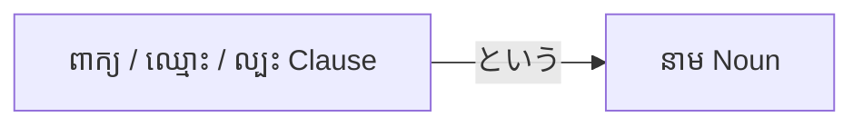

# ចំណុចវេយ្យាករណ៍ជប៉ុន: ～という (〜to iu) Noun
**កម្រិត JLPT:** JLPT N4

---

## ១. សេចក្តីផ្តើម (Introduction)
ទម្រង់វេយ្យាករណ៍ **～という (〜to iu)** គឺជាទម្រង់គ្រឹះដ៏សំខាន់មួយនៅក្នុងភាសាជប៉ុន ដែលត្រូវបានប្រើសម្រាប់បញ្ជាក់ន័យ កំណត់និយមន័យ ឬពណ៌នានាមណាមួយដោយបញ្ជាក់អំពីឈ្មោះរបស់វា ឬបញ្ជាក់អំពីខ្លឹមសារនៃប្រយោគដែលភ្ជាប់មកជាមួយ។ នៅក្នុងភាសាខ្មែរ វាមានន័យស្មើនឹង **«ដែលហៅថា...»**, **«ដែលមានឈ្មោះថា...»** ឬ **«ដែលថា... (ខ្លឹមសារ/ពាក្យចចាមអារ៉ាម/ដំណឹង...)»**។ ទម្រង់នេះមានសារៈសំខាន់ខ្លាំងណាស់នៅពេលណែនាំគំនិតថ្មី របស់របរថ្មី ឬនៅពេលចង់បញ្ជាក់ឱ្យច្បាស់លាស់ថាតើយើងកំពុងនិយាយអំពីមនុស្ស ទីកន្លែង ឬរឿងរ៉ាវជាក់លាក់ណាមួយ។

---

## ២. ការពន្យល់វេយ្យាករណ៍ស្នូល (Core Grammar Explanation)

### អត្ថន័យ (Meaning)
- **[ពាក្យ/ឈ្មោះ/ល្បះ] + という + នាម (Noun)**: នាម**ដែលហៅថា...**, នាម**ដែលមានឈ្មោះថា...**, ឬ នាម**ដែលថា... (ខ្លឹមសារ)**
ទម្រង់នេះអនុញ្ញាតឱ្យអ្នកនិយាយប្រាប់ពីឈ្មោះ ចំណងជើង ឬខ្លឹមសារលម្អិតនៃនាមនោះ ដើម្បីណែនាំ ឬបញ្ជាក់ឱ្យអ្នកស្តាប់បានដឹងច្បាស់។

### ទម្រង់វេយ្យាករណ៍ (Structure)
ទម្រង់មូលដ្ឋានមានដូចខាងក្រោម៖
```
[ពាក្យ / ឈ្មោះ / ល្បះទម្រង់ធម្មតា (Plain form)] + という + នាម (Noun)
```
- **[ពាក្យ / ឈ្មោះ / ល្បះ]**: ឈ្មោះ ចំណងជើង ឬប្រយោគពិពណ៌នាខ្លឹមសារដែលចង់ភ្ជាប់ទៅកាន់នាម។
- **という**: ឃ្លាភ្ជាប់មានន័យថា «ដែលហៅថា...» ឬ «ដែលថា...»។
- **នាម (Noun)**: នាមដែលត្រូវបានគេបញ្ជាក់ន័យ ឬកំណត់និយមន័យ (ឧទាហរណ៍៖ 人, 食べ物, 噂, 話, ニュース, 町, 会社...)។

### ដ្យាក្រាមទម្រង់ (Formation Diagram)


### ការពន្យល់លម្អិត (Detailed Explanation)
- **という** កើតចេញពីកិរិយាសព្ទ **言う (いう - និយាយ/ហៅ)** រួមផ្សំជាមួយឈ្នាប់ដកស្រង់ **と**។
- នៅពេលភ្ជាប់ជាមួយពាក្យ ឈ្មោះ ឬល្បះ វានឹងបង្កើតជាកន្សោមពាក្យគុណនាមសម្រាប់កែប្រែ/បញ្ជាក់ន័យឱ្យនាមខាងក្រោយ ដែលមានន័យថា «ដែលហៅថា...» ឬ «ដែលថា...»។
- ទម្រង់នេះត្រូវបានប្រើប្រាស់ដើម្បី៖
  - ណែនាំរបស់របរ ឬឈ្មោះដែលអ្នកស្តាប់ប្រហែលជាមិនស្គាល់ពីមុនមក។
  - បញ្ជាក់ច្បាស់ថាតើយើងកំពុងសំដៅលើនាមមួយណា (មនុស្ស ទីកន្លែង សៀវភៅ ក្រុមហ៊ុន...)។
  - ពន្យល់លម្អិតអំពីខ្លឹមសារខាងក្នុងនៃនាមអរូបី ដូចជា ពាក្យចចាមអារ៉ាម (噂), រឿងរ៉ាវ (話), ដំណឹង (ニュース), ឬគំនិត (考え)។

### តារាងបំបែកសមាសធាតុទម្រង់ (Visual Aid: Structure Breakdown)
| សមាសធាតុ (Component) | មុខងារ (Function) | ឧទាហរណ៍ទី ១ (ឈ្មោះ) | ឧទាហរណ៍ទី ២ (ខ្លឹមសារ/ល្បះ) |
|---|---|---|---|
| **ពាក្យ/ឈ្មោះ/ល្បះ** | ឈ្មោះ ឬ ខ្លឹមសារកំណត់នាម | スシ (ស៊ូស៊ី) | 結婚する (រៀបការ) |
| **という** | ឈ្នាប់ «ដែលហៅថា / ដែលថា» | という | という |
| **នាម (Noun)** | របស់/រឿងដែលត្រូវបានពណ៌នា | 食べ物 (ម្ហូបអាហារ) | 噂 (ពាក្យចចាមអារ៉ាម) |
| **កន្សោមពេញលេញ** | គំនិតពេញលេញ | **スシという食べ物** | **結婚するという噂** |
| **អត្ថន័យខ្មែរ** | | ម្ហូបអាហារ**ដែលហៅថា**ស៊ូស៊ី | ពាក្យចចាមអារ៉ាម**ដែលថានឹង**រៀបការ |

---

## ៣. ការវិភាគប្រៀបធៀប និង ន័យស៊ីជម្រៅ (Comparative Analysis & Nuance)

### ការប្រើប្រាស់ ២ បែបធំៗនៃ ～という + នាម
នៅកម្រិត JLPT N4 ទម្រង់ **～という + Noun** ចែកចេញជា ២ របៀបប្រើប្រាស់យ៉ាងសំខាន់ដែលអ្នករៀនត្រូវយល់ដឹង៖

1. **ការបញ្ជាក់ឈ្មោះ (Appositive Name / Title): `[ឈ្មោះ/នាម] + という + នាម`**
   - ប្រើសម្រាប់បញ្ជាក់ឈ្មោះរបស់មនុស្ស ទីកន្លែង ឬវត្ថុ (ឧទាហរណ៍៖ «田中さんという人» - មនុស្សដែលមានឈ្មោះថាតាណាកា; «桜という花» - ផ្កាដែលមានឈ្មោះថាសាគូរ៉ា)។
   - ប្រើជាទូទៅនៅពេលអ្នកនិយាយគិតថាអ្នកស្តាប់មិនទាន់ស្គាល់ឈ្មោះនោះ ឬចង់លើកយកឈ្មោះនោះមកបញ្ជាក់ឱ្យច្បាស់លាស់។

2. **ការបញ្ជាក់ខ្លឹមសារនៃល្បះ (Clause Defining Noun Content): `[Clause (ល្បះទម្រង់ធម្មតា)] + という + នាមអរូបី`**
   - ប្រើសម្រាប់លាតត្រដាង ឬបញ្ជាក់ខ្លឹមសារនៃនាមអរូបី ដូចជា **噂 (ពាក្យចចាមអារ៉ាម), 話 (រឿងរ៉ាវ/ដំណឹង), ニュース (ព័ត៌មាន), 意見 (មតិ), 約束 (ការសន្យា)**។
   - **ឧទាហរណ៍ជាក់ស្តែង៖**
     - **結婚するという噂** (*kekkon suru to iu uwasa*): ពាក្យចចាមអារ៉ាម**ដែលថានឹងរៀបការ** (ខ្លឹមសារនៃពាក្យចចាមអារ៉ាមគឺ «រៀបការ»)។
     - **日本へ行くという話** (*Nihon e iku to iu hanashi*): ដំណឹង/រឿងរ៉ាវ**ដែលថានឹងទៅប្រទេសជប៉ុន** (ខ្លឹមសារនៃរឿងគឺ «ទៅជប៉ុន»)។
   - ត្រង់ចំណុចនេះ វាមិនមែនជាឈ្មោះទេ ប៉ុន្តែជា «ខ្លឹមសារនៃគំនិត/ដំណឹង» នោះផ្ទាល់តែម្តង។

### ការប្រៀបធៀបទម្រង់ស្រដៀងគ្នា (Synonymous & Related Forms)

#### ១. **～と呼ばれる (〜to yobareru)**
- **អត្ថន័យ**: «ត្រូវបានហៅថា...», «ត្រូវបានគេស្គាល់ថាជា...» (កិរិយាសព្ទអកម្ម 受身形 នៃ 呼ぶ)
- **កម្រិតភាសា និងការប្រើប្រាស់**: មានលក្ខណៈផ្លូវការខ្លាំង (Formal/Written) ប្រើជាញឹកញាប់ក្នុងការសរសេរ អត្ថបទវិទ្យាសាស្ត្រ ឬសុន្ទរកថាផ្លូវការ។
- **ឧទាហរណ៍**:
  - 東京は日本の首都**と呼ばれる**都市です。
  - *Tōkyō wa Nihon no shuto to yobareru toshi desu.*
  - ទីក្រុងតូក្យូ គឺជាទីក្រុងមួយដែល**ត្រូវបានគេហៅថាជា**រាជធានីនៃប្រទេសជប៉ុន។

#### ២. **～っていう (〜tte iu)**
- **អត្ថន័យ**: ទម្រង់និយាយកាត់/សាមញ្ញនៃ **という**
- **កម្រិតភាសា និងការប្រើប្រាស់**: ប្រើក្នុងកម្រិតស្និទ្ធស្នាល (Casual / Spoken) ក្នុងការសន្ទនាប្រចាំថ្ងៃរវាងមិត្តភក្តិ ឬក្រុមគ្រួសារ។
- **ឧទាហរណ៍**:
  - スシ**っていう**食べ物を知ってる？
  - *Sushi tte iu tabemono o shitteru?*
  - ស្គាល់ម្ហូប**ដែលគេហៅថា**ស៊ូស៊ីទេ?

### តារាងសង្ខេបកម្រិតនៃការប្រើប្រាស់ (Nuance Breakdown)
| ទម្រង់ | កម្រិតនៃការប្រើប្រាស់ (Formality/Register) | បរិបទនៃការប្រើប្រាស់ |
|---|---|---|
| **～という** | កណ្តាល / ទូទៅ (Neutral) | ប្រើបានទាំងផ្លូវការ និងមិនផ្លូវការ សមស្របគ្រប់ស្ថានភាព។ |
| **～と呼ばれる** | ផ្លូវការខ្លាំង / ការសរសេរ (Formal / Written) | ប្រើសម្រាប់និយមន័យផ្លូវការ ឈ្មោះល្បី ឬគោរមងារ។ |
| **～っていう** | ស្និទ្ធស្នាល / ភាសានិយាយ (Casual / Spoken) | ប្រើក្នុងការសន្ទនាមាត់ទទេរវាងមិត្តភក្តិ ឬអ្នកស្និទ្ធស្នាល។ |

---

## ៤. ឧទាហរណ៍ក្នុងបរិបទជាក់ស្តែង (Examples in Context)

### ឧទាហរណ៍ប្រយោគ (Sentence Examples)

#### **ឧទាហរណ៍ទី ១: ការណែនាំពាក្យ ឬរបស់ថ្មី (Introducing a New Term)**
- **ភាសាជប៉ុន**: これは **ラーメン** という食べ物です。
- **Romaji**: Kore wa **rāmen** to iu tabemono desu.
- **អត្ថន័យខ្មែរ**: នេះគឺជាម្ហូបអាហារមួយប្រភេទ**ដែលហៅថា «រ៉ាមេន»**។

#### **ឧទាហរណ៍ទី ២: ការបញ្ជាក់អំពីមនុស្សជាក់លាក់ (Specifying a Person)**
- **ភាសាជប៉ុន**: **田中さん** という人が訪ねてきました。
- **Romaji**: **Tanaka-san** to iu hito ga tazunete kimashita.
- **អត្ថន័យខ្មែរ**: មានមនុស្សម្នាក់**ដែលមានឈ្មោះថា «លោកតាណាកា»** បានមកសួរសុខទុក្ខ។

#### **ឧទាហរណ៍ទី ៣: ការពិពណ៌នាអំពីទីកន្លែង (Describing a Place)**
- **ភាសាជប៉ុន**: 京都には **金閣寺** というお寺があります。
- **Romaji**: Kyōto ni wa **Kinkaku-ji** to iu otera ga arimasu.
- **អត្ថន័យខ្មែរ**: នៅក្យូតូ មានវត្តមួយ**ដែលមានឈ្មោះថា «វត្តគីនកាគុជី (Kinkaku-ji)»**។

#### **ឧទាហរណ៍ទី ៤: ការលើកឡើងអំពីសៀវភៅ ឬស្នាដៃ (Talking About a Book/Title)**
- **ភាសាជប៉ុន**: **「星の王子さま」** という本を読みました。
- **Romaji**: **"Hoshi no Ōjisama"** to iu hon o yomimashita.
- **អត្ថន័យខ្មែរ**: ខ្ញុំបានអានសៀវភៅមួយក្បាល**ដែលហៅថា «ព្រះអង្គម្ចាស់តូច (The Little Prince)»**។

#### **ឧទាហរណ៍ទី ៥: ការសន្ទនាក្នុងជីវភាពរស់នៅ (Casual Conversation)**
- **ភាសាជប៉ុន**: 明日、 **花火大会** というイベントに行くよ。
- **Romaji**: Ashita, **hanabi taikai** to iu ibento ni iku yo.
- **អត្ថន័យខ្មែរ**: ថ្ងៃស្អែក ខ្ញុំនឹងទៅចូលរួមកម្មវិធីមួយ**ដែលហៅថា «ពិធីបុណ្យកាំជ្រួច»**។

#### **ឧទាហរណ៍ទី ៦: ការបញ្ជាក់ខ្លឹមសារនៃពាក្យចចាមអារ៉ាម (Noun Defined by Clause - 噂)**
- **ភាសាជប៉ុន**: 彼が **結婚する** という噂を聞きました。
- **Romaji**: Kare ga **kekkon suru** to iu uwasa o kikimashita.
- **អត្ថន័យខ្មែរ**: ខ្ញុំបានឮពាក្យចចាមអារ៉ាម**ដែលថាលោកនឹងរៀបការ**។

#### **ឧទាហរណ៍ទី ៧: ការបញ្ជាក់ខ្លឹមសារនៃដំណឹង/រឿងរ៉ាវ (Noun Defined by Clause - 話)**
- **ភាសាជប៉ុន**: 来年 **日本へ行く** という話は本当ですか。
- **Romaji**: Rainen **Nihon e iku** to iu hanashi wa hontō desu ka.
- **អត្ថន័យខ្មែរ**: តើរឿងរ៉ាវ/ដំណឹង**ដែលថានឹងទៅប្រទេសជប៉ុន**នៅឆ្នាំក្រោយជារឿងពិតដែរឬទេ?

---

## ៥. កំណត់សម្គាល់វប្បធម៌ (Cultural Notes)

### ទំនាក់ទំនងវប្បធម៌ក្នុងការប្រាស្រ័យទាក់ទង (Cultural Relevance)
- **ភាពច្បាស់លាស់ក្នុងការប្រាស្រ័យទាក់ទង (Clarity in Communication)**: នៅក្នុងវប្បធម៌ជប៉ុន ការផ្តល់ព័ត៌មានលម្អិត និងបរិបទមានសារៈសំខាន់ខ្លាំង ជាពិសេសនៅពេលលើកឡើងពីពាក្យបច្ចេកទេស ឬឈ្មោះដែលអ្នកស្តាប់ប្រហែលជាមិនធ្លាប់ស្គាល់ពីមុនមក។
- **ការគិតគូរដល់អ្នកស្តាប់ (Consideration & Politeness)**: ការប្រើប្រាស់ **という** បង្ហាញពីការយល់យោគ និងការគិតគូរដល់អ្នកស្តាប់ ដោយមិនសន្មតថាអ្នកស្តាប់ត្រូវតែស្គាល់ឈ្មោះនោះឡើយ (ការពារកុំឱ្យអ្នកស្តាប់មានអារម្មណ៍ទើសទាល់នៅពេលជួបពាក្យប្លែក)។

### កម្រិតគួរសម និងទម្រង់ផ្លូវការ (Levels of Politeness and Formality)
- គ្រោងទម្រង់ **～という** ខ្លួនឯងមានលក្ខណៈអព្យាក្រឹត (Neutral)។
- កម្រិតគួរសមរបស់ប្រយោគទាំងមូលត្រូវបានកំណត់ដោយកិរិយាសព្ទបញ្ចប់ប្រយោគ៖
  - ទម្រង់ស្និទ្ធស្នាល (Casual): បញ្ចប់ដោយ **だ (da)**, **する (suru)**...
  - ទម្រង់គួរសម (Polite): បញ្ចប់ដោយ **です (desu)**, **します (shimasu)**...

### ឃ្លា និងសុភាសិតទាក់ទង (Idiomatic Expressions)
#### **名は体を表す (なはたいをあらわす - Na wa tai o arawasu)**
- **អត្ថន័យ**: «ឈ្មោះតែងតែឆ្លុះបញ្ចាំងពីលក្ខណៈពិត» ឬ «ឈ្មោះយ៉ាងណា ធាតុពិតយ៉ាងនោះ»។
- **ការប្រើប្រាស់**: បង្ហាញពីសារៈសំខាន់នៃឈ្មោះដែលស័ក្តិសមទៅនឹងបុគ្គល ឬវត្ថុពិត។

#### **「猫」という動物 (កន្សោមពន្យល់បែបអប់រំ)**
- ជាញឹកញាប់ត្រូវបានប្រើក្នុងបរិបទបង្រៀន ឬអប់រំ ដើម្បីផ្តល់និយមន័យ៖
  - **ឧទាហរណ៍**: **猫という動物はとてもかわいいです。** (*Neko to iu dōbutsu wa totemo kawaii desu.*)
  - សត្វ**ដែលហៅថាឆ្មា** គឺពិតជាគួរឱ្យស្រឡាញ់ណាស់។

---

## ៦. កំហុសទូទៅ និងគន្លឹះចងចាំ (Common Mistakes and Tips)

### ការវិភាគកំហុសទូទៅ (Error Analysis)

#### **កំហុសទី ១: ការលុបបំបាត់នាមខាងក្រោយចោល (Omitting the Noun)**
- **ខុស**: これは **スシという** 。❌
  - ខ្វះនាមនៅខាងក្រោយពាក្យ **という**។
- **ត្រូវ**: これは **スシという食べ物** です。⭕ (នេះជាម្ហូបអាហារដែលហៅថាស៊ូស៊ី។)

#### **កំហុសទី ២: ការរៀបលំដាប់ពាក្យខុសទីតាំង (Misplacing the Structure)**
- **ខុស**: **というスシ食べ物**。❌
  - ពាក្យ **という** ត្រូវតែនៅពីក្រោយឈ្មោះ **スシ** ជានិច្ច។
- **ត្រូវ**: **スシという食べ物**。⭕

#### **កំហុសទី ៣: ការប្រើច្រឡំរវាង と និង という**
- **ខុស**: **スシと食べ物**。❌ (មានន័យថា «ស៊ូស៊ី និងម្ហូបអាហារ» ព្រោះ と ប្រែថា «និង»)
- **ត្រូវ**: **スシという食べ物**。⭕ (ម្ហូបអាហារដែលហៅថាស៊ូស៊ី)

### គន្លឹះនៃការរៀន (Learning Strategies)
#### **គន្លឹះទី ១: ចងចាំន័យ «ដែលហៅថា...» ឬ «ដែលថា...»**
- នៅពេលណាដែលឃើញ **という** នៅចន្លោះពាក្យពីរ ឬនៅចន្លោះល្បះ និងនាម សូមជំនួសដោយពាក្យខ្មែរថា **«ដែលហៅថា»** (ករណីឈ្មោះ) ឬ **«ដែលថា»** (ករណីខ្លឹមសារល្បះ) ដើម្បីងាយយល់ន័យភ្លាមៗ។
#### **គន្លឹះទី ២: អនុវត្តជាមួយឈ្មោះដែលធ្លាប់ស្គាល់**
- បង្កើតប្រយោគជាមួយឈ្មោះល្បីៗ ដូចជា៖
  - **ポケモンというゲーム** (ហ្គេមដែលហៅថា Pokémon)
  - **アンコールワットという寺院** (ប្រាសាទដែលហៅថា អង្គរវត្ត)
#### **គន្លឹះទី ៣: ប្រើប្រាស់បណ្ណពាក្យ (Flashcards)**
- កត់ត្រាប្រយោគគំរូទាំង ២ ប្រភេទ (ប្រភេទបញ្ជាក់ឈ្មោះ និងប្រភេទបញ្ជាក់ខ្លឹមសារ clause ដូចជា 結婚するという噂) ទៅក្នុង flashcard ដើម្បីរំលឹកជាប្រចាំ។

---

## ៧. សង្ខេប និងការរំលឹកឡើងវិញ (Summary and Review)

### ចំណុចសំខាន់ៗដែលត្រូវចងចាំ (Key Takeaways)
- **～という** ត្រូវបានប្រើសម្រាប់កំណត់ ឬពណ៌នានាមមួយតាមរយៈឈ្មោះ ចំណងជើង ឬខ្លឹមសារលម្អិតរបស់វា។
- ទម្រង់វេយ្យាករណ៍៖ **[ពាក្យ/ឈ្មោះ/Clause] + という + នាម (Noun)**
- ប្រែសម្រួលជាភាសាខ្មែរថា៖ **«នាមដែលហៅថា...»**, **«នាមដែលមានឈ្មោះថា...»** ឬ **«នាមដែលថា... (ខ្លឹមសារ)»**។
- មានប្រយោជន៍ខ្លាំងក្នុងការណែនាំគំនិតថ្មី បញ្ជាក់ឈ្មោះជាក់លាក់ និងពន្យល់ខ្លឹមសារនៃនាមអរូបី (ពាក្យចចាមអារ៉ាម ដំណឹង គំនិត)។

### សំណួររំលឹកមេរៀនរហ័ស (Quick Recap Quiz)
១. **តើឃ្លា «ចម្រៀងដែលមានឈ្មោះថា សាគូរ៉ា» និយាយជាភាសាជប៉ុនយ៉ាងដូចម្តេច?**
   - **ចម្លើយ**: **「さくら」という歌** (*"Sakura" to iu uta*)

២. **ចូរជ្រើសរើសបំពេញចន្លោះ៖ 彼は _____ という会社で働いています。(គាត់ធ្វើការនៅក្រុមហ៊ុនមួយដែលមានឈ្មោះថា ABC Corp)**
   - **ចម្លើយ**: **「ABCコーポレーション」** (ABC Corporation)

៣. **ពិត ឬ មិនពិត (True or False): តើទម្រង់ ～という អាចប្រើជាមួយល្បះ (Clause) ដើម្បីបញ្ជាក់ខ្លឹមសារនៃនាម ដូចជា 噂 (ពាក្យចចាមអារ៉ាម) ឬ 話 (រឿងរ៉ាវ) បានដែរឬទេ?**
   - **ចម្លើយ**: **ពិត (True)** (ឧទាហរណ៍៖ 結婚するという噂 - ពាក្យចចាមអារ៉ាមដែលថានឹងរៀបការ, 日本へ行くという話 - ដំណឹងដែលថានឹងទៅប្រទេសជប៉ុន)។

---

តាមរយៈការស្វែងយល់ និងការអនុវត្តទម្រង់ **～という** អ្នកនឹងអាចណែនាំ និងពណ៌នាអំពីវត្ថុ ទីកន្លែង មនុស្ស ឬរឿងរ៉ាវផ្សេងៗបានយ៉ាងរលូន និងមានលក្ខណៈធម្មជាតិនៅក្នុងភាសាជប៉ុន។ សូមចងចាំជានិច្ចនូវការដាក់ទីតាំង **という** ឱ្យបានត្រឹមត្រូវនៅចន្លោះឈ្មោះ/ល្បះ និងនាមដែលត្រូវបញ្ជាក់ន័យ។

---

© [Hanabira.org](https://hanabira.org)
