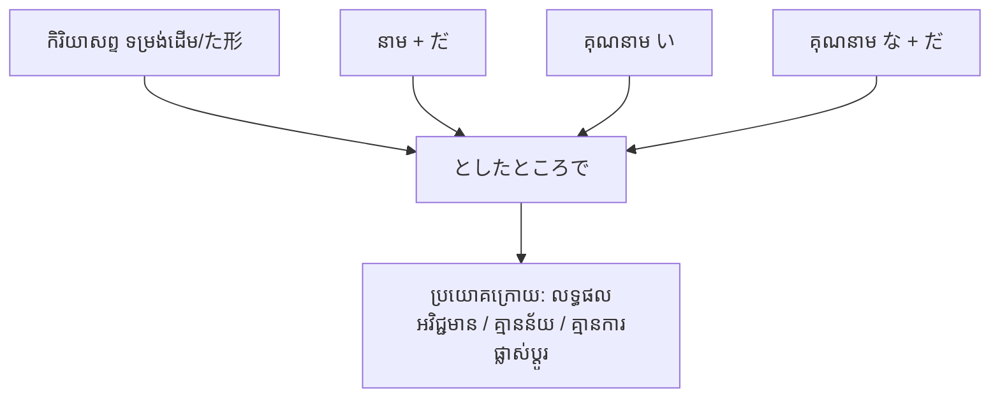

Processing keyword: ～としたところで (〜to shita tokoro de)
# ចំណុចវេយ្យាករណ៍ជប៉ុន: ～としたところで (〜to shita tokoro de)
**កម្រិត JLPT:** JLPT N1

## ១. សេចក្តីផ្តើម (Introduction)
ទម្រង់វេយ្យាករណ៍ **～としたところで** (`〜to shita tokoro de`) ត្រូវបានប្រើប្រាស់ដើម្បីបង្ហាញគំនិតថា *ទោះបីជា / បើទោះជា* សកម្មភាព ឬលក្ខខណ្ឌណាមួយកើតឡើង ឬត្រូវបានអនុវត្តក៏ដោយ ក៏វាមិនអាចផ្លាស់ប្តូរ ឬនាំមកនូវលទ្ធផលសំខាន់អ្វីបានឡើយ។ ទម្រង់នេះបង្កប់នូវអារម្មណ៍អស់សង្ឃឹម គ្មានប្រយោជន៍ (futility) ឬការទទួលយកការពិតដោយបង្ខំចិត្ត (resignation) ដោយសង្កត់ធ្ងន់ថា ការខិតខំប្រឹងប្រែង ឬលក្ខខណ្ឌទាំងនោះគឺមិនគ្រប់គ្រាន់ដើម្បីកែប្រែស្ថានភាពនោះឡើយ។

---
## ២. ការពន្យល់វេយ្យាករណ៍ស្នូល (Core Grammar Explanation)
### អត្ថន័យ (Meaning)
- **ទោះបីជា... ក៏ដោយ (Even if ~)**
- **ឧបមាថា... ក៏ដោយចុះ (Assuming that ~)**
- **បើទោះបីជា... យ៉ាងណាក៏ដោយ (Even though ~)**

### ទម្រង់ផ្សំ (Structure / Formation)
ទម្រង់នេះផ្សំឡើងពីទម្រង់សន្មត **とした** (មកពីកិរិយាសព្ទ する ក្នុងអត្ថន័យសន្មត "ចាត់ទុកថា / ឧបមាថា") បូកនឹង **ところで** (ទោះបីជា... ក៏ដោយ)។ អាចភ្ជាប់ជាមួយកិរិយាសព្ទ (ទាំងទម្រង់ដើម និងទម្រង់អតីតកាល た形), នាម, និងគុណនាម៖

| ប្រភេទពាក្យ (Part of Speech) | របៀបផ្សំ (Formation) |
|---|---|
| **កិរិយាសព្ទ (Verb)** | កិរិយាសព្ទ (ទម្រង់វចនានុក្រម / た形) + としたところで |
| **នាម (Noun)** | នាម + (だ) + としたところで |
| **គុណនាម い (い-adjective)** | គុណនាម い + としたところで |
| **គុណនាម な (な-adjective)** | គុណនាម な + (だ) + としたところで |

#### ឧទាហរណ៍នៃការផ្គុំ (Formation Examples)
- **កិរិយាសព្ទ:** 行く / 行った **としたところで** (ទោះបីជាទៅ / ឧបមាថាទៅក៏ដោយ)
- **នាម:** 無理 **だとしたところで** (ទោះបីជាវាមិនអាចទៅរួចក៏ដោយ)
- **គុណនាម い:** 高い **としたところで** (ទោះបីជាថ្លៃយ៉ាងណាក៏ដោយ)
- **គុណនាម な:** 簡単 **だとしたところで** (ទោះបីជាវាងាយស្រួលក៏ដោយចុះ)

### ការពន្យល់លម្អិត (Detailed Explanation)
ទម្រង់វេយ្យាករណ៍ **～としたところで** ត្រូវបានប្រើនៅពេលអ្នកនិយាយចង់សន្មតស្ថានភាពណាមួយឡើង ហើយវាយតម្លៃថា "បើទោះបីជាស្ថានភាព ឬការសន្មតនោះជាការពិត ឬកើតឡើងមែន ក៏លទ្ធផលចុងក្រោយនៅតែគ្មានប្រយោជន៍ គ្មានន័យ ឬគ្មានអ្វីប្រែប្រួលជាដុំកំភួនឡើយ"។
- **បង្ហាញពីភាពគ្មានប្រយោជន៍ ឬផលជះកម្រិតទាប (Conveys futility or limited impact):** បញ្ជាក់យ៉ាងច្បាស់ថាសកម្មភាព ឬការខិតខំនោះនឹងមិនអាចកែប្រែលទ្ធផលបានឡើយ។
- **ការលើកឡើងពីសេណារីយ៉ូសន្មត (Hypothetical scenario):** ភាគច្រើនប្រើក្នុងការសន្មតស្ថានភាពដែលមិនទំនងកើតឡើង ឬទោះជាកើតឡើងក៏នៅតែមិនគ្រប់គ្រាន់ដើម្បីដោះស្រាយបញ្ហា។
- **សង្កត់ធ្ងន់លើអារម្មណ៍អស់សង្ឃឹម ឬមន្ទិលសង្ស័យ (Emphasizes resignation or skepticism):** បង្ហាញពីការសង្ស័យយ៉ាងខ្លាំងចំពោះប្រសិទ្ធភាពនៃសកម្មភាពនោះ។

#### គំនូសបំព្រួញនៃការផ្គុំ (Visual Diagram)

---
## ៣. ការវិភាគប្រៀបធៀប និង ន័យស៊ីជម្រៅ (## ការវិភាគប្រៀបធៀប និង ន័យស៊ីជម្រៅ)

### ៣.១. ភាពខុសគ្នារវាងទម្រង់វេយ្យាករណ៍ស្រដៀងគ្នា

#### ក. ～としたところで vs. ～たところで
- **～たところで (JLPT N2):**
  - ផ្សំផ្ទាល់ជាមួយកិរិយាសព្ទអតីតកាល `[Verb-た] + ところで`។
  - សង្កត់ធ្ងន់លើសកម្មភាពជាក់ស្តែង ឬការសាកល្បងដែលធ្វើឡើងរួចហើយលទ្ធផលនៅតែអវិជ្ជមាន៖ "ទោះបីជាខំធ្វើ... ក៏គ្មានប្រយោជន៍ដែរ"។
  - ឧទាហរណ៍៖ 今さら**走ったところで**、間に合わない。(ទោះបីជាខំរត់ឥឡូវនេះ ក៏មិនទាន់ដែរ។)
- **～としたところで (JLPT N1):**
  - មានធាតុផ្សំ `とした` (មកពី とする = សន្មតថា / ឧបមាថា) ដូច្នេះវាផ្តោតខ្លាំងលើ **ការសន្មតបែបទ្រឹស្តី ឬការស្រមើលស្រមៃ (Hypothetical premise)**។
  - មានអត្ថន័យថា "ឧបមាថាទោះបីជាអាចធ្វើដល់កម្រិតនោះបានក៏ដោយចុះ... ក៏លទ្ធផលនៅតែអវិជ្ជមានដដែល"។
  - ឧទាហរណ៍៖ 全員が**賛成したとしたところで**、予算が足りない。(ឧបមាថាទោះបីជាមនុស្សគ្រប់គ្នាឯកភាពគាំទ្រក៏ដោយ ក៏ថវិកានៅតែមិនគ្រប់គ្រាន់ដែរ។)
  - អាចផ្សំបានទាំងជាមួយ នាម, គុណនាម, និងកិរិយាសព្ទ ខណៈដែល `〜たところで` ភាគច្រើនកម្រិតតែលើកិរិយាសព្ទ `た形` ប៉ុណ្ណោះ។

#### ខ. ～としたところで vs. ～としても / ～にしても
- **～としても / ～にしても (JLPT N2/N3):**
  - គ្រាន់តែជាការសន្មតលក្ខខណ្ឌផ្ទុយបែបអព្យាក្រឹត ("ទោះបីជា... ក៏ដោយ")។ ប្រយោគខាងក្រោយអាចជាការពិតទូទៅ ឬសកម្មភាពវិជ្ជមាន/អវិជ្ជមានក៏បាន។
  - ឧទាហរណ៍៖ 雨が降る**としても**、出発します。(ទោះបីជាភ្លៀងធ្លាក់ក៏ដោយ ក៏ខ្ញុំនឹងចេញដំណើរដែរ។ -> សម្តែងឆន្ទៈ)
- **～としたところで:**
  - មិនមែនជាទម្រង់អព្យាក្រឹតទេ! ប្រយោគខាងក្រោយ **ត្រូវតែជាការវាយតម្លៃអវិជ្ជមាន ការអស់សង្ឃឹម ឬភាពគ្មានន័យ/គ្មានប្រយោជន៍ (Futility / Meaningless outcome)** ជានិច្ច។ មិនអាចប្រើជាមួយប្រយោគបញ្ជា ឬការប្តេជ្ញាចិត្តវិជ្ជមានឡើយ។

#### គ. ～としたところで vs. ～ても
- **～ても (JLPT N5/N4):**
  - ជាឈ្នាប់លក្ខខណ្ឌសម្បទានទូទៅបំផុតក្នុងភាសាជប៉ុន ("ទោះបីជា... ក៏...")។ គ្មានបង្កប់នូវអារម្មណ៍អស់សង្ឃឹម ឬការវាយតម្លៃថា "គ្មានប្រយោជន៍" នោះទេ។
  - ឧទាហរណ៍៖ 薬を飲んでも、治らない。(ទោះបីលេបថ្នាំ ក៏មិនទាន់ជាដែរ។ -> គ្រាន់តែរៀបរាប់ការពិត)

### ៣.២. កម្រិតភាសា និងបរិបទប្រើប្រាស់ (Register & Pragmatics)
- **កម្រិតផ្លូវការ (Formality):** ជាទម្រង់កម្រិតខ្ពស់ (JLPT N1) ដែលច្រើនប្រើក្នុងការសរសេរ (អត្ថបទវិចារណកថា កាសែត របាយការណ៍) ឬការជជែកពិភាក្សាដេញដោលផ្លូវការ ដើម្បីច្រានចោលទឡ្ហីករណ៍ណាមួយ ដោយលើកឡើងថា "ទោះបីជាទទួលយកចំណុចនោះ ក៏មិនអាចកែខៃស្ថានភាពបានដែរ"។
- **កំហិតនៃប្រយោគខាងក្រោយ (Clause-B Constraints):** ប្រយោគខាងក្រោយតែងតែបញ្ចប់ដោយពាក្យបញ្ជាក់ពីការវាយតម្លៃអវិជ្ជមាន ដូចជា៖
  - `〜ない` / `〜ではない` (មិន...)
  - `意味がない` / `無駄だ` (គ្មានន័យ / អត់ប្រយោជន៍)
  - `〜にすぎない` (គ្រាន់តែជា...)
  - `〜とは限らない` (មិនប្រាកដថា...)
  - `〜だろう / 〜かもしれない` (ប្រហែលជា... មិន...)

---
## ៤. ឧទាហរណ៍ក្នុងបរិបទ (Examples in Context)

### ឧទាហរណ៍ ១ (កម្រិតផ្លូវការ - Formal)
**彼が参加したとしたところで、大きな変化はないだろう。**  
*かれが さんかした としたところで、おおきな へんかは ないだろう。*  
"ទោះបីជាគាត់ចូលរួមយ៉ាងណាក៏ដោយ ក៏ប្រហែលជាគ្មានការផ្លាស់ប្តូរធំដុំអ្វីកើតឡើងនោះឡើយ។"

---
### ឧទាហរណ៍ ២ (កម្រិតសន្ទនាទូទៅ - Informal / Conversational)
**急いだとしたところで、もう間に合わないよ。**  
*いそいだ としたところで、もう まにあわないよ。*  
"ទោះបីជាឯងប្រញាប់យ៉ាងណាក៏ដោយ ក៏លែងទាន់ពេលវេលាទៀតហើយ។"

---
### ឧទាហរណ៍ ៣ (លទ្ធផលអវិជ្ជមាន - Negative Outcome)
**今から準備を始めたとしたところで、時間が足りない。**  
*いまから じゅんびを はじめた としたところで、じかんが たりない។*  
"ទោះបីជាចាប់ផ្តើមរៀបចំពីពេលនេះទៅក៏ដោយចុះ ក៏ពេលវេលានៅតែមិនគ្រប់គ្រាន់ដែរ។"

---
### ឧទាហរណ៍ ៤ (ការបង្ហាញពីភាពគ្មានប្រយោជន៍ - Expressing Futility)
**謝ったとしたところで、彼女は許してくれないかもしれない。**  
*あやまった としたところで、かのじょは ゆるしてくれない かもしれない。*  
"ទោះបីជាទៅសុំទោសនាងក៏ដោយ ក៏នាងប្រហែលជាមិនលើកលែងទោសឱ្យនោះដែរ។"

---
### ឧទាហរណ៍ ៥ (ការសន្មតបែបទ្រឹស្តី - Hypothetical Scenario)
**宝くじに当たったとしたところで、幸せになれるとは限らない。**  
*たからくじに あたった としたところで、しあわせに なれるとは かぎらない。*  
"ឧបមាថាទោះបីជាត្រូវឆ្នោតរង្វាន់ធំក៏ដោយ ក៏មិនប្រាកដថានឹងទទួលបានសុភមង្គលនោះដែរ។"

---
### ឧទាហរណ៍ ៦ (ប្រើជាមួយគុណនាម និងនាម - Adjective & Noun)
**性能が良いとしたところで、これほど高価では誰も買わないだろう。**  
*せいのうが よいとしたところで、これほど こうかでは だれも かわないだろう。*  
"ទោះបីជាគុណភាពដំណើរការល្អយ៉ាងណាក៏ដោយចុះ បើថ្លៃដល់ថ្នាក់នេះ ប្រហែលជាគ្មានអ្នកណាទិញនោះឡើយ។"

---
## ៥. កំណត់សម្គាល់វប្បធម៌ (Cultural Notes)
### ទំនាក់ទំនងវប្បធម៌ជប៉ុន (Cultural Relevance)
នៅក្នុងសង្គមជប៉ុន ការរក្សាសុខដុមនីយកម្ម (和 - Wa) និងការចៀសវាងការប្រឈមមុខដាក់គ្នាដោយផ្ទាល់ គឺជាគុណតម្លៃស្នូល។ ការប្រើប្រាស់ទម្រង់ **～としたところで** ជួយឱ្យអ្នកនិយាយអាចច្រានចោលគំនិត ឬសំណើរបស់ភាគីម្ខាងទៀតដោយប្រយោល និងសមហេតុផល។ តាមរយៈការទទួលស្គាល់ការសន្មតជាមុនសិន ("ឧបមាថាធ្វើដូចអ្នកឯងនិយាយចុះ...") រួចទើបពន្យល់ពីភាពគ្មានផ្លែផ្កា ("...ក៏លទ្ធផលនៅតែមិនអាចដោះស្រាយបានដដែល") វាជួយបន្ទន់សម្ពាធនៃការបដិសេធ និងរក្សាភាពគួរសមក្នុងការពិភាក្សា។

### កម្រិតគួរសម និងទម្រង់បែបបទ (Politeness & Formality)
- **កម្រិតគួរសម:** អាចប្រើប្រាស់បានទាំងក្នុងទម្រង់គួរសម (敬語 / 丁寧語 បញ្ចប់ដោយ です/ます) និងទម្រង់ស្និទ្ធស្នាល (普通形)។
- **ទម្រង់បែបបទ:** ពេញនិយមប្រើក្នុងអត្ថបទសរសេរផ្លូវការ ការវិភាគស៊ីជម្រៅ ឬការជជែកដេញដោលតាមបែបហេតុផលឡូជីខល។

---
## ៦. កំហុសទូទៅ និងគន្លឹះចងចាំ (Common Mistakes and Tips)
### ការវិភាគកំហុស (Error Analysis)
១. **ច្រឡំទម្រង់កិរិយាសព្ទ (Using the Wrong Verb Form):**
   - **ខុស:** 行ってとしたところで、間に合わない。
   - **ត្រូវ:** 行くとしたところで、間に合わない。 ឬ 行ったとしたところで、間に合わない。
   *ការពន្យល់:* ត្រូវប្រើកិរិយាសព្ទក្នុងទម្រង់ដើម (辞書形) ឬទម្រង់អតីតកាល (た形) នៅពីមុខ **としたところで** មិនត្រូវប្រើទម្រង់ て形 ឡើយ។

២. **ការប្រើជាមួយប្រយោគខាងក្រោយដែលមានលទ្ធផលវិជ្ជមាន ឬបញ្ជា (Positive or Imperative Clause B):**
   - **ខុស:** 練習したとしたところで、試合に勝とう！ (ទោះបីហាត់សមយ៉ាងណា ក៏តោះទៅឈ្នះការប្រកួត!)
   - **ត្រូវ:** 練習したとしたところで、勝てる見込みは薄い。 (ទោះបីជាខំហាត់សមយ៉ាងណាក៏ដោយ ក៏សង្ឃឹមឈ្នះនៅតែតិចតួចដែរ។)
   *ការពន្យល់:* ប្រយោគខាងក្រោយនៃ `〜としたところで` ត្រូវតែជាការវាយតម្លៃអវិជ្ជមាន ឬភាពអស់សង្ឃឹម មិនអាចប្រើជាប្រយោគលើកទឹកចិត្ត បញ្ជា ឬប្តេជ្ញាចិត្តវិជ្ជមានឡើយ។

### គន្លឹះក្នុងការរៀន (Learning Strategies)
- **ផ្សារភ្ជាប់ជាមួយ "ភាពគ្មានប្រយោជន៍" (Futility):** ចងចាំថាពេលណាឃើញ `としたところで` គឺមានន័យថា "ទោះខំធ្វើដល់កម្រិតណាក៏នៅតែអត់ប្រយោជន៍ដដែល"។
- **កត់សម្គាល់ពាក្យបញ្ចប់ប្រយោគ:** ពិនិត្យមើលពាក្យដូចជា `〜ない`, `〜無駄だ`, `〜意味がない`, `〜とは限らない` នៅចុងប្រយោគ។

---
## ៧. សង្ខេប និងកម្រងសំណួររំលឹកឡើងវិញ (Summary and Review)
### ចំណុចគន្លឹះសំខាន់ៗ (Key Takeaways)
- **～としたところで** ប្រើដើម្បីបង្ហាញថា ទោះបីជាលក្ខខណ្ឌ ឬការសន្មតណាមួយកើតឡើង ក៏វាមិនអាចកែប្រែលទ្ធផលជាដុំកំភួនបានឡើយ។
- បង្កប់នូវអារម្មណ៍អស់សង្ឃឹម (futility) ឬការសន្មតបែបទ្រឹស្តី (hypothetical resignation)។
- ផ្សំជាមួយកិរិយាសព្ទ (辞書形/た形), នាម + だ, គុណនាម い, និងគុណនាម な + だ។

### កម្រងសំណួរខ្លីៗ (Quick Recap Quiz)
១. **ចូរជ្រើសរើសទម្រង់ត្រឹមត្រូវបំពេញចន្លោះ៖**  
   どんなに説明した________、彼は理解しないだろう。  
   **ចម្លើយ:** としたところで  
   *(ការពន្យល់: ទោះបីជាខំប្រឹងពន្យល់យ៉ាងណាក៏ដោយ ក៏គាត់ប្រហែលជាមិនយល់ដដែល។)*

២. **ត្រូវ ឬខុស (True or False):**  
   ទម្រង់ **～としたところで** អាចប្រើក្នុងប្រយោគដែលមានលទ្ធផលវិជ្ជមាន ឬការប្តេជ្ញាចិត្តជោគជ័យបាន។  
   **ចម្លើយ:** ខុស (False)  
   *(ការពន្យល់: ត្រូវតែប្រើជាមួយលទ្ធផលអវិជ្ជមាន ឬការវាយតម្លៃថាគ្មានប្រយោជន៍ប៉ុណ្ណោះ។)*

៣. **ចូរជ្រើសរើសប្រយោគដែលប្រើប្រាស់ **～としたところで** បានត្រឹមត្រូវ៖**  
   a) 今から寝たとしたところで、十分な睡眠は取れない。  
   b) 今から寝て、十分な睡眠は取れる。  
   c) 今から寝たところで、十分な睡眠は取れる。  
   **ចម្លើយ:** a) 今から寝たとしたところで、十分な睡眠は取れない。  
   *(ការពន្យល់: ជម្រើស a ត្រឹមត្រូវ ព្រោះប្រយោគខាងក្រោយបង្ហាញពីលទ្ធផលអវិជ្ជមាន "មិនអាចគេងបានគ្រប់គ្រាន់ទេ")*

---
**សូមអបអរសាទរ!** អ្នកបានសិក្សាស្វែងយល់ចប់សព្វគ្រប់នូវចំណុចវេយ្យាករណ៍កម្រិត N1 **～としたところで**។ សូមបន្តបង្កើតប្រយោគផ្ទាល់ខ្លួនដើម្បីពង្រឹងការចងចាំឱ្យកាន់តែច្បាស់លាស់!

---
© [Hanabira.org](https://hanabira.org)
