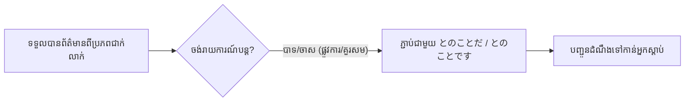

Processing keyword: ～とのことだ (〜to no koto da)
# ចំណុចវេយ្យាករណ៍ជប៉ុន: ～とのことだ (〜to no koto da)
**កម្រិត JLPT:** JLPT N1

## ១. សេចក្តីផ្តើម (Introduction)
ទម្រង់វេយ្យាករណ៍ **～とのことだ (〜to no koto da)** ត្រូវបានប្រើប្រាស់ក្នុងភាសាជប៉ុនដើម្បីបញ្ជូនបន្ត ឬរាយការណ៍ព័ត៌មានដែលបានឮ ឬទទួលបានពីអ្នកដទៃ (ពាក្យចចាមអារ៉ាម ឬដំណឹងបន្ត)។ ទម្រង់នេះច្រើនតែប្រើដើម្បីរាយការណ៍សារ ឬដំណឹងដោយប្រយោល និងមានលក្ខណៈគួរសមផ្លូវការ ដែលធ្វើឱ្យវាក្លាយជាទម្រង់វេយ្យាករណ៍ដ៏សំខាន់បំផុតមួយក្នុងការទំនាក់ទំនងបែបផ្លូវការ ជាពិសេសក្នុងការងារ និងការសរសេរសំបុត្រ/អ៊ីមែលធុរកិច្ច។

---

## ២. ការពន្យល់វេយ្យាករណ៍គោល (Core Grammar Explanation)

### អត្ថន័យ (Meaning)
- **～とのことだ** ត្រូវបានប្រើដើម្បី **រាយការណ៍ព័ត៌មាន ឬបញ្ជូនបន្តនូវសារ** ដែលអ្នកបានឮ ឬទទួលបានពី **ប្រភពជាក់លាក់ណាមួយ** (មនុស្ស សំបុត្រ អ៊ីមែល សេចក្តីជូនដំណឹង)។
- អាចបកប្រែជាភាសាខ្មែរថា៖ **"ឮថា..."**, **"ឃើញថា..."**, **"បានដឹងមកថា..."**, ឬ **"តាមដែលបានប្រាប់មកគឺថា..."**។

### ទម្រង់វេយ្យាករណ៍ (Structure)
ទម្រង់នេះផ្សំឡើងដោយយក **ទម្រង់ធម្មតា (Plain Form / 普通形)** នៃកិរិយាសព្ទ គុណនាម ឬនាម មកភ្ជាប់ជាមួយ **とのことだ** (ឬ **とのことです** ក្នុងទម្រង់គួរសម)។

### តារាងទម្រង់នៃការផ្សំ (Formation Diagram)

| ប្រភេទពាក្យ (Clause Type) | រូបមន្តនៃការផ្សំ (Formation) | ឧទាហរណ៍ (Example) |
|---|---|---|
| **កិរិយាសព្ទ (Verb)** | **Verb (Plain Form)** + とのことだ | 行く / 行かない / 行った + とのことだ |
| **គុណនាម い (い-Adjective)** | **い-Adj** + とのことだ | 忙しい / 寒かった + とのことだ |
| **គុណនាម な (な-Adjective)** | **な-Adj + だ** + とのことだ *(ជួនកាលកាត់ だ)* | 元気だ + とのことだ |
| **នាម (Noun)** | **Noun + だ** + とのことだ *(ជួនកាលកាត់ だ)* | 休みだ / 雨だ + とのことだ |

*សម្គាល់:* ចំពោះគុណនាម な និងនាម ក្នុងកម្រិតផ្លូវការច្រើនរក្សា `だ` (ឧ. `元気だとのことだ`) ប៉ុន្តែក្នុងការសរសេរ ឬការនិយាយខ្លះគេក៏អាចជួបការភ្ជាប់ផ្ទាល់ដោយគ្មាន `だ` ផងដែរ (ឧ. `合格とのことです`)។

### ការវិភាគសមាសភាគ (Grammatical Breakdown)
- **との**: ផ្សំឡើងពីធ្នាក់ដកស្រង់ **と** (បញ្ជាក់សម្រង់សម្តី ឬព័ត៌មាន) + ធ្នាក់ **の** (ភ្ជាប់ទៅនឹងនាម)
- **こと**: នាមអរូបីមានន័យថា "រឿងរ៉ាវ / ដំណឹង / ខ្លឹមសារ"
- **だ**: កិរិយាសព្ទជំនួយបញ្ជាក់ន័យ (Copula) ដែលអាចប្តូរជា `です` (កម្រិតគួរសម) ឬ `でした` (អតីតកាល)

### ការពន្យល់លម្អិត (Detailed Explanation)
- **とのことだ** បញ្ជាក់ពីខ្លឹមសារទាំងស្រុងនៃដំណឹងដែលត្រូវបានបញ្ជូនមក ដោយរក្សាគម្លាតផ្លូវចិត្ត (Psychological Detachment) រវាងអ្នកនិយាយ និងព័ត៌មាននោះ។ អ្នកនិយាយគ្រាន់តែជាអ្នកនាំសារ មិនមែនជាអ្នកទទួលខុសត្រូវលើភាពពិតជាក់ស្តែងទាំងស្រុងនៃដំណឹងឡើយ។
- ជារឿយៗវាច្រើនដើរទន្ទឹមគ្នាជាមួយនឹងកន្សោមបញ្ជាក់ប្រភពព័ត៌មាន ដូចជា **〜によると (យោងតាម...)** ឬ **〜によれば (តាមរយៈ...)** ឬ **〜の話では (តាមសម្តីរបស់...)**។

### គំនូសបំព្រួញលំហូរនៃការប្រើប្រាស់ (Visual Aid: Usage Flowchart)

---

## ៣. ការវិភាគប្រៀបធៀប និង ន័យស៊ីជម្រៅ (Comparative Nuance Analysis)

### កម្រិតប្រើប្រាស់ និងការចុះសម្រុងគ្នាក្នុងសង្គម (Register & Sociolinguistic Context)
ទម្រង់ **～とのことだ** ស្ថិតក្នុងកម្រិតភាសាផ្លូវការ (Formal / Business Register) និងការសរសេរជាលក្ខណៈអាជីព។ ក្នុងការប្រាស្រ័យទាក់ទងបែបជប៉ុន ការប្រើប្រាស់ទម្រង់នេះជួយរក្សាសុខដុមនីយកម្ម និងការបន្ទាបខ្លួន ព្រោះអ្នកនិយាយបង្ហាញយ៉ាងច្បាស់ថាព័ត៌មាននេះកើតចេញពីប្រភពដើម មិនមែនជាការសន្និដ្ឋានតាមទំនើងចិត្តរបស់ខ្លួនឡើយ។

### ការប្រៀបធៀបរវាងទម្រង់រាយការណ៍ដំណឹង (Comparative Breakdown)

| ចំណុចប្រៀបធៀប | **～とのことだ** | **～そうだ (ដំណឹងបន្ត)** | **～ということだ** | **～って (សន្ទនាទូទៅ)** |
|---|---|---|---|---|
| **កម្រិតផ្លូវការ (Register)** | ផ្លូវការខ្លាំង / ធុរកិច្ច / លាយលក្ខណ៍អក្សរ | មធ្យម (ទូទៅក្នុងការនិយាយ និងសរសេរ) | ផ្លូវការ / សារព័ត៌មាន / ការសន្និដ្ឋាន | ស្និទ្ធស្នាល / ភាសានិយាយប្រចាំថ្ងៃ |
| **ប្រភពព័ត៌មាន (Source)** | មកពីប្រភពជាក់លាក់ ឬដំណឹងផ្ទាល់ពីបុគ្គល | ប្រភពទូទៅ ឬការឮតៗគ្នា | ប្រភពទូទៅ ឬជាការបូកសរុបហេតុផល | មិត្តភក្តិ ឬមនុស្សជិតស្និទ្ធ |
| **មុខងារបន្ថែម** | បញ្ជូនសារ (Message relaying) | ដំណឹងសុទ្ធសាធ | មានន័យបន្ថែមថា "មានន័យថា..." (Summary/Conclusion) | ប្រើក្នុងសំណួរបញ្ជាក់ ("ឯងថាម៉េច?") |
| **ការប្រើប្រាស់** | `山田様は遅れるとのことです` | `雨が降るそうだ` | `つまり、不合格ということだ` | `田中さん、来ないって` |

#### ភាពខុសគ្នាសំខាន់ៗ៖
1. **～とのことだ vs. ～そうだ**:
   - `～そうだ` ផ្តោតលើព័ត៌មានដែលឮមកជាទូទៅ ("ឮថា...") ហើយអាចប្រើបានទាំងក្នុងបរិបទសាមញ្ញ និងការសរសេរទូទៅ។
   - `～とのことだ` ផ្តោតខ្លាំងលើការ **បញ្ជូនបន្តនូវសារ ឬការឆ្លើយតបជាក់លាក់** ពីភាគីម្ខាងទៀតទៅកាន់អ្នកស្តាប់ (ជាពិសេសពេលទទួលទូរស័ព្ទ ឬអ៊ីមែលពីអតិថិជន)។
2. **～とのことだ vs. ～ということだ**:
   - `～ということだ` អាចប្រើបានពីរយ៉ាង៖ (១) ដំណឹងបន្តដូច `〜そうだ` និង (២) ការសន្និដ្ឋាន ឬទាញហេតុផល ("...មានន័យថា... / សរុបមកគឺថា...")។
   - ចំណែកឯ `～とのことだ` គឺ **កម្រិតសម្រាប់តែការរាយការណ៍ដំណឹងដែលបានឮមកប៉ុណ្ណោះ** មិនអាចប្រើក្នុងន័យទាញសេចក្តីសន្និដ្ឋានឡូជីខលបានឡើយ។

---

## ៤. ឧទាហរណ៍ក្នុងបរិបទជាក់ស្តែង (Examples in Context)

### ប្រយោគគំរូ (Example Sentences)

1. **បរិបទធុរកិច្ចផ្លូវការ (Formal - Business Setting)**
   - 彼は来月大阪支社へ転勤する**とのことです**。
     - *កាឡិកា:* Kare wa raigetsu Oosaka shisha e tenkin suru **to no koto desu**.
     - *ប្រែសម្រួល:* បានទទួលដំណឹងមកថា លោកនឹងត្រូវផ្លាស់ប្តូរទីកន្លែងការងារទៅកាន់សាខាអូសាកានៅខែក្រោយ។

2. **ការសន្ទនាប្រចាំថ្ងៃ (Informal / Daily Conversation)**
   - 山田さんは最近とても元気だ**とのことだよ**。
     - *កាឡិកា:* Yamada-san wa saikin totemo genki da **to no koto da yo**.
     - *ប្រែសម្រួល:* ឮគេថា មួយរយៈនេះលោកយ៉ាម៉ាដាសុខសប្បាយជាធម្មតាទេ។

3. **ការទាក់ទងតាមទូរស័ព្ទ ឬលាយលក្ខណ៍អក្សរ (Written / Telephone Communication)**
   - お客様からお電話があり、電車の遅延で少し遅れる**とのことでした**。
     - *កាឡិកា:* Okyakusama kara odenwa ga ari, densha no chien de sukoshi okureru **to no koto deshita**.
     - *ប្រែសម្រួល:* មានទូរស័ព្ទពីអតិថិជន ដោយគាត់បានជម្រាបមកថា គាត់នឹងយឺតបន្តិចដោយសាររថភ្លើងពន្យារពេល។

4. **ការរាយការណ៍ដំណឹង និងគម្រោង (Reporting News & Projects)**
   - 来期から新しいプロジェクトが始まる**とのことだ**。
     - *កាឡិកា:* Raiki kara atarashii purojekuto ga hajimaru **to no koto da**.
     - *ប្រែសម្រួល:* តាមដំណឹងបានឱ្យដឹងថា គម្រោងថ្មីនឹងចាប់ផ្តើមពីឆមាសក្រោយតទៅ។

5. **ការដកស្រង់ព័ត៌មានពីភាគីទីបី (Third-Party Information with 〜によると)**
   - 気象庁の天気予報によると、明日は関東地方で大雪になる**とのことだ**。
     - *កាឡិកា:* Kishouchou no tenki yohou ni yoru to, ashita wa Kantou chihou de ooyuki ni naru **to no koto da**.
     - *ប្រែសម្រួល:* យោងតាមការព្យាករណ៍អាកាសធាតុរបស់នាយកដ្ឋានឧតុនិយម ឮថាថ្ងៃស្អែកនឹងមានធ្លាក់ព្រិលខ្លាំងនៅតំបន់កាន់តូ។

---

## ៥. កំណត់សម្គាល់វប្បធម៌ និងការប្រើប្រាស់ (Cultural Notes)

### ភាពស៊ីសង្វាក់គ្នានឹងវប្បធម៌ជប៉ុន (Cultural Relevance)
- **ភាពគួរសម និងការរក្សាគម្លាត (Politeness & Indirectness):** នៅក្នុងសង្គមការងារជប៉ុន ការបញ្ជូនសារដោយប្រើ `～とのことです` បង្ហាញពីការគោរព និងការមិនហ៊ានអះអាងជំនួសម្ចាស់ដើម។ វាឆ្លុះបញ្ចាំងពីទស្សនៈមិនលូកដៃជ្រៅលើរឿងរបស់អ្នកដទៃ (Indirect Communication)។
- **ការបញ្ជូនពាក្យផ្តាំផ្ញើ (Conveying Greetings):** ជនជាតិជប៉ុននិយមប្រើទម្រង់នេះជាញឹកញាប់ក្នុងការផ្តាំសួរសុខទុក្ខ។

### កន្សោមប្រើញឹកញាប់ (Idiomatic Expressions)
- **よろしくとのことです (Yoroshiku to no koto desu):**
  - *អត្ថន័យ:* គាត់បានផ្តាំសួរសុខទុក្ខមកកាន់លោកអ្នក / គាត់ផ្ញើការគួរសមមកផង។
- **お疲れ様とのことです (Otsukaresama to no koto desu):**
  - *អត្ថន័យ:* គាត់បានជម្រាបថ្លែងអំណរគុណចំពោះការខិតខំប្រឹងប្រែងបំពេញការងាររបស់លោកអ្នក។

---

## ៦. កំហុសទូទៅ និងគន្លឹះចងចាំ (Common Mistakes and Tips)

### ការវិភាគកំហុស (Error Analysis)
- **ការប្រើក្នុងបរិបទស្និទ្ធស្នាលពេក (Casual Context Misuse):**
  - ប្រសិនបើកំពុងជជែកលេងជាមួយមិត្តជិតស្និទ្ធ ការប្រើ `〜とのことだ` អាចស្តាប់ទៅហាក់ដូចជាមានគម្លាត ផ្លូវការជ្រុល ឬរឹងស្តូក។
  - *គន្លឹះ:* ក្នុងការសន្ទនាស្និទ្ធស្នាល គួរជំនួសដោយ **～って** ឬ **～んだって** វិញ (ឧ. `田中さん、明日休むんだって` ជំនួសឱ្យ `休むとのことだ`)។
- **ការភាន់ច្រឡំជាមួយ ～ということだ (Confusion with To Iu Koto Da):**
  - សូមចងចាំថា `～ということだ` អាចប្រើដើម្បីធ្វើការសន្និដ្ឋាន ("មានន័យថា...") ប៉ុន្តែ `～とのことだ` ប្រើបាន **សម្រាប់តែការរាយការណ៍ដំណឹងដែលបានឮមកប៉ុណ្ណោះ**។
  - *ខុស:* `A=B, B=C. つまり A=C とのことだ。` ❌
  - *ត្រូវ:* `A=B, B=C. つまり A=C ということだ。` ⭕

### វិធីសាស្ត្រចងចាំ (Mnemonic Strategy)
- គិតថាពាក្យ **こと (Koto)** គឺតំណាងឱ្យ "រឿងរ៉ាវ / ខ្លឹមសារដំណឹង" ហើយ **と (To)** គឺតំណាងឱ្យ "សម្រង់សម្តី"។ ដូច្នេះ `〜とのことだ` គឺមានន័យថា "ជាខ្លឹមសារនៃដំណឹងដែលត្រូវបានដកស្រង់មក"។

---

## ៧. សង្ខេប និងកម្រងសំណួររំលឹកឡើងវិញ (Summary and Review)

### ចំណុចគន្លឹះសំខាន់ៗ (Key Takeaways)
1. **～とのことだ** ប្រើដើម្បីរាយការណ៍ដំណឹង ឬសារដែលទទួលបានពីប្រភពជាក់លាក់ណាមួយ ("ឮថា...", "ដំណឹងថា...")។
2. មានកម្រិតផ្លូវការ និងគួរសមខ្ពស់ ស័ក្តិសមបំផុតក្នុងបរិបទធុរកិច្ច អ៊ីមែលការងារ និងការបញ្ជូនសារបន្ត។
3. ត្រូវជ្រើសរើសទម្រង់ឱ្យត្រូវនឹងកម្រិតស្និទ្ធស្នាល និងស្ថានការណ៍សង្គម។

### កម្រងសំណួររហ័ស (Quick Recap Quiz)

**សំណួរទី១:** តើមុខងារចម្បងនៃទម្រង់ ～とのことだ គឺជាអ្វី?
- ក) បញ្ជាក់ពីបំណងប្រាថ្នាផ្ទាល់ខ្លួនរបស់បុគ្គលនិយាយ
- ខ) រាយការណ៍ ឬបញ្ជូនបន្តព័ត៌មានដែលទទួលបានពីប្រភពជាក់លាក់
- គ) ទស្សន៍ទាយព្រឹត្តិការណ៍ដែលនឹងកើតឡើងទៅអនាគត

**សំណួរទី២:** រវាងទម្រង់ `～そうだ` និង `～とのことだ` តើទម្រង់មួយណាមានកម្រិតផ្លូវការជាង?

**សំណួរទី៣:** ចូរជ្រើសរើសចម្លើយបំពេញចន្លោះ៖
- 田中さんは風邪で今日休む__________。 (រាយការណ៍ជាផ្លូវការថា លោកតាណាកាឈប់សម្រាកថ្ងៃនេះដោយសារផ្តាសាយ)

---

### ចម្លើយ (Answers)
1. **ខ) រាយការណ៍ ឬបញ្ជូនបន្តព័ត៌មានដែលទទួលបានពីប្រភពជាក់លាក់**
2. **～とのことだ មានកម្រិតផ្លូវការ និងគួរសមជាង ～そうだ**
3. **田中さんは風邪で今日休むとのことだ (ឬ とのことです)**

---

តាមរយៈការស្វែងយល់ និងអនុវត្តប្រើប្រាស់ទម្រង់ **～とのことだ** ឱ្យបានត្រឹមត្រូវ លោកអ្នកនឹងអាចបង្កើនសមត្ថភាពទំនាក់ទំនងបែបផ្លូវការក្នុងភាសាជប៉ុនប្រកបដោយភាពរលូន និងស្របតាមក្រមសីលធម៌វប្បធម៌ជប៉ុន។

---

© [Hanabira.org](https://hanabira.org)
