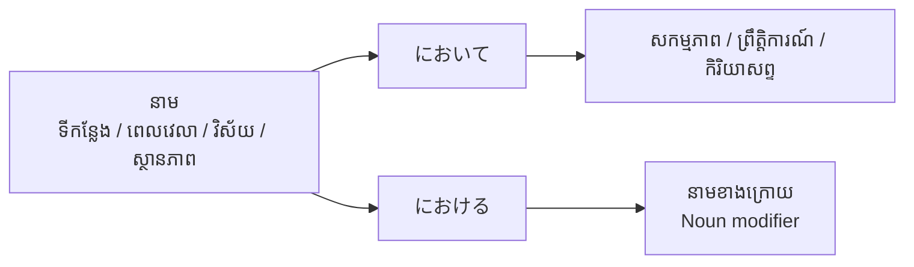

# ចំណុចវេយ្យាករណ៍ជប៉ុន៖ ～において (〜ni oite)
**កម្រិត JLPT:** JLPT N3

---

## ១. សេចក្តីផ្តើម (Introduction)
ទម្រង់វេយ្យាករណ៍ **～において (〜ni oite)** គឺជាចំណុចវេយ្យាករណ៍កម្រិត JLPT N3 ដ៏សំខាន់មួយ ដែលត្រូវបានប្រើប្រាស់ជាចម្បងក្នុងកម្រិតភាសាផ្លូវការ (Formal Register) ទាំងក្នុងការសរសេររបាយការណ៍ សារព័ត៌មាន ឯកសារសិក្សាស្រាវជ្រាវ និងការថ្លែងសុន្ទរកថាផ្លូវការ។ វេយ្យាករណ៍នេះត្រូវបានប្រើសម្រាប់បញ្ជាក់អំពី **ទីកន្លែង (Location)**, **ពេលវេលា / យុគសម័យ (Time / Era)**, ឬ **វិស័យ / ស្ថានភាព / បរិបទ (Domain / Field / Situation)** ដែលសកម្មភាព ឬព្រឹត្តិការណ៍ណាមួយកើតឡើង។

នៅក្នុងភាសាខ្មែរ ～において អាចបកប្រែបានថា៖ **«នៅ / នៅក្នុង / នៅឯ / ចំពោះ / ទាក់ទងនឹង»**។

---

## ២. ការពន្យល់វេយ្យាករណ៍ស្នូល (Core Grammar Explanation)

### អត្ថន័យ (Meaning)
**～において** ត្រូវបានប្រើដើម្បីកំណត់ចង្អុលបង្ហាញឱ្យដឹងជាក់ច្បាស់អំពី៖
1. **ទីកន្លែង (Place / Location)**៖ បញ្ជាក់ទីកន្លែងដែលព្រឹត្តិការណ៍ ឬពិធីផ្លូវការកើតឡើង («នៅ / នៅឯ / នៅក្នុង»)។
2. **ពេលវេលា ឬយុគសម័យ (Time / Era / Period)**៖ បញ្ជាក់កាលវេលា ដំណាក់កាល ឬយុគសម័យ («នៅក្នុង (សម័យ/សតវត្សរ៍/ដំណាក់កាល)»)។
3. **វិស័យ បរិបទ ឬស្ថានភាព (Domain / Field / Situation / Context)**៖ បញ្ជាក់អំពីវិស័យជំនាញ ក្របខ័ណ្ឌការងារ ឬបរិបទណាមួយ («នៅក្នុងវិស័យ... / ចំពោះ... / ក្នុងចំណោម...»)។

### ទម្រង់វេយ្យាករណ៍ (Structure)

#### ១. ប្រើជាកន្សោមកិរិយាសព្ទវិសេស (Adverbial modifier ភ្ជាប់ទៅកិរិយាសព្ទ ឬប្រយោគ)៖
```plaintext
[នាម (ទីកន្លែង / ពេលវេលា / វិស័យ / ស្ថានភាព)] + において + [សកម្មភាព / ព្រឹត្តិការណ៍]
```
- **[Noun] において [Verb Phrase / Sentence]**
- *ឧទាហរណ៍៖* 会議**において**発表する (ធ្វើបទបង្ហាញ**នៅក្នុង**កិច្ចប្រជុំ)។

#### ២. ប្រើជាកន្សោមគុណនាមសម្រាប់ពង្រីកនាម (Attributive form កែប្រែនាមខាងក្រោយ)៖
```plaintext
[នាម ១] + における + [នាម ២]
```
- **[Noun 1] における [Noun 2]**
- *ចំណាំសំខាន់៖* នៅពេលចង់យកកន្សោមនេះទៅភ្ជាប់ជាមួយ «នាម» ខាងក្រោយដោយផ្ទាល់ ទម្រង់ `において` ត្រូវប្តូរទៅជា **`における`** ជាដាច់ខាត។
- *ឧទាហរណ៍៖* 現代社会**における**問題 (បញ្ហា**នៅក្នុង**សង្គមសម័យទំនើប)។

### ដ្យាក្រាមរចនាសម្ព័ន្ធ (Formation Diagram)


---

## ៣. ការវិភាគប្រៀបធៀប និង ន័យស៊ីជម្រៅ (Comparative Analysis & Deep Nuance)

### ការប្រៀបធៀបរវាង ～において, ～で និង ～における

| ចំណុចវេយ្យាករណ៍ | ការប្រើប្រាស់ | កម្រិតគួរសម/ផ្លូវការ (Register) | ទម្រង់តភ្ជាប់ | ឧទាហរណ៍ |
|---|---|---|---|---|
| **～において** | បញ្ជាក់ទីកន្លែង ពេលវេលា ឬវិស័យនៃសកម្មភាព | **ផ្លូវការខ្លាំង (Formal/Written/Speech)** | នាម + において + កិរិយាសព្ទ/ឃ្លា | 会議**において**発表を行う。<br>(ធ្វើបទបង្ហាញនៅក្នុងកិច្ចប្រជុំ។) |
| **～で** | បញ្ជាក់ទីកន្លែងនៃសកម្មភាព មធ្យោបាយ ឬមូលហេតុ | **ទូទៅ / ធម្មតា (Everyday/Spoken)** | នាម + で + កិរិយាសព្ទ | 教室**で**勉強する。<br>(រៀននៅក្នុងបន្ទប់រៀន។) |
| **～における** | កែប្រែនាម (ភ្ជាប់នាមទៅនឹងនាម) ក្នុងកម្រិតផ្លូវការ | **ផ្លូវការខ្លាំង (Formal Attributive)** | នាម + における + នាម | 我が国**における**教育制度<br>(ប្រព័ន្ធអប់រំនៅក្នុងប្រទេសយើង) |

### ន័យស៊ីជម្រៅ និងការកម្រិតនៃការប្រើប្រាស់ (Deep Nuance Breakdown)

១. **កម្រិតភាសាផ្លូវការ (Formal Register & Written Context):**
   - `～において` គឺជាពាក្យផ្លូវការដែលស្មើនឹងធ្នាក់ `で` ក្នុងការសន្ទនាប្រចាំថ្ងៃ។ គេច្រើនប្រើវាក្នុងការប្រកាសផ្លូវការ សារព័ត៌មាន សុន្ទរកថា របាយការណ៍អាជីវកម្ម និងនិក្ខេបបទសិក្សាស្រាវជ្រាវ។
   - **ការហាមឃាត់ក្នុងជីវភាពប្រចាំថ្ងៃ៖** មិនត្រូវប្រើ `～において` សម្រាប់សកម្មភាពផ្ទាល់ខ្លួនប្រចាំថ្ងៃ ឬទីកន្លែងផ្ទាល់ខ្លួនធម្មតានោះឡើយ (ឧទាហរណ៍៖ មិននិយាយថា `家においてご飯を食べる` ❌ នោះទេ ត្រូវប្រើ `家でご飯を食べる` ⭕)។

២. **វិសាលភាពនៃទីកន្លែង និងយុគសម័យ (Scope of Location and Time):**
   - ទីកន្លែងដែលប្រើជាមួយ `～において` ច្រើនជាទីកន្លែងធំទូលាយ ឬជាវេទិកាផ្លូវការ ដូចជា៖ ប្រទេស, អន្តរជាតិ, ទីប្រជុំជន, សាលសន្និសីទ (ឧ. `国際社会において` - នៅក្នុងសហគមន៍អន្តរជាតិ)។
   - ចំពោះពេលវេលា វាតំណាងឱ្យយុគសម័យធំៗ កាលបរិច្ឆេទប្រវត្តិសាស្ត្រ ឬដំណាក់កាលជីវិត មិនមែនគ្រាន់តែជាម៉ោងពេលជាក់លាក់តូចតាចនោះទេ (ឧ. `21世紀において` - នៅក្នុងសតវត្សរ៍ទី ២១, `幼少期において` - នៅក្នុងវ័យកុមារភាព)។

៣. **ការប្រើប្រាស់ក្នុងន័យអរូបី/វិស័យ (Abstract Domain / Field):**
   - `～において` ត្រូវបានប្រើប្រាស់យ៉ាងទូលំទូលាយក្នុងន័យអរូបីដើម្បីសំដៅលើ «វិស័យ (Field)», «ទិដ្ឋភាព (Aspect)», ឬ «ក្របខ័ណ្ឌ (Scope)» ដូចជា៖ វិស័យអប់រំ (`教育の分野において`), វិស័យវេជ្ជសាស្ត្រ (`医療の現場において`), ឬទិដ្ឋភាពច្បាប់ (`法律の観点において`)។ ក្នុងករណីបែបនេះ វាមិនត្រឹមតែមានន័យថា «នៅ/ក្នុង» ប៉ុណ្ណោះទេ ថែមទាំងអាចបកប្រែថា «ចំពោះ / ក្នុងចំណោម / ផ្នែក...» ផងដែរ។

៤. **ភាពខុសគ្នារវាង ～において និង ～における:**
   - **～において** ដើរតួជាកិរិយាសព្ទវិសេស (Adverbial) សម្រាប់បញ្ជាក់ឱ្យកិរិយាសព្ទ ឬសកម្មភាពទាំងមូលនៃប្រយោគ៖ `[Noun] において + Verb`។
   - **～における** ដើរតួជាគុណនាម (Adjectival / Attributive) សម្រាប់ពង្រីកនាមដែលនៅខាងក្រោយផ្ទាល់ ដោយមានទម្រង់ជា៖ `[Noun 1] における + [Noun 2]` (ស្មើនឹង `[Noun 1] での [Noun 2]` ក្នុងកម្រិតធម្មតា)។

---

## ៤. ឧទាហរណ៍ក្នុងបរិបទជាក់ស្តែង (Examples in Context)

### ឧទាហរណ៍ប្រយោគ (Example Sentences)

#### ១. ការបញ្ជាក់ទីកន្លែង (Indicating Place)
- **科学技術館において展示会が開催されます。**  
  (ពិព័រណ៍នឹងត្រូវបានរៀបចំឡើង**នៅឯសារមន្ទីរវិទ្យាសាស្ត្រ និងបច្ចេកវិទ្យា**។)
- **本日の式典は、本校講堂において執り行われます。**  
  (ពិធីនាថ្ងៃនេះ នឹងត្រូវបានប្រារព្ធឡើង**នៅក្នុងសាលប្រជុំធំនៃសាលារបស់យើង**។)

#### ២. ការបញ្ជាក់ពេលវេលា ឬយុគសម័យ (Indicating Time / Era)
- **20世紀において、多くの重要な科学的発明が生まれた。**  
  (បច្ចេកវិទ្យានិងការរកឃើញវិទ្យាសាស្ត្រសំខាន់ៗជាច្រើន ត្រូវបានបង្កើតឡើង**នៅក្នុងសតវត្សរ៍ទី ២០**។)
- **現代において、インターネットは生活に欠かせないものとなっている。**  
  (ជីវិត**នៅក្នុងសម័យបច្ចុប្បន្ន** អ៊ីនធឺណិតបានក្លាយជារបស់ដែលមិនអាចខ្វះបានឡើយ។)

#### ៣. ការបញ្ជាក់វិស័យ បរិបទ ឬស្ថានភាព (Indicating Situation / Context / Field)
- **教育の分野において、彼は非常に有名な人物です。**  
  (**នៅក្នុងវិស័យអប់រំ** លោកជាបុគ្គលដ៏ល្បីល្បាញម្នាក់។)
- **スポーツの世界において、フェアプレーの精神は何よりも大切だ。**  
  (**នៅក្នុងពិភពកីឡា** ស្មារតីលេងដោយយុត្តិធម៌គឺសំខាន់ជាងអ្វីៗទាំងអស់។)

#### ៤. ឧទាហរណ៍ក្នុងការសរសេរផ្លូវការ (Formal Writing Example)
- **昨日の国際会議において、地球温暖化対策に関する重要な議論が行われた。**  
  (**នៅក្នុងសន្និសីទអន្តរជាតិ**កាលពីម្សិលមិញ ការពិភាក្សាយ៉ាងសំខាន់ស្តីពីវិធានការទប់ទល់នឹងការប្រែប្រួលអាកាសធាតុក្តៅឡើងនៃភពផែនដីត្រូវបានធ្វើឡើង។)

#### ៥. បរិបទធុរកិច្ច និងការងារ (Business Context)
- **弊社においては、お客様の満足度を最優先事項としております。**  
  (**នៅក្នុងក្រុមហ៊ុនរបស់យើងខ្ញុំ** យើងខ្ញុំចាត់ទុកការពេញចិត្តរបស់អតិថិជនជាអាទិភាពចម្បងបំផុត។)
- **業務の遂行において、情報セキュリティの確保を徹底してください。**  
  (**នៅក្នុងការបំពេញការងារ** សូមធានាឱ្យបានម៉ឺងម៉ាត់នូវសុវត្ថិភាពព័ត៌មាន។)

#### ៦. ឧទាហរណ៍ការប្រើប្រាស់ ～における (Noun Modifier Example)
- **現代社会における情報技術の役割は極めて大きい。**  
  (តួនាទីនៃបច្ចេកវិទ្យាព័ត៌មាន**នៅក្នុងសង្គមសម័យទំនើប** គឺធំធេងក្រៃលែង។)

---

## ៥. កំណត់សម្គាល់វប្បធម៌ និងការប្រើប្រាស់ជាក់ស្តែង (Cultural Notes)

### កម្រិតនៃការប្រើប្រាស់ (Cultural Relevance & Register)
- **កម្រិតផ្លូវការខ្ពស់ (High Formality):**
  - ～において ត្រូវបានប្រើប្រាស់ជាទូទៅក្នុងឯកសាររដ្ឋបាល សេចក្តីប្រកាសព័ត៌មាន ការផ្សាយដំណឹង ឯកសារស្រាវជ្រាវសិក្សា និងការទាក់ទងពាណិជ្ជកម្ម។
  - វាមិនត្រូវបានប្រើប្រាស់នៅក្នុងការសន្ទនាផ្ទាល់ខ្លួនប្រចាំថ្ងៃជាមួយមិត្តភក្តិ ឬក្រុមគ្រួសារឡើយ ព្រោះវានឹងធ្វើឱ្យការសន្ទនាស្តាប់ទៅហាក់ដូចជាពិធីការរឹងរូសពេក។

### កន្សោមឃ្លាពេញនិយម (Idiomatic Expressions)
- **司法の場において**  
  - *នៅក្នុងស្ថាប័នតុលាការ / ក្នុងវិស័យយុត្តិធម៌*
- **国際的な舞台において**  
  - *នៅលើឆាកអន្តរជាតិ*
- **あらゆる分野において**  
  - *នៅក្នុងគ្រប់វិស័យទាំងអស់*
- **人生において**  
  - *នៅក្នុងឆាកជីវិត*

---

## ៦. កំហុសទូទៅ និងគន្លឹះចងចាំ (Common Mistakes and Tips)

### ការវិភាគកំហុស (Error Analysis)

១. **ការប្រើ ～において ក្នុងការសន្ទនាធម្មតាប្រចាំថ្ងៃ (Too Formal for Casual Settings):**
   - **ខុស៖** 昨日、友達において映画を見た。❌
   - **ត្រូវ៖** 昨日、友達**と**映画を見た。⭕  
   - *មូលហេតុ៖* `において` មិនអាចប្រើជំនួសដៃគូសកម្មភាព (ជាមួយ) បានទេ ហើយវាក៏ផ្លូវការជ្រុលសម្រាប់ការសន្ទនាបែបស្និទ្ធស្នាលផងដែរ។

២. **ការច្រឡំរវាង ～において និង ～で ក្នុងសកម្មភាពប្រចាំថ្ងៃ:**
   - **ខុស៖** 部屋において宿題をします。❌ (ក្នុងបរិបទជីវភាពប្រចាំថ្ងៃ)
   - **ត្រូវ៖** 部屋**で**宿題をします。⭕  
   - *មូលហេតុ៖* ចំពោះទីកន្លែងផ្ទាល់ខ្លួនធម្មតា ឬសកម្មភាពប្រចាំថ្ងៃ ត្រូវប្រើធ្នាក់ `で` ជានិច្ច។ ទុក `において` សម្រាប់កម្មវិធីផ្លូវការ ព្រឹត្តិការណ៍ធំ ឬវិស័យទូទៅ។

៣. **ការប្រើ において ភ្ជាប់ទៅនាមដោយផ្ទាល់ (Misusing as Noun Modifier):**
   - **ខុស៖** 日本において文化 ❌
   - **ត្រូវ៖** 日本**における**文化 ⭕ (វប្បធម៌នៅក្នុងប្រទេសជប៉ុន)  
   - *មូលហេតុ៖* នៅពេលកែប្រែនាមខាងក្រោយ ត្រូវប្រើ `における` មិនអាចប្រើ `において` បានឡើយ។

### គន្លឹះក្នុងការរៀន (Learning Strategies)
- **ចងចាំកម្រិតផ្លូវការ៖** ភ្ជាប់ពាក្យ «において» ទៅនឹងភាសាសរសេរផ្លូវការ ឬការថ្លែងសុន្ទរកថាផ្លូវការ។
- **គន្លឹះកាត់៖** នៅពេលឃើញកិរិយាសព្ទប្រើ `において` ប៉ុន្តែបើឃើញនាមនៅខាងក្រោយ ត្រូវប្តូរទៅជា `における` ភ្លាម។

---

## ៧. សេចក្តីសង្ខេប និងការរំលឹកឡើងវិញ (Summary and Review)

### ចំណុចគន្លឹះសំខាន់ៗ (Key Takeaways)
- **～において** ប្រើសម្រាប់បញ្ជាក់ទីកន្លែង ពេលវេលា ឬបរិបទ/វិស័យនៃសកម្មភាព ឬព្រឹត្តិការណ៍ ក្នុងបរិបទផ្លូវការ។
- ស្មើនឹងភាសាខ្មែរថា «នៅ / នៅក្នុង / នៅឯ / ចំពោះ / ទាក់ទងនឹង» និងភាសាអង់គ្លេសថា "in," "at," "on," ឬ "regarding"។
- ក្នុងការសន្ទនាប្រចាំថ្ងៃ គេប្រើធ្នាក់ **～で** ជំនួសវិញ។
- នៅពេលភ្ជាប់ជាមួយនាមខាងក្រោយ វាប្តូរទម្រង់ទៅជា **～における**។

### សំណួររំលឹកមេរៀនរហ័ស (Quick Recap Quiz)

១. **តើ ～において ប្រើសម្រាប់បញ្ជាក់ពីអ្វី?**  
   ក) មូលហេតុនិងផល  
   ខ) ទីកន្លែង ពេលវេលា ឬបរិបទ/វិស័យ  
   គ) សមត្ថភាព ឬលទ្ធភាព  
   **ចម្លើយ៖** ខ) ទីកន្លែង ពេលវេលា ឬបរិបទ/វិស័យ

២. **តើប្រយោគមួយណាមានកម្រិតផ្លូវការខ្ពស់ជាង?**  
   - **A:** 東京でオリンピックが開催された。  
   - **B:** 東京においてオリンピックが開催された。  
   **ចម្លើយ៖** B

៣. **ចូរបំពេញចន្លោះដោយប្រើទម្រង់ត្រឹមត្រូវ៖**  
   **会議___、新しいプロジェクトが提案された。**  
   **ចម្លើយ៖** において

---
តាមរយៈការយល់ដឹងច្បាស់ពីទម្រង់ **～において (និង ～における)** អ្នកនឹងអាចអភិវឌ្ឍសមត្ថភាពប្រើប្រាស់ភាសាជប៉ុនផ្លូវការ ក៏ដូចជាការអានស្វែងយល់អត្ថបទកម្រិតខ្ពស់ និងឯកសារពាណិជ្ជកម្មប្រកបដោយទំនុកចិត្ត។

---

© [Hanabira.org](https://hanabira.org)
