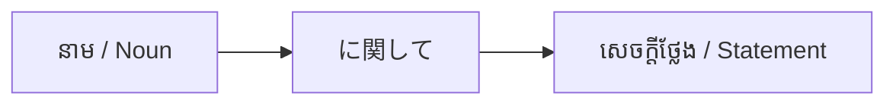

Processing keyword: ～に関して (〜ni kanshite)
# ចំណុចវេយ្យាករណ៍ជប៉ុន: ～に関して (〜ni kanshite)
**កម្រិត JLPT:** JLPT N3

---

## ១. សេចក្តីផ្តើម (Introduction)
នៅក្នុងមេរៀននេះ យើងនឹងសិក្សាអំពីចំណុចវេយ្យាករណ៍ភាសាជប៉ុន **～に関して (〜ni kanshite)** ដែលត្រូវបានប្រើប្រាស់សម្រាប់បង្ហាញអត្ថន័យថា "ទាក់ទងនឹង..." "ពាក់ព័ន្ធនឹង..." ឬ "ស្តីអំពី..." ប្រធានបទជាក់លាក់ណាមួយ។ ទម្រង់នេះត្រូវបានប្រើប្រាស់ជាទូទៅក្នុងបរិបទផ្លូវការ ការងារជំនួញ និងការសរសេរឯកសារស្រាវជ្រាវ ហើយវាជាទម្រង់ចាំបាច់បំផុតក្នុងការពិភាក្សាលើប្រធានបទលម្អិត និងស៊ីជម្រៅ។

---

## ២. ការពន្យល់វេយ្យាករណ៍គោល (Core Grammar Explanation)

### អត្ថន័យ (Meaning)
**～に関して** ត្រូវបានប្រើដើម្បីបង្ហាញថាសេចក្តីថ្លែង ឬព័ត៌មានដែលនៅបន្ទាប់ គឺមានទំនាក់ទំនង ឬពាក់ព័ន្ធទៅនឹងនាមដែលនៅពីមុខ។ វាមានន័យស្មើនឹង "ទាក់ទងនឹង..." ឬ "ពាក់ព័ន្ធនឹង..." នៅក្នុងភាសាខ្មែរ (ស្រដៀងនឹង "regarding..." ឬ "concerning..." ក្នុងភាសាអង់គ្លេស)។

### ទម្រង់វេយ្យាករណ៍ (Structure)
ទម្រង់មូលដ្ឋានមានដូចខាងក្រោម៖
- **នាម (Noun) + に関して**
- **នាម (Noun) + に関しては** (សង្កត់ធ្ងន់លើប្រធានបទ)
- **នាម (Noun) + に関しても** (ទាក់ទងនឹង... ក៏ដោយ/ដែរ)
- **នាម (Noun) + に関する + នាម (Noun)** (ប្រើសម្រាប់ពង្រីកន័យ ឬបញ្ជាក់លក្ខណៈឱ្យនាមខាងក្រោយ)
- **នាម (Noun) + に関しての + នាម (Noun)** (ទម្រង់កម្រិតផ្លូវការសរសេរសម្រាប់ពង្រីកន័យឱ្យនាម)

### តារាងទម្រង់វេយ្យាករណ៍ (Formation Diagram)
| **ទម្រង់វេយ្យាករណ៍** | **ការប្រើប្រាស់** |
| -------------------- | ----------------- |
| **នាម (Noun) + に関して** | ប្រើសម្រាប់លើកយកប្រធានបទមកថ្លែង ពន្យល់ ឬពិភាក្សា |
| **នាម (Noun) + に関する + នាម (Noun)** | ប្រើសម្រាប់បញ្ជាក់លក្ខណៈ ឬភ្ជាប់ទៅនាមដែលទាក់ទងនឹងប្រធានបទនោះ |

### ដ្យាក្រាមរចនាសម្ព័ន្ធ (Visual Aid: Structure Breakdown)

---

## ៣. ការវិភាគប្រៀបធៀប និង ន័យស៊ីជម្រៅ (Nuance & Comparative Analysis)

### ～に関して vs. ～について

ទាំង **～に関して** និង **～について** សុទ្ធតែមានន័យថា "អំពី..." "ទាក់ទងនឹង..." ឬ "ស្តីពី..." ប៉ុន្តែមានកម្រិតផ្លូវការ និងវិសាលភាពនៃន័យខុសគ្នាដូចខាងក្រោម៖

| ចំណុចវេយ្យាករណ៍ | កម្រិតគួរសម/ផ្លូវការ | វិសាលភាពនៃប្រធានបទ (Scope) | បរិបទនៃការប្រើប្រាស់ (Usage) |
| :--- | :--- | :--- | :--- |
| **～に関して** | ផ្លូវការខ្លាំង (Formal / Written / Business) | វិសាលភាពទូលំទូលាយ (Broad Domain): រួមបញ្ចូលទាំងបញ្ហា ឬបរិបទជុំវិញប្រធានបទនោះ | ប្រើក្នុងកិច្ចប្រជុំការងារ បទបង្ហាញ សេចក្តីប្រកាសផ្លូវការ របាយការណ៍ ព័ត៌មាន និងការស្រាវជ្រាវ |
| **～について** | ទូទៅ / កណ្តាល (Neutral / Spoken / Conversational) | ចង្អុលចំៗលើប្រធានបទផ្ទាល់ (Direct Topic Focus) | ប្រើក្នុងការសន្ទនាប្រចាំថ្ងៃទូទៅ ការពិភាក្សាធម្មតា ឬការសាកសួរព័ត៌មានទូទៅ |

#### ភាពខុសគ្នាសំខាន់ៗ (Key Nuances):
1. **កម្រិតផ្លូវការ (Formality & Register):**
   - `～に関して` មានកម្រិតផ្លូវការ និងថ្លៃថ្នូរខ្ពស់ជាង `～について`។ នៅក្នុងការសរសេរឯកសាររដ្ឋបាល របាយការណ៍អាជីវកម្ម ឬការធ្វើបទបង្ហាញផ្លូវការ គេតែងតែជ្រើសរើស `～に関して` ជាជាង `～について`។
2. **វិសាលភាពនៃប្រធានបទ (Semantic Scope):**
   - `～について` ចង្អុលបង្ហាញចំស្នូលនៃប្រធានបទផ្ទាល់ (Direct subject matter)។
   - `～に関して` គ្របដណ្តប់លើវិស័យ ឬដែនទាំងមូលដែលទាក់ទងនឹងប្រធានបទនោះ (Peripheral & related issues) រួមទាំងផលប៉ះពាល់ បរិបទជុំវិញ និងព័ត៌មានពាក់ព័ន្ធនានា។
3. **ការកែប្រែនាម (Noun Modification):**
   - សម្រាប់ `～に関して` ពេលភ្ជាប់ជាមួយនាម គេប្រើ **「〜に関する + នាម」** (ឬ 「〜に関しての + នាម」)។
   - សម្រាប់ `～について` ពេលភ្ជាប់ជាមួយនាម គេប្រើ **「〜についての + នាម」**។

---

## ៤. ឧទាហរណ៍ក្នុងបរិបទជាក់ស្តែង (Examples in Context)

### បរិបទផ្លូវការ (Formal Context)
1. **環境問題に関して研究しています。**
   *Kankyō mondai ni kanshite kenkyū shite imasu.*
   ខ្ញុំកំពុងធ្វើការស្រាវជ្រាវទាក់ទងនឹងបញ្ហាបរិស្ថាន។
   *(I am researching concerning environmental issues.)*

2. **その件に関して、後ほどご連絡いたします。**
   *Sono ken ni kanshite, nochihodo go-renraku itashimasu.*
   ទាក់ទងនឹងរឿងរ៉ាវ/បញ្ហានោះ ខ្ញុំនឹងទាក់ទងទៅលោកអ្នកនៅពេលក្រោយ។
   *(Regarding that matter, I will contact you later.)*

### ការភ្ជាប់ជាមួយនាម (Modifying a Noun)
3. **健康に関する本を読みました。**
   *Kenkō ni kan suru hon o yomimashita.*
   ខ្ញុំបានអានសៀវភៅមួយក្បាលដែលទាក់ទងនឹងសុខភាព។
   *(I read a book about health.)*

### ភាសាសរសេរ និងសេចក្តីជូនដំណឹង (Written Language & Announcements)
4. **新製品に関してのお知らせがあります。**
   *Shinseihin ni kanshite no o-shirase ga arimasu.*
   យើងមានសេចក្តីជូនដំណឹងមួយទាក់ទងនឹងផលិតផលថ្មី។
   *(We have an announcement regarding the new product.)*

### ភាសានិយាយក្នុងបរិបទផ្លូវការ (Spoken Language - Formal / Business)
5. **この問題に関して、ご意見をお願いします。**
   *Kono mondai ni kanshite, go-iken o onegai shimasu.*
   ទាក់ទងនឹងបញ្ហានេះ សូមមេត្តាផ្តល់ជាមតិយោបល់។
   *(Please give us your opinion concerning this issue.)*

---

## ៥. ចំណាំវប្បធម៌ និងការប្រើប្រាស់ (Cultural Notes)

### កម្រិតគួរសម និងការប្រាស្រ័យទាក់ទងក្នុងសង្គមការងារ
- **～に関して** មានភាពផ្លូវការ និងគួរសមជាង **～について** យ៉ាងច្បាស់។
- ត្រូវបានប្រើប្រាស់ជាញឹកញាប់ក្នុងការប្រជុំអាជីវកម្ម បរិយាកាសសិក្សាស្រាវជ្រាវ ឬសេចក្តីប្រកាសផ្លូវការរបស់ស្ថាប័ន។
- ការប្រើប្រាស់ **～に関して** បង្ហាញពីការគោរព វិជ្ជាជីវៈខ្ពស់ និងភាពម៉ត់ចត់ក្នុងការពិភាក្សា។

### កន្សោមឃ្លាសាមញ្ញ (Idiomatic Expressions)
- **～に関するところでは**
  *~ni kan suru tokoro de wa*
  តាមដែល (នរណាម្នាក់) ដឹងទាក់ទងនឹង... ("As far as someone knows regarding...")

---

## ៦. កំហុសទូទៅ និងគន្លឹះចងចាំ (Common Mistakes and Tips)

### កំហុសដែលតែងតែកើតមាន (Common Mistakes)
1. **ការប្រើប្រាស់ ～に関して ក្នុងការសន្ទនាស្និទ្ធស្នាលធម្មតា**
   - មិនត្រឹមត្រូវ: *昨日の映画に関して面白かった。* (មានលក្ខណៈរឹង និងផ្លូវការជ្រុលសម្រាប់ការនិយាយលេង)
   - ត្រឹមត្រូវ: *昨日の映画について話そう。* ឬ *昨日の映画、面白かった。*
   - **គន្លឹះ:** ប្រើ **～について** ឬទម្រង់ធម្មតានៅក្នុងការសន្ទនាប្រចាំថ្ងៃជាមួយមិត្តភក្តិ។
2. **ការភ្លេចបំប្លែងទម្រង់ត្រឹមត្រូវនៅពេលភ្ជាប់ជាមួយនាម**
   - មិនត្រឹមត្រូវ: *環境に関して本* ❌
   - ត្រឹមត្រូវ: *環境に関する本* ✅ (ឬ *環境に関しての本*)
   - **គន្លឹះ:** នៅពេលចង់ពង្រីកន័យ ឬភ្ជាប់ទៅនាមខាងក្រោយ ត្រូវប្រើ **に関する**។

### វិធីសាស្ត្ររៀន និងចងចាំ (Learning Strategies)
- **ការចងចាំតាមតួអក្សរកានជី:** អក្សរកានជី **関** ក្នុងពាក្យ **関して** មានន័យថា "ការផ្សារភ្ជាប់/ទំនាក់ទំនង" (Connection) ដូច្នេះវាគឺជារបៀបតភ្ជាប់ប្រធានបទមួយក្នុងទម្រង់បែបបទផ្លូវការ។
- **ការអនុវត្ត:** សាកល្បងតែងប្រយោគផ្លូវការដែលទាក់ទងនឹងវិស័យការងារ ឬការសិក្សាដែលអ្នកចាប់អារម្មណ៍។

---

## ៧. សេចក្តីសង្ខេប និងលំហាត់រំលឹកឡើងវិញ (Summary and Review)

### ចំណុចគន្លឹះសំខាន់ៗ (Key Takeaways)
- **～に関して** ត្រូវបានប្រើសម្រាប់បង្ហាញអត្ថន័យថា "ទាក់ទងនឹង..." ឬ "ពាក់ព័ន្ធនឹង..." ក្នុងបរិបទផ្លូវការ។
- វាមានលក្ខណៈផ្លូវការ និងគ្របដណ្តប់វិសាលភាពទូលំទូលាយជាង **～について**។
- ត្រូវប្រើ **に関する** (ឬ **に関しての**) នៅពេលភ្ជាប់ជាមួយនាមខាងក្រោយ។

### លំហាត់សាកល្បងខ្លីៗ (Quick Recap Quiz)
១. តើអ្នកនិយាយថា "ខ្ញុំមានសំណួរមួយទាក់ទងនឹងកាលវិភាគ" ដោយប្រើ **～に関して** យ៉ាងដូចម្តេច?
   **ចម្លើយ:** *スケジュールに関して質問があります。* (Sukejūru ni kanshite shitsumon ga arimasu.)
២. តើមួយណាមានកម្រិតផ្លូវការជាង: **～に関して** ឬ **～について**?
   **ចម្លើយ:** **～に関して** មានកម្រិតផ្លូវការជាង។
៣. ចូរជ្រើសរើសបំពេញចន្លោះ: *経済______論文を読みました。* (ខ្ញុំបានអានសារណាស្រាវជ្រាវមួយស្តីអំពីសេដ្ឋកិច្ច។)
   **ចម្លើយ:** *経済**に関する**論文を読みました。* (Keizai ni kan suru ronbun o yomimashita.)

---

តាមរយៈការស្វែងយល់ និងការអនុវត្តប្រើប្រាស់ **～に関して** អ្នកនឹងអាចលើកយកប្រធានបទផ្សេងៗមកពិភាក្សាជាភាសាជប៉ុនកម្រិតផ្លូវការប្រកបដោយប្រសិទ្ធភាព និងបង្កើនសមត្ថភាពប្រាស្រ័យទាក់ទងក្នុងការងារប្រកបដោយវិជ្ជាជីវៈ។

---

© [Hanabira.org](https://hanabira.org)