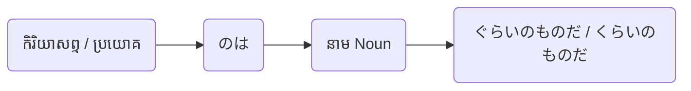

Processing keyword: ～のは Noun ぐらいのものだ (〜no wa 〜 gurai no mono da)
# ចំណុចវេយ្យាករណ៍ភាសាយ៉ា Role: ～のは Noun ぐらいのものだ (〜no wa 〜 gurai no mono da)
**កម្រិត JLPT:** JLPT N1

## ១. សេចក្តីផ្តើម (Introduction)
នៅក្នុងមេរៀននេះ យើងនឹងសិក្សាស្វែងយល់អំពីទម្រង់វេយ្យាករណ៍កម្រិតខ្ពស់ **～のは Noun ぐらいのものだ**។ ទម្រង់វេយ្យាករណ៍នេះត្រូវបានប្រើប្រាស់ដើម្បីគូសបញ្ជាក់ និងសង្កត់ធ្ងន់ថា មានតែបុគ្គល ឬវត្ថុជាក់លាក់មួយប៉ុណ្ណោះ ដែលបំពេញនូវលក្ខខណ្ឌជាក់លាក់ ឬមានសមត្ថភាពអាចធ្វើរឿងនោះបាន។ វាជាទម្រង់សម្រាប់បញ្ជាក់ពីលក្ខណៈផ្តាច់មុខ ភាពកម្រ ឬភាពពិសេសដាច់គេ (Exclusivity / Uniqueness)។

## ២. ការពន្យល់វេយ្យាករណ៍ស្នូល (Core Grammar Explanation)
### ការពន្យល់លម្អិត
ទម្រង់ **～のは [Noun] ぐらいのものだ** ប្រើដើម្បីបង្ហាញថារឿងរ៉ាវ សកម្មភាព ឬស្ថានភាពណាមួយ គឺត្រូវបានកម្រិតផ្តាច់មុខចំពោះនាម (Noun) ណាមួយតែប៉ុណ្ណោះ។ វាសង្កត់ធ្ងន់ថា *«ក្រៅពីនាមនោះ គ្មានអ្នកណា ឬគ្មានអ្វីផ្សេងទៀតអាចធ្វើបាន ឬសមស្របនោះឡើយ»* (មានតែ...នេះមួយគត់ដែលអាច...)។

### អត្ថន័យ
- **អត្ថន័យជាភាសាខ្មែរ**: «មានតែ (Noun) ទេដែលអាច...», «ក្រៅពី (Noun) គឺគ្មានអ្នកណាអាច...ឡើយ», «ប្រហែលជាមានតែ (Noun) ប៉ុណ្ណោះដែល...»
- **មុខងារ**: សង្កត់ធ្ងន់លើភាពផ្តាច់មុខ ភាពកម្របំផុត ឬភាពពិសេសលើសគេ (Emphasizes exclusivity or uniqueness)។

### ទម្រង់នៃការផ្សំ (Structure)
#### តារាងផ្សំទម្រង់
| ធាតុផ្សំ (Component) | តួនាទីវេយ្យាករណ៍ (Grammatical Role) |
|---|---|
| **កិរិយាសព្ទ (辞書形 / ទម្រង់ដើម ឬទម្រង់បដិសេធ/លទ្ធភាព) + のは** | ធ្វើនាមរូបកម្មកិរិយាសព្ទ (បម្លែងប្រយោគសកម្មភាពទៅជានាម ឬប្រធានបទ) |
| **នាម (Noun)** | អង្គភាព មនុស្ស ឬវត្ថុផ្តាច់មុខតែមួយគត់ |
| **ぐらいのものだ / くらいのものだ** | «មានប្រហែលតែ...ប៉ុណ្ណោះ / គឺមានត្រឹមតែ...ប៉ុណ្ណឹងឯង» |

#### គំនូសបំព្រួញរូបភាព (Visual Aid)

## ៣. ការវិភាគប្រៀបធៀប និង ន័យស៊ីជម្រៅ (## ការវិភាគប្រៀបធៀប និង ន័យស៊ីជម្រៅ)

### ១. ភាពខុសគ្នានៃកម្រិតភាសា និងទម្រង់ប្រហាក់ប្រហែល (Register & Comparative Analysis)
ទម្រង់វេយ្យាករណ៍នេះមានលក្ខណៈស្រដៀងគ្នានឹងទម្រង់កម្រិតទាបដូចជា `〜しかない`, `〜だけだ`, ឬ `〜のみだ` ក៏ប៉ុន្តែវាមានអត្ថន័យស៊ីជម្រៅ និងកម្រិតខុសប្លែកគ្នាទាំងស្រុង៖

| ទម្រង់វេយ្យាករណ៍ | កម្រិតភាសា / បរិបទប្រើប្រាស់ | ន័យលម្អិត និងកម្រិតសង្កត់ធ្ងន់ | ឧទាហរណ៍ជាក់ស្តែង |
|---|---|---|---|
| **～のは Noun ぐらいのものだ** | កម្រិតខ្ពស់ (N1), ប្រើក្នុងទាំងការនិយាយបែបថ្លៃថ្នូរ និងការសរសេរ | សង្កត់ធ្ងន់ខ្លាំងលើភាពកម្រ អស្ចារ្យ ឬផ្តាច់មុខដាច់គេ។ មានអត្ថន័យបង្កប់ថា ស្ទើរតែគ្មានអ្នកណាផ្សេងក្រៅពីនេះឡើយ។ | こんな難しい問題を解ける**のは**、彼**ぐらいのものだ**。 *(រឿងដែលអាចដោះស្រាយលំហាត់ពិបាកបែបនេះបាន ប្រហែលជាមានតែគាត់ម្នាក់ប៉ុណ្ណោះ។)* |
| **～しかない** | កម្រិតមធ្យម (N3/N4), ការសន្ទនាទូទៅ | បង្ហាញពីកង្វះជម្រើស ឬការអស់ជម្រើស («មានតែ...ប៉ុណ្ណោះ គ្មានអ្វីក្រៅពីនេះទេ»)។ ផ្ដោតលើការគ្មានជម្រើសផ្សេង។ | ここには水**しかない**。 *(នៅទីនេះមានតែទឹកមួយមុខគត់ គ្មានអ្វីផ្សេងទៀតឡើយ។)* |
| **～だけだ** | កម្រិតដំបូង (N5/N4), ប្រើទូទៅគ្រប់កាលៈទេសៈ | កំណត់ព្រំដែនសាមញ្ញ គ្មានការបញ្ចេញអារម្មណ៍កោតសរសើរ ឬសង្កត់ធ្ងន់លើភាពកម្រខ្លាំងក្លាឡើយ។ | 彼**だけが**来た。 *(មានតែគាត់ម្នាក់គត់ដែលបានមក។)* |

### ២. វិភាគលើរចនាសម្ព័ន្ធពាក្យ `ぐらい (Gurai)` និង `ものだ (Mono da)`
- **ぐらい (Gurai / くらい Kurai):** ដើមឡើយមានន័យថា «ប្រមាណ / ប្រហែល»។ ប៉ុន្តែនៅក្នុងទម្រង់នេះ វាត្រូវបានប្រើដើម្បីធ្វើឱ្យការអះអាងមានសភាពបន្ទន់បន្តិច (Softening effect) តាមបែបវប្បធម៌ជប៉ុន ដើម្បីកុំឱ្យមើលទៅជាការនិយាយដាច់ខាតពេក ប៉ុន្តែតាមពិតបង្កប់ន័យសង្កត់ធ្ងន់ថា *«ក្រៅពីបុគ្គលនេះ គ្មាននរណាផ្សេងទៀតឡើយ»*។
- **ものだ (Mono da):** បញ្ជាក់ពីការវាយតម្លៃ ការសន្និដ្ឋានជាក់ស្តែង ឬជំនឿជាក់យ៉ាងមុតមាំរបស់អ្នកនិយាយទៅលើការពិតនោះ។
- ការរួមបញ្ចូលគ្នានៃ `〜のは [Noun] ぐらいのものだ` បង្កើតបានជាទម្រង់ Cleft Sentence (ប្រយោគបំបែកសង្កត់ធ្ងន់) ដែលទាញយកចំណុចសំខាន់ (Noun) មកដាក់នៅខាងក្រោយ ដើម្បីសង្កត់ធ្ងន់ឱ្យកាន់តែច្បាស់។

### ៣. បរិបទ និងអារម្មណ៍របស់អ្នកនិយាយ (Pragmatic Context)
- **ការកោតសរសើរ និងលើកតម្កើង (Admiration/Praise):** ភាគច្រើនប្រើដើម្បីសរសើរសមត្ថភាពកម្រ ឬទេពកោសល្យខ្ពស់របស់បុគ្គលណាម្នាក់ ដែលមនុស្សទូទៅពិបាកនឹងធ្វើបាន (ឧទាហរណ៍៖ កម្រិតអ្នកជំនាញ កម្រិតទេពកោសល្យ)។
- **ការបន្ទាបខ្លួន ឬអារម្មណ៍ឯកោ (Modesty or Exclusivity):** អាចប្រើក្នុងបរិបទដែលគ្មានអ្នកណាជួយ ឬគ្មានអ្នកណាយល់ចិត្ត ដោយនៅសល់មនុស្សតែម្នាក់គត់ (ឧទាហរណ៍៖ «មនុស្សដែលអាចទុកចិត្តបាន មានតែឯងម្នាក់គត់»)។

## ៤. ឧទាហរណ៍ក្នុងបរិបទ (Examples in Context)
### ឧទាហរណ៍ប្រយោគ
1. **彼が問題を解けるのは天才ぐらいのものだ。**
   - *Kare ga mondai o tokeru no wa tensai gurai no mono da.*
   - មានតែមនុស្សកម្រិតទេពកោសល្យដូចគាត់ទេ ទើបអាចដោះស្រាយលំហាត់នេះចេញ។
   - *(It is only a genius like him who can solve this problem.)*

2. **こんな難しい曲を演奏できるのは彼女ぐらいのものだ。**
   - *Konna muzukashii kyoku o ensō dekiru no wa kanojo gurai no mono da.*
   - បទភ្លេងដ៏លំបាកកម្រិតនេះ ប្រហែលជាមានតែនាងម្នាក់ប៉ុណ្ណោះដែលអាចប្រគំបាន។
   - *(She is about the only one who can perform such a difficult piece.)*

3. **私が信用できるのは君ぐらいのものだ。**
   - *Watashi ga shin'yō dekiru no wa kimi gurai no mono da.*
   - មនុស្សដែលខ្ញុំអាចជឿទុកចិត្តបាន គឺមានតែឯងម្នាក់គត់។
   - *(You're the only one I can truly trust.)*

4. **この料理を作れるのはプロのシェフぐらいのものだ。**
   - *Kono ryōri o tsukureru no wa puro no shefu gurai no mono da.*
   - ម្ហូបដែលមានរសជាតិ និងបច្ចេកទេសបែបនេះ មានតែមេចុងភៅអាជីពទេទើបអាចធ្វើបាន។
   - *(Only a professional chef can prepare this dish.)*

5. **彼と対等に戦えるのは彼女ぐらいのものだろう。**
   - *Kare to taitō ni tatakaeru no wa kanojo gurai no mono darō.*
   - អ្នកដែលអាចតស៊ូស្មើដៃជាមួយគាត់ ប្រហែលជាមានតែនាងម្នាក់ប៉ុណ្ណោះ។
   - *(She is probably the only one who can fight him on equal terms.)*

## ៥. កំណត់សម្គាល់ខាងវប្បធម៌ (Cultural Notes)
### ទំនាក់ទំនងវប្បធម៌ជប៉ុន
នៅក្នុងវប្បធម៌ជប៉ុន ការបន្ទាបខ្លួន (Modesty) និងការទទួលស្គាល់ភាពអស្ចារ្យ ឬទេពកោសល្យរបស់អ្នកដទៃ គឺជាគុណតម្លៃដ៏សំខាន់។ ការប្រើប្រាស់ទម្រង់វេយ្យាករណ៍នេះ ឆ្លុះបញ្ចាំងពីការគោរពយ៉ាងជ្រាលជ្រៅចំពោះសមត្ថភាពពិសេសដាច់គេរបស់បុគ្គលម្នាក់ ឬបង្ហាញពីភាពកម្រនៃកាលៈទេសៈណាមួយ ដោយប្រើពាក្យ `ぐらい` បន្ទន់សំឡេង ដើម្បីកុំឱ្យស្តាប់ទៅហាក់ដូចជាការអះអាងរឹងរូសជ្រុល។

### ឃ្លាគំរូទម្លាប់ប្រើ (Idiomatic Expressions)
- **それができるのは彼ぐらいのものだ。**
  - *(រឿងដែលអាចធ្វើបែបនោះបាន ប្រហែលជាមានតែគាត់ម្នាក់គត់។)*
  - ជាឃ្លាទម្លាប់ប្រើដ៏ពេញនិយមសម្រាប់បង្ហាញការស្ងើចសរសើរចំពោះសមត្ថភាពពិសេសដាច់គេរបស់នរណាម្នាក់។

## ៦. កំហុសទូទៅ និងគន្លឹះចងចាំ (Common Mistakes and Tips)
### ការវិភាគកំហុស
- **កំហុសទី ១**: ការភ្លេចពាក្យ **のは** ដែលជាតំណភ្ជាប់យ៉ាងសំខាន់សម្រាប់បម្លែងកិរិយាសព្ទទៅជានាម (Nominalization)។
  - *មិនត្រឹមត្រូវ*: 彼ができるぐらいのものだ。
  - *ត្រឹមត្រូវ*: 彼ができる**のは**プロぐらいのものだ。
- **កំហុសទី ២**: ការប្រើ **だけ** ជំនួសឱ្យ **ぐらいのものだ** នាំឱ្យបាត់បង់ជម្រៅន័យ និងកម្រិតសង្កត់ធ្ងន់។
  - *មិនត្រឹមត្រូវ*: 彼女だけがこの仕事をできる。 (ប្រយោគនេះត្រឹមត្រូវតាមវេយ្យាករណ៍ធម្មតា តែកម្រិតន័យធម្មតា គ្មានភាពសង្កត់ធ្ងន់ ឬកោតសរសើរឡើយ)
  - *ត្រឹមត្រូវ*: この仕事をできる**のは**彼女**ぐらいのものだ**។ (បង្ហាញពីភាពកម្រ និងសមត្ថភាពដាច់គេរបស់នាង)
- **កំហុសទី ៣**: ភ្លេចធ្នាក់ **の** នៅចន្លោះ `ぐらい` និង `ものだ`។
  - *មិនត្រឹមត្រូវ*: ...君ぐらいものだ。
  - *ត្រឹមត្រូវ*: ...君ぐらい**の**ものだ。

### យុទ្ធសាស្ត្រនៃការចងចាំ
- **ក្បួនចងចាំ (Mnemonic)**: ចងចាំថា **ぐらい** មានន័យថា «ប្រហែល/ត្រឹម» ហើយ **のものだ** មានន័យថា «ជាមនុស្ស/របស់នោះឯង»។ ដូច្នេះនៅពេលផ្សំគ្នា `〜のは [Noun] ぐらいのものだ` មានន័យថា «រឿងដែល...នោះ គឺមានត្រឹមតែ [Noun] ហ្នឹងឯង»។
- **ការអនុវត្ត**: ព្យាយាមបង្កើតប្រយោគដោយខ្លួនឯង ដោយជ្រើសរើសមនុស្សដែលមានទេពកោសល្យខ្ពស់ ឬស្ថានភាពកម្របំផុតដែលអ្នកធ្លាប់ជួប។

## ៧. សេចក្តីសង្ខេប និងការរំលឹកឡើងវិញ (Summary and Review)
### ចំណុចគន្លឹះសំខាន់ៗ
- **～のは Noun ぐらいのものだ** ប្រើដើម្បីសង្កត់ធ្ងន់ថា មានតែនាមជាក់លាក់មួយប៉ុណ្ណោះ ដែលសមស្របនឹងលក្ខខណ្ឌ ឬអាចធ្វើសកម្មភាពនោះបាន។
- បង្ហាញពីភាពកម្រ ភាពអស្ចារ្យ ភាពផ្តាច់មុខ ឬទេពកោសល្យពិសេសដាច់គេ។
- រចនាសម្ព័ន្ធត្រឹមត្រូវ៖ **កិរិយាសព្ទ (ទម្រង់ដើម/លទ្ធភាព) + のは + នាម + ぐらいのものだ**។

### កម្រងសំណួររំលឹកឡើងវិញ (Quick Recap Quiz)
១. តើពាក្យ **ぐらいのものだ** បង្កប់ន័យបែបណាខ្លះនៅក្នុងទម្រង់វេយ្យាករណ៍នេះ?  
២. ចូរផ្លាស់ប្តូរប្រយោគខាងក្រោមដោយប្រើទម្រង់ **～のは Noun ぐらいのものだ**៖  
   - "Only professionals can understand this code." (មានតែអ្នកជំនាញប៉ុណ្ណោះដែលអាចយល់កូដនេះបាន)  
   - *ចម្លើយ*: このコードを理解できるのはプロフェッショナルぐらいのものだ。  
៣. ចូរកែកំហុសនៅក្នុងប្រយោគខាងក្រោម៖  
   - 彼が解決できるのは彼女ぐらいものだ。  
   - *ចម្លើយ*: ខ្វះធ្នាក់ **の** នៅបន្ទាប់ពី **ぐらい**។ ប្រយោគត្រឹមត្រូវគឺ៖ 彼が解決できるのは彼女ぐらい**の**ものだ。

---
តាមរយៈការស្វែងយល់ និងការអនុវត្តទម្រង់វេយ្យាករណ៍នេះ អ្នកនឹងអាចប្រើប្រាស់ភាសាយ៉ា Role កម្រិតខ្ពស់ N1 ដើម្បីបញ្ជាក់ពីភាពផ្តាច់មុខ និងភាពអស្ចារ្យនៃសមត្ថភាពរបស់មនុស្ស ឬវត្ថុបានយ៉ាងត្រឹមត្រូវ និងទាក់ទាញបំផុត។

---

© [Hanabira.org](https://hanabira.org)
