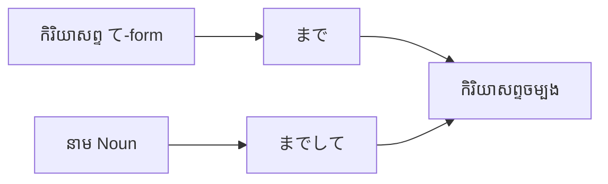

Processing keyword: ～まで～て (〜made 〜te)
# ចំណុចវេយ្យាករណ៍ជប៉ុន: ～まで～て (〜made 〜te) / ～てまで (〜te made)
**កម្រិត JLPT:** JLPT N2

## ១. សេចក្តីផ្តើម (Introduction)
នៅក្នុងមេរៀននេះ យើងនឹងសិក្សាអំពីទម្រង់វេយ្យាករណ៍ភាសាជប៉ុន **～まで～て (〜made 〜te)** (ឬទម្រង់ទូទៅគឺ **～てまで** និង **Noun + までして**)។ ទម្រង់វេយ្យាករណ៍នេះត្រូវបានប្រើប្រាស់ដើម្បីបង្ហាញអំពីការធ្វើសកម្មភាពហួសហេតុ ជ្រុលហួសព្រំដែនធម្មតា ឬហ៊ានលះបង់ដល់កម្រិតហួសប្រមាណដើម្បីសម្រេចគោលបំណងអ្វីមួយ។ ជារឿយៗ វាបង្កប់នូវអារម្មណ៍ភ្ញាក់ផ្អើល ការរិះគន់ ការស្តីបន្ទោស ឬការយល់ឃើញថាសកម្មភាពនោះជាការលះបង់ជ្រុលហួសហេតុពេក (មិនចាំបាច់ធ្វើដល់ថ្នាក់ហ្នឹងទេ)។

---

## ២. ការពន្យល់វេយ្យាករណ៍ស្នូល (Core Grammar Explanation)
### អត្ថន័យ (Meaning)
ទម្រង់ **～てまで** (ឬ **～までして**) មានន័យថា **«ហ៊ានដល់ថ្នាក់... / ធ្វើរហូតដល់ថ្នាក់... ដើម្បី... / សូម្បីតែ... ក៏នៅតែ...»** (going so far as to... / even to the extent of...)។ 
វាបង្ហាញថា បុគ្គលម្នាក់បានជ្រើសរើសមធ្យោបាយ ឬសកម្មភាពធ្ងន់ធ្ងរ មិនសមរម្យ ឬហួសពីការស្មាន ដើម្បីសម្រេចគោលដៅអ្វីមួយ។ ជារឿយៗ វាបង្កប់នូវការរិះគន់ (批判) ចំពោះទង្វើជ្រុលហួសហេតុ ឬការតាំងចិត្តដ៏មុតមាំហួសកម្រិត។

**សមមូលជាភាសាខ្មែរ និងអង់គ្លេស៖**
- ហ៊ានដល់ថ្នាក់... / ធ្វើរហូតដល់កម្រិត...
- សូម្បីតែត្រូវ... ក៏នៅតែ...
- "Go so far as to..."
- "Even to the point/extent of..."

### ទម្រង់វេយ្យាករណ៍ (Structure)
ទម្រង់នេះផ្សំឡើងដោយ៖
#### **កិរិយាសព្ទ (Verb て-form) + まで + កិរិយាសព្ទចម្បង (Main Verb)**
ឬទម្រង់នាម៖ **នាម (Noun) + までして + កិរិយាសព្ទ**

| សមាសភាគ | តួនាទីវេយ្យាករណ៍ |
|---|---|
| **Verb て-form** | សកម្មភាពកម្រិតធ្ងន់ធ្ងរ/ហួសហេតុដែលត្រូវបានធ្វើឡើង (Extreme action taken) |
| **まで** | ធ្នាក់បញ្ជាក់កម្រិតព្រំដែន «រហូតដល់/សូម្បីតែ» (To the extent of) |
| **កិរិយាសព្ទចម្បង (Main Verb)** | សកម្មភាពគោលបំណងចម្បង (Primary action / Goal) |

### គំនូសតាងទម្រង់ (Formation Diagram)

---

## ៣. ការវិភាគប្រៀបធៀប និង ន័យស៊ីជម្រៅ (Nuance & Comparative Analysis)
### ការវិភាគន័យស៊ីជម្រៅ (Deep Nuance Breakdown)
១. **ការរំលងព្រំដែនធម្មតា (Crossing Social & Moral Boundaries):**
   - វេយ្យាករណ៍នេះពិពណ៌នាអំពីការធ្វើសកម្មភាពដែលសង្គម ឬមនុស្សទូទៅចាត់ទុកថា «មិនគួរធ្វើដល់ថ្នាក់ហ្នឹងទេ» (ឧទាហរណ៍៖ ខ្ចីបុលលុយគេដើម្បីទិញរបស់ប្រណីត, កុហកបោកប្រាស់ដើម្បីការពារខ្លួន, បំផ្លាញសុខភាពខ្លួនឯងដើម្បីតែការងារ)។
   - ពេលប្រើក្នុងប្រយោគសំណួរ ឬប្រយោគបដិសេធ (ដូចជា `〜てまで...する必要はない` ឬ `〜てまで...したくない`) វាបង្ហាញពីគោលជំហររឹងមាំរបស់អ្នកនិយាយថា មិនគួរលះបង់ជ្រុលហួសហេតុដល់ថ្នាក់នោះឡើយ។

២. **ការប្រៀបធៀបជាមួយទម្រង់ស្រដៀងគ្នា (Comparison with Similar Expressions):**
- **～てまで vs ～てでも:**
  - **～てでも:** ផ្តោតសំខាន់លើ **ការប្តេជ្ញាចិត្តដ៏មុតមាំរបស់អ្នកនិយាយផ្ទាល់** ក្នុងការសម្រេចគោលដៅ ទោះបីជាត្រូវប្រើមធ្យោបាយលំបាក ឬមិនចង់ធ្វើក៏ដោយ (ន័យវិជ្ជមាននៃការតាំងចិត្ត ដូចជា៖ «ទោះបីត្រូវខ្ចីលុយគេ ក៏ខ្ញុំត្រូវតែទៅជួបគាត់ឱ្យបាន» `借金してでも行く`)។
  - **～てまで:** ផ្តោតសំខាន់លើ **ការវាយតម្លៃពីភាពជ្រុលហួសហេតុ (Excessiveness)** ឬការរិះគន់សកម្មភាពនោះថាខុសប្រក្រតី/មិនសមរម្យ (`借金してまで買う` = ហ៊ានដល់ថ្នាក់ខ្ចីបុលលុយគេដើម្បីទិញ - បង្កប់ការរិះគន់ ឬភ្ញាក់ផ្អើល)។

- **～てまで vs ～Noun までして:**
  - `Verb て-form + まで`: ប្រើជាមួយសកម្មភាព (ឧ. `嘘をついてまで` = ហ៊ានដល់ថ្នាក់កុហក)។
  - `Noun + までして`: ប្រើជាមួយនាមដែលជាមធ្យោបាយហួសហេតុ (ឧ. `カンニングまでして` = ហ៊ានដល់ថ្នាក់លួចមើលកម្រងសំណួរ/លួចចម្លងប្រឡង)។

- **～までも:**
  - ប្រើបញ្ជាក់កម្រិតព្រំដែនជ្រុលនៃនាម («សូម្បីតែ...ក៏») ដូចជា `命までも捧げる` (ហ៊ានលះបង់សូម្បីតែជីវិត) ប៉ុន្តែពុំមានទម្រង់កិរិយាសព្ទ `〜てまで` ដែលបង្ហាញពីចេតនាជ្រុលហួសហេតុក្នុងការព្យាយាមធ្វើអ្វីមួយនោះទេ។

---

## ៤. ឧទាហរណ៍ក្នុងបរិបទ (Examples in Context)
### ប្រយោគគំរូ (Example Sentences)
១. **彼は借金してまで新車を買った。**
   *Kare wa shakkin shite made shinsha o katta.*
   - **ប្រែសម្រួល:** គាត់ហ៊ានដល់ថ្នាក់ខ្ចីបុលលុយគេ ដើម្បីទិញឡានថ្មីមួយគ្រឿង។
   - *(បង្ហាញការភ្ញាក់ផ្អើល និងរិះគន់ចំពោះទង្វើហួសហេតុ)*

២. **彼女は嘘をついてまで彼を守った。**
   *Kanojo wa uso o tsuite made kare o mamotta.*
   - **ប្រែសម្រួល:** នាងបានការពារគាត់ រហូតដល់ថ្នាក់និយាយកុហកថែមទៀតផង។
   - *(បង្ហាញពីការលះបង់ហួសហេតុ ដោយហ៊ានបំពានសីលធម៌)*

៣. **健康を害してまで働く必要はない。**
   *Kenkō o gaishite made hataraku hitsuyō wa nai.*
   - **ប្រែសម្រួល:** មិនចាំបាច់ត្រូវធ្វើការ រហូតដល់ថ្នាក់បំផ្លាញសុខភាពខ្លួនឯងបែបនេះទេ។
   - *(ការទូន្មាន ឬយល់ឃើញថាទង្វើបែបនេះជ្រុលហួសហេតុ មិនគួរធ្វើ)*

៤. **名誉を失ってまで成功したくない。**
   *Meiyo o ushinatte made seikō shitakunai.*
   - **ប្រែសម្រួល:** ខ្ញុំមិនចង់ជោគជ័យឡើយ ប្រសិនបើត្រូវបាត់បង់កិត្តិយសដល់ថ្នាក់ហ្នឹងនោះ។
   - *(ការបដិសេធមិនព្រមប្រើមធ្យោបាយអាក្រក់ដើម្បីគោលដៅ)*

៥. **徹夜してまでこのゲームをクリアしたい。**
   *Tetsuya shite made kono gēmu o kuria shitai.*
   - **ប្រែសម្រួល:** ខ្ញុំចង់លេងហ្គេមនេះឱ្យឈ្នះ សូម្បីតែត្រូវដាច់យប់មិនដេកក៏ដោយ។
   - *(ការតាំងចិត្តជ្រុលចំពោះរឿងកម្សាន្ត)*

### បរិបទនៃការប្រើប្រាស់ (Contextual Usage)
- **ភាសាសរសេរផ្លូវការ (Formal Written):**
  - **環境を破壊してまで経済成長を求めるべきではない。**
    *Kankyō o hakai shite made keizai seichō o motomeru beki dewa nai.*
    - យើងមិនគួរស្វែងរកកំណើនសេដ្ឋកិច្ច រហូតដល់ថ្នាក់បំផ្លាញបរិស្ថាននោះឡើយ។
- **ភាសានិយាយទូទៅ (Casual Spoken):**
  - **徹夜してまで勉強するなんて、無理しないで。**
    *Tetsuya shite made benkyō suru nante, muri shinai de.*
    - រៀនសូត្រដល់ថ្នាក់ទល់ភ្លឺអត់ដេកបែបហ្នឹង កុំបង្ខំខ្លួនឯងជ្រុលពេកអី!

---

## ៥. កត់សម្គាល់ខាងវប្បធម៌ (Cultural Notes)
### ទំនាក់ទំនងវប្បធម៌ជប៉ុន (Cultural Relevance)
នៅក្នុងវប្បធម៌ជប៉ុន តុល្យភាព ការរក្សាសណ្តាប់ធ្នាប់ និងការសម្របខ្លួនក្នុងកម្រិតមធ្យម គឺជាគុណតម្លៃដ៏សំខាន់។ ការប្រើប្រាស់ **～まで～て / ～てまで** គូសបញ្ជាក់ពីសកម្មភាពដែលរំលងហួសព្រំដែនប្រក្រតី ដែលជាទូទៅត្រូវបានគេមើលឃើញថាជាការជ្រុលហួសហេតុ គ្មានការប្រុងប្រយ័ត្ន ឬមិនចាំបាច់។ ហេតុនេះ ទម្រង់នេះច្រើនតែបង្កប់នូវអត្ថន័យអវិជ្ជមាន ឬការដាស់តឿនកុំឱ្យធ្វើជ្រុលពេក។

### កម្រិតគួរសម និងការប្រើប្រាស់ (Levels of Politeness)
ទម្រង់នេះអាចប្រើបានទាំងក្នុងស្ថានភាពផ្លូវការ និងការសន្ទនាប្រចាំថ្ងៃ៖
- ក្នុងកម្រិតផ្លូវការ ឬការសរសេរបែបអត្ថាធិប្បាយ៖ ប្រើដើម្បីពិភាក្សាអំពីបញ្ហាសង្គម សីលធម៌ ឬផលប៉ះពាល់ធ្ងន់ធ្ងរ។
- ក្នុងកម្រិតសន្ទនាស្និទ្ធស្នាល៖ ប្រើដើម្បីបង្ហាញការបារម្ភចំពោះមិត្តភក្តិ ឬភ្ញាក់ផ្អើលចំពោះការប្រឹងប្រែងជ្រុលរបស់នរណាម្នាក់។

### ឃ្លាជាក់លាក់ដែលនិយមប្រើ (Idiomatic / Set Expressions)
- **死んでまで (Shinde made):** ដល់ថ្នាក់ស្លាប់ / សូម្បីតែស្លាប់
  - **死んでまで守りたいものがある。**
    *(មានរឿង/វត្ថុដែលខ្ញុំចង់ការពារ សូម្បីតែត្រូវប្តូរដោយជីវិតក៏ដោយ។)*
- **親をだましてまで (Oya o damashite made):** ហ៊ានដល់ថ្នាក់បោកប្រាស់ឪពុកម្តាយ

---

## ៦. កំហុសទូទៅ និងគន្លឹះចងចាំ (Common Mistakes and Tips)
### ការវិភាគកំហុស (Error Analysis)
១. **ច្រឡំប្រើទម្រង់ដើមជំនួសឱ្យទម្រង់ て (Using Plain Form Instead of て-form):**
   - **ខុស:** 借金するまで新車を買った。❌
   - **ត្រូវ:** 借金してまで新車を買った。⭕
   - *ការពន្យល់:* ត្រូវតែប្រើកិរិយាសព្ទ **ទម្រង់ て (Verb て-form)** នៅពីមុខ まで។

២. **ដាក់ទីតាំង まで ខុសកន្លែង (Misplacing まで):**
   - **ខុស:** 彼はまで借金して新車を買った。❌
   - **ត្រូវ:** 彼は借金してまで新車を買った。⭕
   - *ការពន្យល់:* ធ្នាក់ **まで** ត្រូវតែនៅជាប់ពីក្រោយកិរិយាសព្ទ **ទម្រង់ て** ជានិច្ច (`〜て + まで`)។

### គន្លឹះ និងវិធីសាស្ត្រចងចាំ (Learning Strategies)
- **វិធីទន្ទេញចាំរហ័ស (Mnemonic):**
  - ចងចាំថា **«ធ្វើដល់ថ្នាក់ て + まで»** គឺជាការឆ្លងកាត់ព្រំដែនដែលមនុស្សធម្មតាមិនហ៊ានធ្វើ។
- **ការភ្ជាប់រូបភាព (Visual Association):**
  - ស្រមៃមើលខ្សែបន្ទាត់ព្រំដែនសុវត្ថិភាព (Limit Line) ហើយបុគ្គលនោះបានដើរឆ្លងកាត់ខ្សែនោះ (まで) ដើម្បីទៅយកអ្វីមួយ។

---

## ៧. សង្ខេប និងរំលឹកឡើងវិញ (Summary and Review)
### ចំណុចគន្លឹះសំខាន់ៗ (Key Takeaways)
- **～まで～て / ～てまで** បង្ហាញអំពីការធ្វើសកម្មភាពជ្រុលហួសហេតុ ឬហ៊ានធ្វើរឿងធ្ងន់ធ្ងរដើម្បីសម្រេចគោលដៅ។
- រូបមន្ត៖ **កិរិយាសព្ទ て-form + まで + កិរិយាសព្ទចម្បង** (ឬ **នាម + までして**).
- បង្កប់នូវអារម្មណ៍ភ្ញាក់ផ្អើល ការរិះគន់ ឬការយល់ឃើញថាទង្វើនោះមិនសមរម្យ/មិនចាំបាច់។

### កម្រងសំណួររហ័ស (Quick Recap Quiz)
១. **ចូរជ្រើសរើសទម្រង់ត្រឹមត្រូវដើម្បីបំពេញចន្លោះ៖**
   健康を________まで働く意味があるのか。
   - **ចម្លើយ:** **害して** (មកពី 害する ➔ 害してまで)

២. **ចូរបកប្រែប្រយោគខាងក្រោមជាភាសាខ្មែរ៖**
   **彼はリスクを冒してまでそのプロジェクトに参加した。**
   - **ចម្លើយ:** គាត់ហ៊ានដល់ថ្នាក់ប្រថុយនឹងគ្រោះថ្នាក់ ដើម្បីចូលរួមក្នុងគម្រោងនោះ។

៣. **ត្រូវ ឬ ខុស (True or False):**
   ទម្រង់វេយ្យាករណ៍ **～まで～て** ប្រើសម្រាប់បង្ហាញពីសកម្មភាពកម្រិតមធ្យមធម្មតាៗប្រចាំថ្ងៃ។
   - **ចម្លើយ:** ខុស (False) — វាប្រើសម្រាប់តែសកម្មភាពជ្រុលហួសហេតុ ឬរំលងព្រំដែនប្រក្រតីប៉ុណ្ណោះ។

---
តាមរយៈការយល់ដឹងពីទម្រង់ **～まで～て / ～てまで** អ្នកនឹងអាចបង្ហាញពីកម្រិតនៃការលះបង់ជ្រុល ឬការរិះគន់ចំពោះទង្វើហួសហេតុ ដែលជួយបន្ថែមជម្រៅ និងភាពរស់រវើកដល់ជំនាញទំនាក់ទំនងភាសាជប៉ុនកម្រិត N2 របស់អ្នក។

---

© [Hanabira.org](https://hanabira.org)
