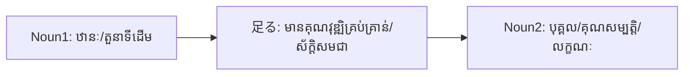

Processing keyword: ～足る Noun (〜taru～)
# ចំណុចវេយ្យាករណ៍ជប៉ុន: ～足る Noun (〜taru～)
**កម្រិត JLPT:** JLPT N1

## ១. សេចក្តីផ្តើម (Introduction)
នៅក្នុងមេរៀននេះ យើងនឹងស្វែងយល់អំពីចំណុចវេយ្យាករណ៍កម្រិតខ្ពស់ **～足る (〜たる)** ដែលជាកន្សោមភាសាផ្លូវការ និងអក្សរសាស្ត្រក្នុងភាសាជប៉ុន ប្រើសម្រាប់បញ្ជាក់អំពី "ភាពស័ក្តិសម លក្ខណសម្បត្តិគ្រប់គ្រាន់ ឬតម្លៃសក្តិសម"។ ទម្រង់នេះសង្កត់ធ្ងន់ថា បុគ្គលណាម្នាក់ ឬវត្ថុណាមួយមានលក្ខណសម្បត្តិ និងគុណវុឌ្ឍិគ្រប់គ្រាន់ពេញលេញក្នុងការបំពេញតួនាទី ឬទទួលបានឋានៈណាមួយជាក់លាក់។

---
## ២. ការពន្យល់វេយ្យាករណ៍ស្នូល (Core Grammar Explanation)
### អត្ថន័យ (Meaning)
កន្សោម **～足る Noun** មានន័យថា "ស័ក្តិសមជា... / មានលក្ខណសម្បត្តិគ្រប់គ្រាន់ជា... / សមជា..."។ វាបង្ហាញឱ្យឃើញច្បាស់ថា ប្រធានមានលក្ខណសម្បត្តិ បទដ្ឋានសីលធម៌ ឬឋានៈស័ក្តិសមឥតខ្ចោះទៅនឹងនាម (Noun) ដែលភ្ជាប់មកខាងក្រោយ។

### ទម្រង់វេយ្យាករណ៍ (Structure)
```plaintext
Noun1 + 足る + Noun2
(កិរិយាសព្ទ / នាម + に + 足る + នាម)
```
- **Noun1**: បុគ្គល ឬអង្គភាពដែលមានលក្ខណសម្បត្តិគ្រប់គ្រាន់ (ឬប្រើជា `〜に足る` ភ្ជាប់ជាមួយកិរិយាសព្ទ/នាមសកម្មភាព)។
- **足る (たる)**: មានប្រភពមកពីកិរិយាសព្ទបុរាណ Bungo (ឬទម្រង់ 連体形 នៃកិរិយាសព្ទជំនួយបុរាណ たり) ដែលមានន័យថា "គ្រប់គ្រាន់", "ពេញលេញ", ឬ "ស័ក្តិសមជា"។
- **Noun2**: តួនាទី ឋានៈ ឬលក្ខណៈសម្បត្តិដែលប្រគល់ជូន (ឧទាហរណ៍៖ 者 [もの], 資質 [ししつ], 人物 [じんぶつ])។

### តារាងសមាសភាគ (Formation Diagram)
| សមាសភាគ (Component) | មុខងារវេយ្យាករណ៍ (Function) |
|----------------------|-----------------------------|
| Noun1                | ប្រធាន ឬតួនាទីដែលមានលក្ខណសម្បត្តិ |
| 足る (たる)           | បង្ហាញពីភាពស័ក្តិសម ឬលក្ខណសម្បត្តិគ្រប់គ្រាន់ |
| Noun2                | ឋានៈ ឬតួនាទីដែលប្រធាននោះស័ក្តិសមទទួលបាន |

---
### ដ្យាក្រាមរូបភាព (Visual Aid)


---
## ៣. ការវិភាគប្រៀបធៀប និង ន័យស៊ីជម្រៅ (## ការវិភាគប្រៀបធៀប និង ន័យស៊ីជម្រៅ)

### ប្រភពដើម និងប្រព័ន្ធវេយ្យាករណ៍បុរាណ (Classical Bungo & Kanbun Roots)
- ពាក្យ **たる** នៅក្នុងទម្រង់ `Noun + たる + Noun` (ដូចជា `教師たる者`) គឺជាទម្រង់ 連体形 (ទម្រង់ភ្ជាប់នាម) នៃកិរិយាសព្ទជំនួយបញ្ជាក់អត្ថិភាព/សភាពបុរាណ **たり** (កាត់មកពី `とあり` ក្នុងភាសាជប៉ុនបុរាណ និងមានទំនាក់ទំនងយ៉ាងជិតស្និទ្ធជាមួយក្បួន Kanbun 漢文訓読)។ វាកំណត់ន័យថា "ក្នុងនាមជា... / ស្ថិតក្នុងឋានៈជា..." ដែលភ្ជាប់មកជាមួយនូវបន្ទុកសីលធម៌ ទំនួលខុសត្រូវ ឬកាតព្វកិច្ចយ៉ាងតឹងរ៉ឹង។
- ចំណែកឯ **〜に足る** (ដូចជា `信頼するに足る`, `賞賛に足る`) បានមកពីកិរិយាសព្ទបុរាណ **足る (たる)** (文語四段活用 / ទំនើប `足りる`) ដែលមានន័យថា "គ្រប់គ្រាន់សម្រាប់ / ស័ក្តិសមនឹងទទួលបាន..."។ ទាំងពីរនេះស្ថិតក្នុងកម្រិតភាសា N1 ផ្លូវការខ្ពស់ដូចគ្នា។

### ការប្រៀបធៀបជាមួយទម្រង់ស្រដៀងគ្នា (Comparative Analysis)

1. **～足る (〜たる) vs ～たる者 (〜たるもの):**
   - **～たる者 (〜たるもの)**: ប្រើជាពិសេសចំពោះបុគ្គលដែលមានឋានៈខ្ពង់ខ្ពស់ អាជីពថ្លៃថ្នូរ ឬតួនាទីសង្គមដ៏សំខាន់ (ឧ. គ្រូបង្រៀន វេជ្ជបណ្ឌិត មេដឹកនាំ) ដោយឃ្លាខាងក្រោយតែងតែតម្រូវឱ្យមានកាតព្វកិច្ចសីលធម៌ (ភ្ជាប់ជាមួយ `〜べきだ`, `〜なければならない`)។
   - **～足る Noun (ឬ 〜に足る Noun)**: អាចប្រើសម្រាប់វាយតម្លៃលក្ខណសម្បត្តិរបស់មនុស្ស ឬគុណភាពនៃស្នាដៃ/វត្ថុផងដែរ (ឧ. `信頼するに足る人物`, `賞賛に足る作品`) ថាស័ក្តិសមនឹងទទួលបានការទុកចិត្ត ឬការសរសើរ។

2. **～足る vs ～にふさわしい:**
   - **～にふさわしい (Appropriate / Suitable)**: ជាភាសាសាមញ្ញទូទៅ ប្រើបានទាំងក្នុងការសន្ទនាប្រចាំថ្ងៃ និងការសរសេរ។ វាគ្រាន់តែបញ្ជាក់ពីភាពត្រូវគ្នា សមរម្យ ឬស៊ីគ្នានៃលក្ខណៈខាងក្រៅ អាកប្បកិរិយា ឬសម្លៀកបំពាក់ប៉ុណ្ណោះ។
   - **～足る**: ជាភាសាផ្លូវការកម្រិតខ្ពស់ (Formal/Literary) បង្ហាញពី "លក្ខណសម្បត្តិស្នូល និងគុណវុឌ្ឍិខាងក្នុង" យ៉ាងរឹងមាំ និងមានកម្រិតស្តង់ដារវាយតម្លៃខ្ពស់បំផុត។

3. **～足る (〜に足る) vs ～に値する (〜にあたいする):**
   - **～に値する**: មានន័យថា "មានតម្លៃសក្តិសមនឹង..." ប្រើបានទូលំទូលាយលើការវាយតម្លៃអរូបី (ដូចជា `尊敬に値する` - សមនឹងទទួលបានការគោរព, `一読に値する` - សមនឹងអានម្តង)។
   - **～に足る**: សង្កត់ធ្ងន់លើ "កម្រិតគ្រប់គ្រាន់នៃលក្ខណៈសម្បត្តិ" (sufficiency/qualification) ដើម្បីធានា ឬតំណាងឱ្យអ្វីមួយ។ ទម្រង់បដិសេធរបស់វា `〜に足らない` តែងមានន័យថា "មិនគ្រប់លក្ខណៈ / មិនមានតម្លៃសូម្បីតែបន្តិច" (ឧ. `取るに足らない` = រឿងកំប៉ិកកំប៉ុក មិនសមនឹងយកមកគិត)។

4. **កម្រិតនៃការប្រើប្រាស់ (Register & Politeness):**
   - **កម្រិតផ្លូវការ:** ផ្លូវការកម្រិតខ្ពស់បំផុត (Archaic/Literary Register)។
   - **បរិបទ:** មិនប្រើក្នុងការសន្ទនាធម្មតាឡើយ; ឃើញតែនៅក្នុងការថ្លែងសុន្ទរកថាផ្លូវការ អត្ថបទតែងសេចក្តី ឯកសារទស្សនវិជ្ជា វិចារណកថា និងក្រមសីលធម៌វិជ្ជាជីវៈ។

---
## ៤. ឧទាហរណ៍ក្នុងបរិបទជាក់ស្តែង (Examples in Context)

### ឧទាហរណ៍ប្រយោគ (Example Sentences)
1. **教師足る者、常に学ぶ姿勢を持つべきだ。**  
   *きょうしたるもの、つねにまなぶしせいをもつべきだ。*  
   *ក្នុងនាមជាបុគ្គលដែលស័ក្តិសមជាគ្រូបង្រៀន គប្បីត្រូវតែមានឥរិយាបថរៀនសូត្រជានិច្ច។*
2. **彼は信頼するに足る人物だ。**  
   *かれはしんらいするにたるじんぶつだ。*  
   *គាត់គឺជាបុគ្គលម្នាក់ដែលមានលក្ខណសម្បត្តិគ្រប់គ្រាន់ស័ក្តិសមនឹងទទួលបានការទុកចិត្ត។*
3. **この作品は賞賛に足る出来栄えだ。**  
   *このさくひんはしょうさんにたるできばえだ。*  
   *ស្នាដៃនេះគឺជាស្នាដៃសម្រេចមួយដែលស័ក្តិសមនឹងទទួលបានការកោតសរសើរ។*
4. **彼女はリーダー足る資質を備えている。**  
   *かのじょはリーダーたるししつをそなえている។*  
   *នាងមានលក្ខណសម្បត្តិ និងគុណវុឌ្ឍិគ្រប់គ្រាន់ស័ក្តិសមជាមេដឹកនាំ។*
5. **政治家足る者、公正であるべきだ。**  
   *せいじかたるもの、こうせいであるべきだ。*  
   *ក្នុងនាមជាបុគ្គលដែលស័ក្តិសមជាអ្នកនយោបាយ គប្បីត្រូវតែមានភាពយុត្តិធម៌ និងសុចរិត។*

---
### បរិបទនៃការប្រើប្រាស់ (Contextual Usage)
- **ស្ថានភាពផ្លូវការខ្ពស់ (Formal Situations):** ប្រើនៅក្នុងសុន្ទរកថាផ្លូវការ កិច្ចពិភាក្សាអំពីក្រមសីលធម៌ តួនាទី និងទំនួលខុសត្រូវក្នុងសង្គម។
- **ការសង្កត់ធ្ងន់លើស្តង់ដារគុណវុឌ្ឍិ (Emphasizing High Standards):** ប្រើដើម្បីបញ្ជាក់អំពីស្តង់ដារ និងលក្ខខណ្ឌសីលធម៌ដ៏ខ្ពង់ខ្ពស់ដែលសង្គមរំពឹងទុកពីបុគ្គលក្នុងមុខតំណែងណាមួយ។

---
## ៥. កំណត់សម្គាល់វប្បធម៌ (Cultural Notes)
### ទំនាក់ទំនងវប្បធម៌ (Cultural Relevance)
នៅក្នុងវប្បធម៌សង្គមជប៉ុន មានការផ្តោតសំខាន់យ៉ាងខ្លាំងលើការបំពេញកាតព្វកិច្ចតាមតួនាទី (役割 - *yakuwari*) និងការរក្សានូវអាកប្បកិរិយាសមរម្យស្របតាមឋានៈរបស់ខ្លួន។ ការប្រើប្រាស់កន្សោម **～足る (たる)** បង្ហាញពីទម្ងន់នៃទំនួលខុសត្រូវសង្គម និងការឆ្លើយតបទៅនឹងការរំពឹងទុករបស់សង្គមចំពោះបុគ្គលដែលមានតួនាទីជាក់លាក់ (ដូចជា មេដឹកនាំ គ្រូបង្រៀន ឬអ្នកនយោបាយ)។

### កម្រិតគួរសម និងផ្លូវការ (Levels of Politeness and Formality)
- **កន្សោមផ្លូវការបែបអក្សរសាស្ត្រ:** មិនប្រើក្នុងការសន្ទនាស្និទ្ធស្នាលប្រចាំថ្ងៃឡើយ។
- **ភាពស័ក្តិសមក្នុងការសរសេរ:** ស័ក្តិសមបំផុតសម្រាប់អត្ថបទតែងសេចក្តី ឯកសារច្បាប់ សំបុត្រផ្លូវការ និងសុន្ទរកថាសាធារណៈ។

### កន្សោមក្បួនទូទៅ (Idiomatic Expressions)
- **勇気ある者足るべし**  
  *(ត្រូវតែជាបុគ្គលដែលមានលក្ខណសម្បត្តិស័ក្តិសមជាអ្នកក្លាហាន។)*
- **紳士足る態度**  
  *(ឥរិយាបថស័ក្តិសមជាសុភាពបុរស។)*

---
## ៦. កំហុសទូទៅ និងគន្លឹះជំនួយ (Common Mistakes and Tips)
### ការវិភាគកំហុស (Error Analysis)
1. **ការប្រើប្រាស់ក្នុងបរិបទសន្ទនាធម្មតា (Using in Informal Contexts)**
   - **កំហុស:** ការយកកន្សោម **～足る** ទៅនិយាយជាមួយមិត្តភក្តិ ឬក្នុងការសន្ទនាធម្មតា ធ្វើឱ្យស្តាប់ទៅរឹង និងឆ្គងខ្លាំង។
   - **កែតម្រូវ:** គួរប្រើពាក្យសាមញ្ញដូចជា **～にふさわしい** ឬកិរិយាសព្ទជំនួយទម្រង់លទ្ធភាព។
   - **ឧទាហរណ៍:**
     - ឆ្គង (ផ្លូវការហួសហេតុ): **彼は信頼するに足る友達だ。**
     - ត្រឹមត្រូវតាមបែបធម្មជាតិ: **彼は信頼できる友達だ。** (*គាត់ជាមិត្តភក្តិដែលអាចទុកចិត្តបាន។*)
2. **ការរៀបចំរចនាសម្ព័ន្ធខុស (Incorrect Structure)**
   - **កំហុស:** ដាក់ទីតាំងពាក្យ **足る** ខុស ឬប្រើប្រាស់ទម្រង់មិនត្រឹមត្រូវ។
   - **កែតម្រូវ:** ត្រូវប្រាកដថា **足る** ភ្ជាប់ផ្ទាល់ពីក្រោយ **Noun1** (ឬប្រើ `កិរិយាសព្ទ/នាម + に足る`)។
   - **ឧទាហរណ៍:**
     - ខុស: **足る教師者、学生の模範だ。**
     - ត្រូវ: **教師足る者、学生の模範だ。** (*បុគ្គលដែលសមជាគ្រូបង្រៀន គឺជាគំរូរបស់សិស្ស។*)

### យុទ្ធសាស្ត្រសិក្សា (Learning Strategies)
- **ការចងចាំតាមន័យធៀប:** ភ្ជាប់អត្ថន័យនៃពាក្យ **足る** ទៅនឹងពាក្យ "គ្រប់គ្រាន់ (Sufficient) ឬ ស័ក្តិសម (Worthy)" ដើម្បីងាយស្រួលចងចាំ។
- **អនុវត្តក្នុងបរិបទផ្លូវការ:** អានអត្ថបទកាសែតផ្លូវការ វិចារណកថា ឬស្តាប់សុន្ទរកថាផ្លូវការរបស់ជប៉ុនដើម្បីសង្កេតមើលរបៀបប្រើប្រាស់ **～足る**។
- **ទន្ទេញឃ្លាគំរូទូទៅ:** ទន្ទេញឃ្លាពេញនិយមដូចជា `信頼するに足る` (សមនឹងទុកចិត្ត) ឬ `教師たる者` (ក្នុងនាមជាគ្រូបង្រៀន) ដើម្បីឱ្យស៊ាំនឹងទម្រង់នេះ។

---
## ៧. សង្ខេប និងរំលឹកឡើងវិញ (Summary and Review)
### ចំណុចគន្លឹះសំខាន់ៗ (Key Takeaways)
- **～足る Noun** គឺជាកន្សោមផ្លូវការកម្រិតខ្ពស់ មានន័យថា "ស័ក្តិសមជា... / មានលក្ខណសម្បត្តិគ្រប់គ្រាន់ជា..."។
- **ទម្រង់វេយ្យាករណ៍:** **Noun1 + 足る + Noun2** (ឬ `〜に足る + Noun`)។
- សង្កត់ធ្ងន់លើលក្ខណសម្បត្តិ គុណវុឌ្ឍិ ឬតម្លៃសមស្របទៅនឹងតួនាទី ឬឋានៈ។
- ប្រើប្រាស់ជាទូទៅក្នុងការសរសេរផ្លូវការ និងការថ្លែងសុន្ទរកថា។
- មិនប្រើប្រាស់ក្នុងការសន្ទនាធម្មតាប្រចាំថ្ងៃឡើយ។

---
### លំហាត់ខ្លីៗរំលឹកមេរៀន (Quick Recap Quiz)
1. **បំពេញចន្លោះ (Fill in the Blank)**
   この作品は賞賛に ____ 出来栄えだ。  
   *(ស្នាដៃនេះគឺជាស្នាដៃសម្រេចមួយដែលស័ក្តិសមនឹងទទួលបានការកោតសរសើរ។)*  
   **ចម្លើយ:** 足る (たる)
2. **ត្រូវ ឬ ខុស (True or False)**
   ទម្រង់ **～足る** ត្រូវបានប្រើប្រាស់ជាញឹកញាប់ក្នុងការជជែកលេងកម្សាន្តធម្មតារវាងមិត្តភក្តិ។  
   **ចម្លើយ:** ខុស (False)
3. **ជ្រើសរើសការប្រើប្រាស់ដែលត្រឹមត្រូវ (Choose the Correct Usage)**
   តើប្រយោគមួយណាប្រើប្រាស់ **～足る** បានត្រឹមត្រូវ?  
   a) 彼は学生足りる者だ。  
   b) 彼は学生足る者だ。  
   c) 彼は学生に足る者だ。  
   **ចម្លើយ:** b) 彼は学生足る者だ。

---
តាមរយៈការយល់ដឹងច្បាស់អំពីចំណុចវេយ្យាករណ៍ **～足る Noun** អ្នកនឹងបង្កើនសមត្ថភាពក្នុងការអាន និងស្វែងយល់អត្ថបទជប៉ុនកម្រិតខ្ពស់ផ្លូវការ ព្រមទាំងអាចបង្ហាញពីគំនិតប្រកបដោយន័យស៊ីជម្រៅទាក់ទងនឹងភាពស័ក្តិសម និងគុណវុឌ្ឍិក្នុងបរិបទត្រឹមត្រូវ។

---
© [Hanabira.org](https://hanabira.org)
